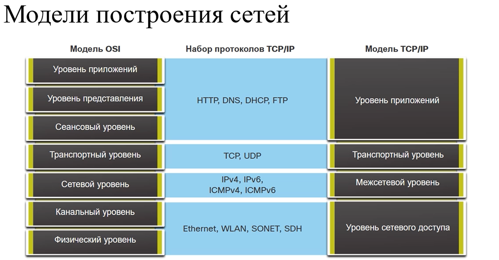
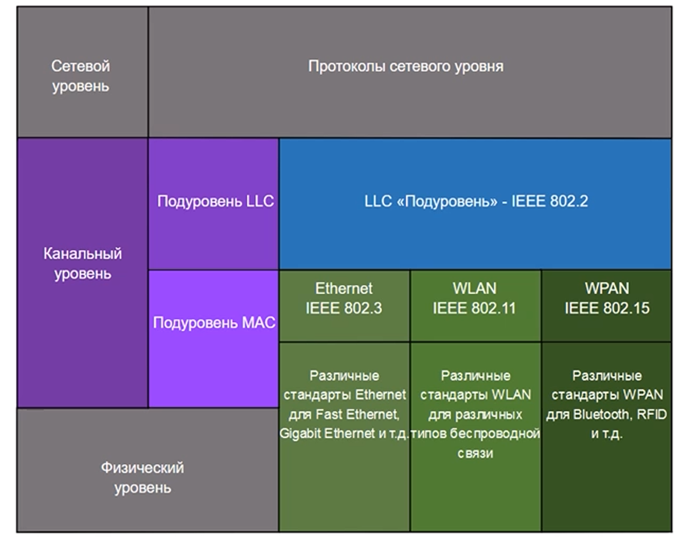
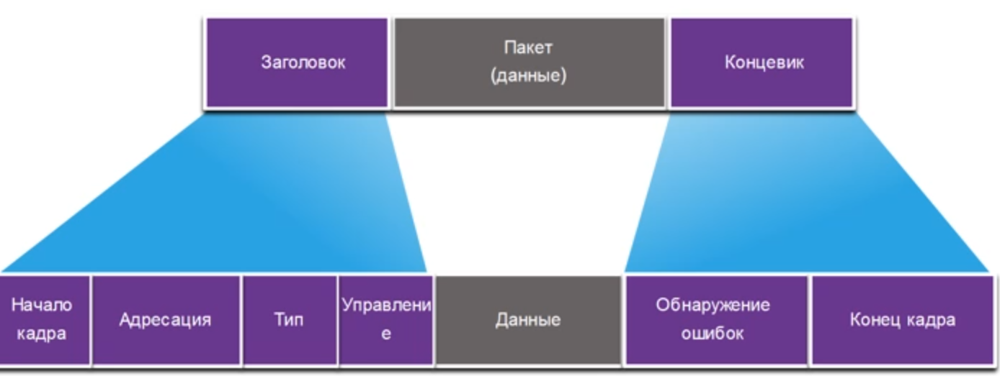
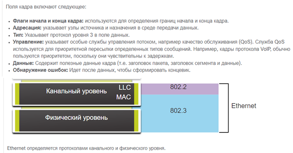
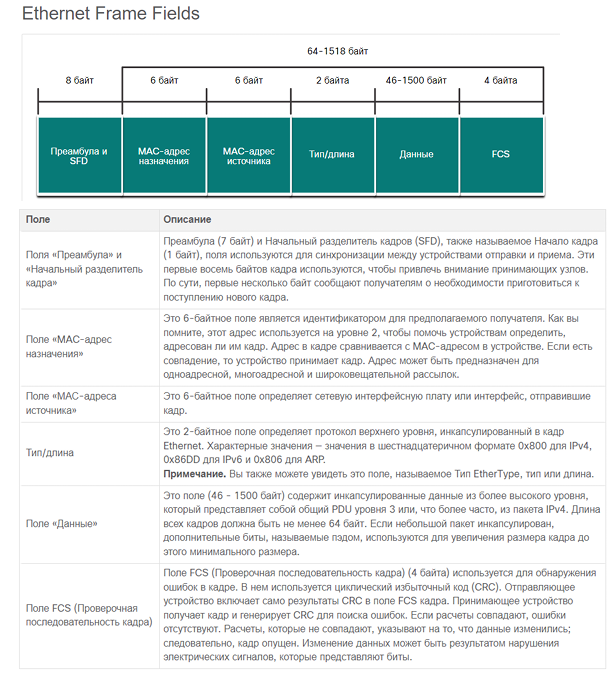
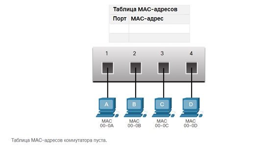
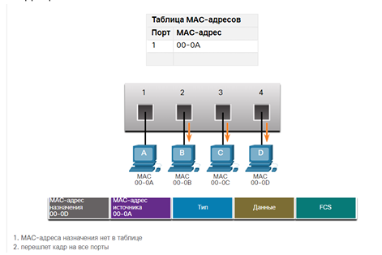
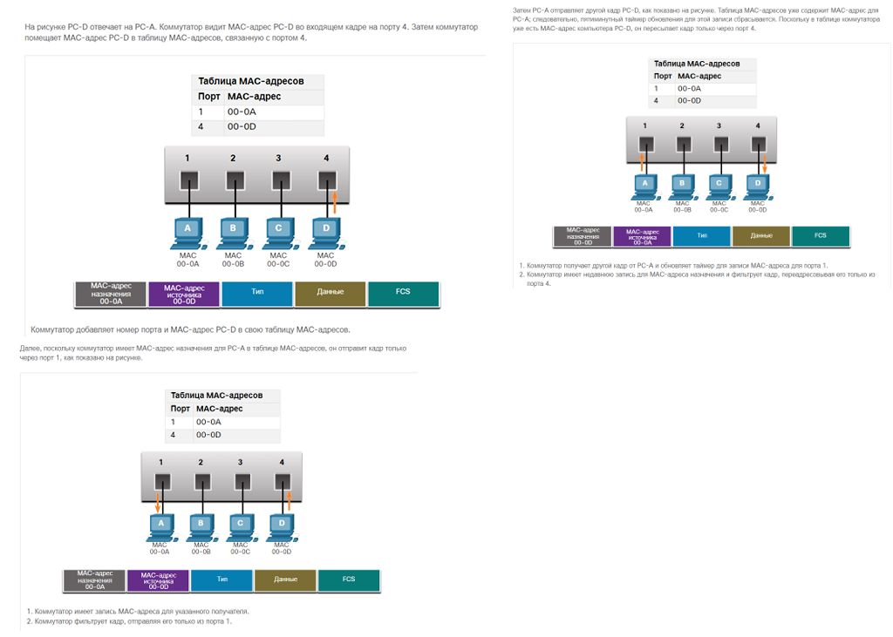
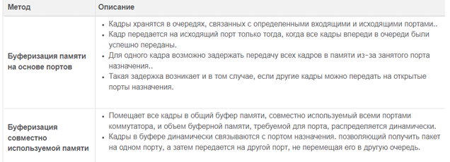

# Принципы коммутации



Модель TCP/IP не является моделью, скорее описывает разделение протоколов на уровни и примерно описывает задачи которые
должны выполняться на каждом уровне в соотношении с моделью OSI

## Канальный уровень

### Задача

**Задача** - связать между собой две сетевые карты конечных устройств либо сетевого оборудования и передать данные
полученные от сетевого уровня на физический уровень. Передача осуществляется с помощью кадров.

Канальный уровень выполняет функции:

1. Обеспечение доступа вышестоящих уровней к среде подключения
2. Принимает данные, обычно пакеты уровня 3(*IPv4 IPv6*) и инкапсулирует их в кадры 2 уровня.
3. Управление передачи и приема данных в среде передачи данных.
4. Обмен кадрами между узлами по физической среде сетевого подключения
5. Получает инкапсулированные данные(*обычно 3 уровня*) и направляет их в соответсвующий протокол вышестоящего уровня
6. Обнаружение ошибок и отклонение поврежденных кадров.

### Подуровни канала передачи данных IEEE 802 LAN/MAN



стандарт IEEE 802 LAN/MAN специфичен для разных типов сети(Ethernet WLAN WPAN).

Канальный уровень состоит из двух подуровней:

1. LLC(Logical Link Control) - уровень логических соединений, взаимодействие с протоколами верхних уровней, добавление
   информации о протоколе сетевого уровня (например, IPv4 или IPv6).
2. MAC(Media Access Control) - управление доступом к среде, инкапсуляция данных, адресация и обнаружение ошибок

**Назначение:** LLC обеспечивает совместимость протоколов, а MAC управляет физической передачей данных.

## Кадры канального уровня, инкапсуляция Ethernet



Кадры любого типа состоят из трех основных компонентов.

* Заголовок
* Данные
* Концевик

Данные - то что пришло с сетевого уровня и инкапсулируется в этот кадр

Заголовок и концевик различаются в зависимости от протокола канального уровня.

Объем управляющей информации, переносимой в кадре, зависит от информации управления доступом и логической топологии.



Ethernet функционирует на канальном и физическом уровнях.

Семейство сетевых технологий, которые регламентируются стандартами IEEE 802.2 и 802.3

Поля кадра Ethernet:

* Минимальный размер кадра Ethernet - 64 байт, максимальный - 1518 байт.



### MAC-адрес: определение, типы

МАС-адрес Ethernet состоит из 48 битов или 6 байт. Каждое устройство в сети Ethernet подключено к одной и той же среде
передачи данных. Часто называют физическим адресом устройством.

МАС-адрес используется для определения источника и места назначения в локальной сети Ethernet. МАС-адресация
предоставляет метод идентификации устройств на более низком уровне модели OSI.

ВСе MAC-адреса должны быть уникальными для устройства Ethernet или интерфейса Ethernet.

Для этого все поставщики должны зарегистрироваться в IEEE, чтобы получить уникальный 3 байтовый код, OUI(организационно
уникальный идентификатор)

Типы:

* Индивидуальный МАС-адрес(unicast) - уникальный адрес, который используется при отправке
  кадра от одного передающего устройства к одному устройству назначения. Для определения МАС-адреса назначения
  используется протокол разрешение адресов(ARP)

**Примечание**: MAC-адрес источника всегда должен быть адресом одноадресной рассылки
(индивидуальным).

* Широковещательный MAC-адрес(broadcast) - кадр широковещательной передачи Ethernet принимается и обрабатывается каждым
  устройством в локальной сети Ethernet.
  Адрес Широковещательного MAC-адреса - FF:FF:FF:FF:FF:FF он пересылается через все порты коммутатора Ethernet, кроме
  входящего порта, он не пересылается маршрутизатором.

* MAC-адрес многоадресной рассылки(multicast) - Кадр многоадресной передачи Ethernet принимается и обрабатывается
  группой устройств в
  локальной сети Ethernet, принадлежащих к той же группе многоадресной рассылки.

  Функции многоадресной рассылки:
    1. Существуют другие зарезервированные МАС-адреса назначения многоадресной рассылки для тех случаев, когда
       инкапсулированные данные не являются IP-адресами.(*например проток STP*)
    2. Он рассылается на все порты коммутатора Ethernet, за исключением входящего порта, если коммутатор не настроен для
       многоадресного отслеживания
    3. Не пересылается маршрутизатором, если маршрутизатор не настроен на маршрутизацию многоадресных пакетов.

Диапазон IPv4-адресов многоадресной рассылки — от 224.0.0.0 до 239.255.255.255.

Диапазон IPv6-адресов многоадресной рассылки начинается с FF00:: /8.

Поскольку адреса многоадресной рассылки представляют собой группу адресов (которая иногда называется
также группой узлов), они используются только как адреса назначения пакета. Источник
всегда имеет адрес одноадресной рассылки

Как и в случае с адресами для одноадресной и широковещательной рассылки, IP-адресу
для многоадресной рассылки требуется соответствующий MAC-адрес, чтобы фактически
передавать кадры по локальной сети. MAC-адрес многоадресной рассылки связан и
использует информацию адресации от адреса многоадресной рассылки IPv4 или IPv6.

**Принадлежность группе определяется работой протокола, которые используются!!!!**

### Коммутация в сети, работа коммутатора, способы пересылки.

Коммутатор Ethernet уровня 2 использует MAC-адреса для принятия решения о пересылке.
Устройство не имеет информации о протоколе, передаваемом в части кадра, выделенной
для данных. Коммутатор пересылает пакеты только на основе MAC-адресов Ethernet уровня 2.

Коммутатор Ethernet обращается к таблице МАС-адресов(*таблица коммутации*) для пересылки каждого конкретного кадра. Он
создает таблицу
МАС-адресов динамически, проверяя МАС-адрес источника в кадрах, принимаемых портов. Пересылает кадры на основе
совпадения МАС-адресом назначения в кадре и записью в таблице коммутации

**Получение информации**



При каждом поступлении кадра в коммутатор выполняется проверка на наличие новой
информации. Проверяются MAC-адрес источника, указанный в кадре, и номер порта, по
которому кадр поступает в коммутатор. Если MAC-адрес источника отсутствует, он
добавляется в таблицу вместе с номером входящего порта. Если MAC-адрес источника уже
существует, коммутатор обновляет таймер обновления для этой записи. По умолчанию в
большинстве коммутаторов Ethernet данные в таблице хранятся в течение 5 минут.
Например, на рисунке PC-A отправляет кадр Ethernet на PC-D. Таблица показывает, что
коммутатор добавляет MAC-адрес для PC-A в таблицу MAC-адресов.
Примечание: Если MAC-адрес источника указан в таблице, но с другим портом, коммутатор
считает эту запись новой. Запись заменяется на тот же MAC-адрес, но с более актуальным
номером порта.

**Перенаправление**



Если MAC-адрес назначения является адресом одноадресной рассылки, коммутатор ищет
совпадения между MAC-адресом назначения кадра и записью в таблице MAC-адресов.
Если MAC-адрес назначения есть в таблице, коммутатор пересылает кадр через указанный
порт. Если MAC-адреса назначения нет в таблице, коммутатор пересылает кадр через все
порты, кроме входящего порта. Это называется одноадресной рассылкой неизвестному
получателю.
Как показано на рисунке, в таблице коммутатора нет MAC-адреса назначения для
компьютера PC-D, поэтому он пересылает кадр через все порты, кроме порта 1.
Примечание: Если MAC-адрес назначения является адресом широковещательной или
многоадресной рассылки, коммутатор также пересылает кадр через все порты, кроме
входящего.

**Фильтрация кадров**



Поскольку коммутатор получает кадры от разных устройств, его таблица MAC-адресов
заполняется через проверку MAC-адреса источника каждого кадра. Если в таблице MAC
адресов коммутатора есть MAC-адрес назначения, он может выполнять фильтрацию кадров
и пересылать его через один порт.

**Способы переадресации кадра на коммутаторах Cisco**

Есть 2 способа переадресации кадра на коммутаторах Cisco:

1. Коммутация с промежуточным хранением - коммутатор получает кадры целиком и вычисляет избыточный циклический код(CRC)
2. Коммутация со сквозной пересылкой - коммутатор пересылает кадр до его полного получения. Рекомендуется указать адрес
   назначения в начале, прежде чем кадр был переадресован

Преимущество коммутации с промежуточным хранением в том, что она проверяет кадр целиком и если кадр будет поврежден, то
коммутации кадра не произойдет

В свою очередь коммутация со сквозной пересылкой необходима для анализа качества обслуживания в конвергентных сетях.
При использовании сквозной коммутации коммутатор обрабатывает данные по мере их
поступления даже в том случае, если передача еще не завершена. Коммутатор добавляет в
буфер только ту часть кадра, которая требуется для чтения MAC-адреса назначения, чтобы
он смог определить, на какой порт пересылать данные. MAC-адрес назначения указан в
первых 6 байтах кадра после преамбулы. Коммутатор ищет MAC-адрес назначения в своей
таблице коммутации, определяет порт исходящего интерфейса и направляет кадр на узел
назначения через определенный порт коммутатора. Коммутатор не проверяет кадр на
наличие каких-либо ошибок.

Есть 2 варианта сквозной коммутации:

1. Коммутация с быстрой пересылкой - обеспечивает наименьший уровень задержки. Пакет пересылается сразу после прочтения
   адреса назначения. Пакеты могут ретранслироваться с ошибками. Типичный способ сквозной коммутации
2. Коммутация с исключением фрагментов - коммутатор сохраняет первые 64 байта кадра перед его отправкой. Причина
   сохранения только 64 байтов в том, что большинство коллизий и сетевых ошибок возникают именно в этих 64 байтах.

**Буферизация памяти на коммутаторах**

Коммутатор Ethernet может поддерживать буферизацию для хранения кадров до их пересылки. Буферизация также может
использоваться, когда порт назначения занят из-за перегрузки.

)

### Физические характеристики коммутатора: дуплекс, скорость.

Физическими характеристиками коммутатора являются пропускная способность и дуплексный режим. Важно, чтобы пропускная
способность и дуплексный режим коммутатора совпадали с подключенными устройствами(*пк или другой коммутатор*).

в Ethernet есть 2 дуплексных режима:

1. Полнодуплексный режим - одновременная отправка и получения данных в обе стороны
2. Полудуплексный режим - отправка данных только с одной стороны.

Автоопределение - доп. функция, которой оснащено большинство коммутаторов Ethernet. Позволяет двум устройствам
автоматически обмениваться информацией о скорости и возможностях дуплексного режима.

Если устройства поддерживают полнодуплексный режим, то он выбирается для работы, а также выбирается максимальная
пропускная способность

**Настройка дуплекса**

```cisco
    conf t
    int fa0/1
    duplex full
    speed auto
```

### Широковещательный домен и домен коллизий.

* Домен коллизий: сегмент сети с общей средой, где возможны коллизии (существует в полудуплексном режиме, ограничивается
  коммутатором).
* Широковещательный домен: область, где кадры с MAC FF-FF-FF-FF-FF-FF пересылаются всем устройствам; сегментируется
  маршрутизатором.
* Различия: коммутатор ограничивает коллизии, но расширяет широковещательный домен.
