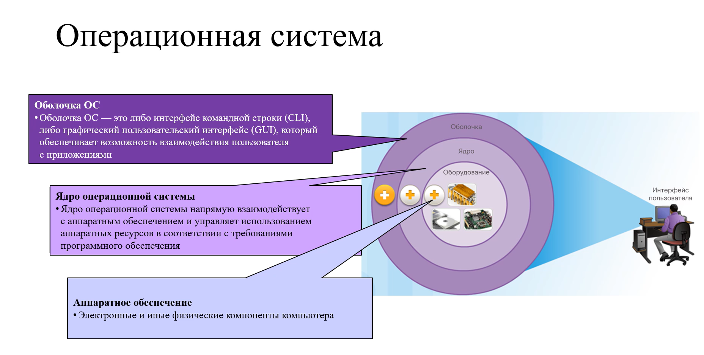
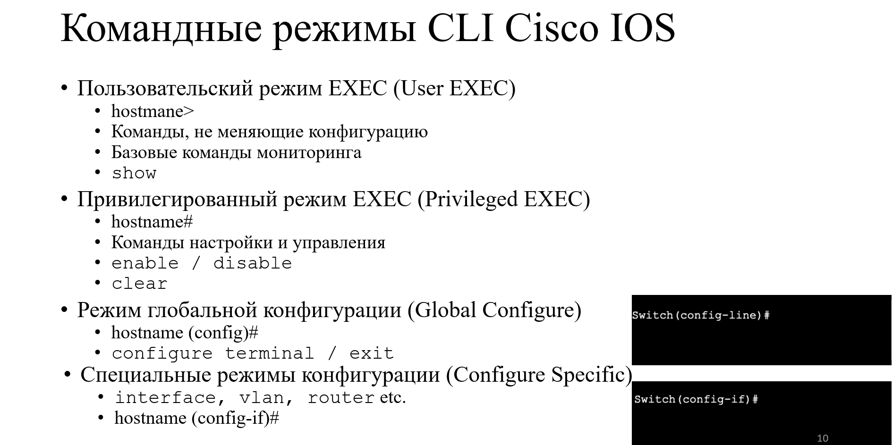
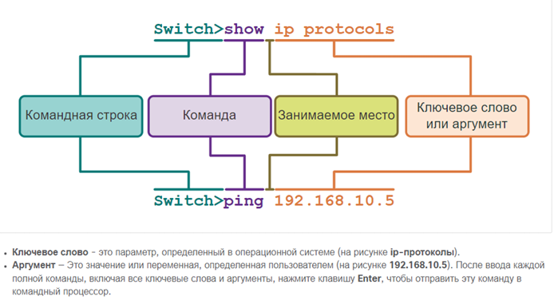
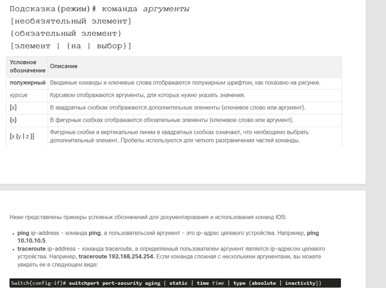
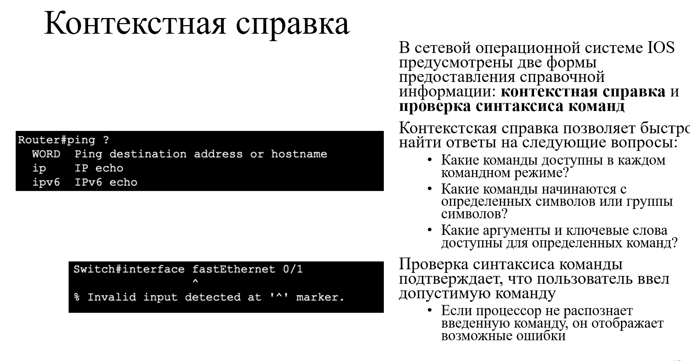
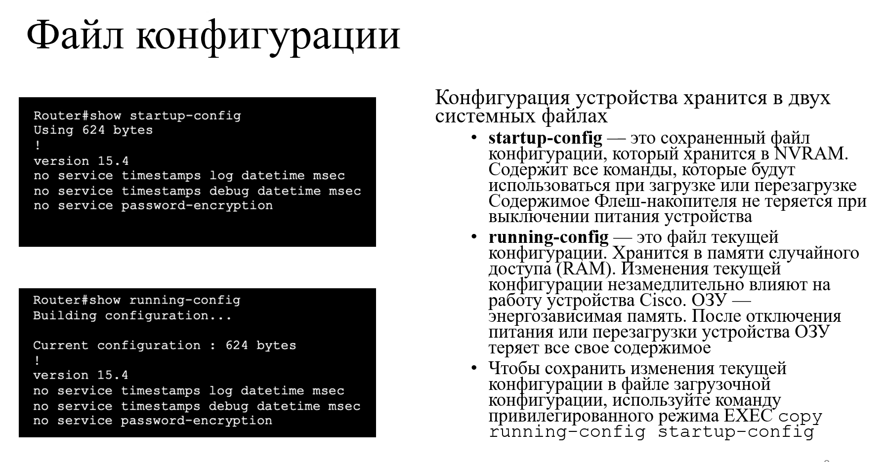
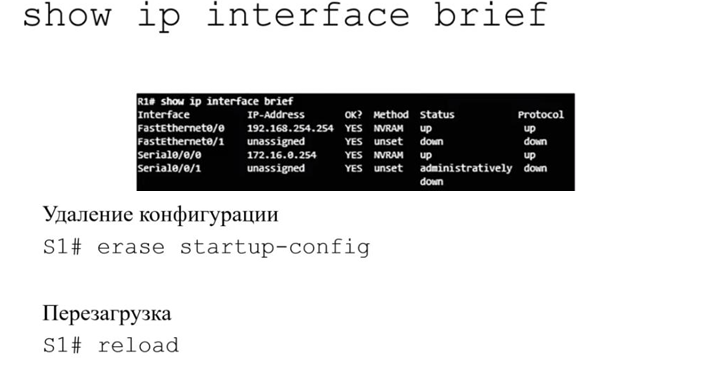

# Базовая настройка оборудования

### Среда передачи данных. Сетевое оборудование. Виды, принцип работы, ОС, устройство сетевого оборудования. Порты и интерфейсы, интерфейс loopback.



Среда передачи данных - канал, по которому сообщения передаются от источника к адресату.

Современные сети используют в первую очередь 3 типа носителей для соединения устройств:

1. Металлические провода в кабелях
2. Оптоволокно
3. Беспроводная передача

Также используется специальная терминология для описания того как каждое устройство и носители соединяются друг с
другом:

* Сетевые интерфейсные платы(NIC) - для подключения устройства к сети
* Физический порт - разъем на сетевом устройстве, через который кабели подключены к ПК или другому сетевому устройству
* Интерфейс - спец порты в сетевом устройстве, подключенные к отдельным сетям. Порты маршрутизатора - сетевые интерфейсы

### Доступ к сетевому оборудованию, управление оборудованием.


Операционная система в сетевом оборудовании - **IOS**

Способы доступа к оборудованию:

1. Консоль - с помощью консольного кабеля можно сделать базовую настройку оборудования
2. SSH - метод, для установления удаленного защищенного соединения CLI через виртуальный интерфейс по сети
3. Telnet - устанавливает небезопасное удаленное подключение CLI по сети.

Для доступа к управлению оборудования нам требуются программы эмуляции терминала например:

* PuTTy

### Командные режимы CLI Cisco IOS.



Для безопасности Cisco IOS использует два отдельных командных режима для доступа к административным функциям:

1. *пользовательский режим, или EXEC* - режим с ограниченными возможностями, удобен для базовых операций. Доступно
   только ограниченное число основных команд мониторинга, но невозможно выполнять какие-либо команды, для изменения
   конфигурации устройства. Определить что ты находишься в EXEC - *>*
2. Привилегированный режим - режим для администратора для выполнения команд настройки. Режимы глобальной конфигурации
   доступны только в этом режиме (*такие, как configure terminal* и т.д). Определить - *#*

Для настройки сетевого оборудования пользователь должен перейти в **режим глобальной конфигурации**. В режиме глобальной
конфигурации выполняются изменения конфигурации CLI.

Из глобального режима конфигурации можно перейти в **Специальные режимы конфигурации**

2 распространенных вложенных режимов конфигурации:

* Режим настройки линии - Определить *(config-line)#*. Предназначен для настройки доступа через одну из физических или
  виртуальных линий(SSH, AUX или Telnet)
* Режим настройки интерфейса - Определить *(Config-if)#*. Нужен для настройки порта коммутатора или сетевого интерфейса
  маршрутизатора.

Выйти из любого режима в привилегированный - **end** или **CTRL+Z**

Выйти на один уровень режима ниже - **Exit**

### Работа в CLI IOS.





Если не помнишь команду, то ее можно посмотреть используя контекстную справку.


Сочетания клавиш для выхода из операции:

* **ctrl-C** - останавливает любой запущенный режим конфигурации и выполняет возврат к привилегированному режиму. При
  работе в режиме настройки возвращает обратно в командную строку.
* **CTRL-Z** - останавливает любой запущенный режим конфигурации и выполняет возврат к привилегированному режиму
* **CTRL-SHIFT-6** - универсальная последовательность прерывания, используемая для прерывания поиска DNS записи,
  трассировки маршрута, ping и т.д.

**ЗАДАНИЕ ИМЕНИ УСТРОЙСТВ**

Имя должно быть понятным. Рекомендации по выбору имени хоста:

* Начинается с буквы
* Нет пробелов
* Оканчивается на букву или цифру
* содержит только буквы цифры и тире
* <= 64 символа

Чтобы установить имя:

```commandline
conf t 
hostname GOSHA-123
```

Удаление:

```commandline
conf t
no hostname GOSHA-123
```


**Настройка паролей**

Обеспечение безопасности пользовательского режима:

```commandline
conf t 
line console 0 
password 1234
login   Если задать просто login без пароля то доступ к оборудованию будет потерян
```

Безопасность привилегированного режима

```commandline
conf t
enable secret 1234
```

Шифрование паролей в файле конфигурации:

```commandline
conf t 
service password-encryption
```

Конфигурация устройства хранится в двух системных файлах.

* startup-config - Это сохраненный файл конфигурации, который хранится в NVRAM. Он
  содержит все команды, которые будут использоваться при загрузке или перезагрузке
* running-config - Это файл текущей конфигурации, хранится в оперативной памяти (RAM). Он
  отражает текущую конфигурацию. Изменения текущей конфигурации незамедлительно
  влияют на работу устройства Cisco.

Команда привилегированного режима EXEC show running-config используется для просмотра
текущей конфигурации. 



### Настройка виртуального интерфейса коммутатора (SVI)

```commandline
conf t
int vlan 1
ip address ip_address mask_address
no sh
ex

ip defualt-getway ip_address
```

Для удаленного доступа к коммутатору на интерфейсе (SVI) нужно настроить IP-адрес и маску
подсети. Чтобы настроить SVI на коммутаторе, используйте команду глобальной
конфигурации interface vlan 1. Vlan 1 — это не реальный физический интерфейс, а виртуальный.
Затем назначьте адрес IPv4 с помощью команды конфигурации интерфейса ip address ip-address
subnet-mask. Наконец, включите виртуальный интерфейс с помощью команды конфигурации
интерфейса no shutdown.
После настройки этих команд все элементы IPv4 в коммутаторе будут готовы для передачи данных
по сети.

Проверка настроек:
**show running-config** - покажет текущий файл конфигурации

**show running-config interface Vlan 1** - покажет текущую настройку интерфейса vlan

**show ip int brief** - покажет настройку интерфейсов на оборудовании

**show history** - история вводимых команд



### Джентльменский набор

Синхронизация логирования:

conf t

line console 0

logging synchronous

Отключение разрешенного доменного имени

conf t

no ip domain-lookup