# Введение в маршрутизацию

### Сетевой уровень: задачи

Прежде чем говорить о маршрутизации, нужно вспомнить о сетевом уровне

Задача сетевого уровня - обеспечить обмен данных между хостами.

Для выполнения сквозных коммутаций через границы сети протоколы сетевого уровня выполняют 4 операции:

1. Адресация: Назначение уникальных IP-адресов для идентификации устройств (например, 192.168.1.1).
2. Инкапсуляция - сетевой уровень получает единицу данных протоколов (PDU) от транспортного уровня.
3. Маршрутизация: Направление пакетов через маршрутизаторы к удаленным сетям
4. Деинкапсуляция - на конечном устройстве данные должны быть деинкапсулированы. При прибытии пакета на адрес назначения
   узел проверяет IP-адрес. Если IP-адрес в заголовке совпадает с IP-адресом конечного устройства, то IP заголовок
   удаляется из пакета.

Протоколы Сетевого уровня:

* IPv4
* IPv6
* Протокол маршрутизации (OSPF)
* Протокол обмена сообщениями (ICMP)

Если устройства находятся в разных сетях, то между ними должен быть подключен маршрутизатор, с настроенной
маршрутизацией.

### Маршрутизация на хостах. Таблица маршрутизации хоста.

Предназначение сетевого узла - пересылка пакетов между узлами.

Узел может отправить пакет на следующие адреса:

1. **Себе** - хост может пинговать себя посылая пакеты на специальный IPv4 адрес 127.0.0.1 или IPv6 адресс ::1
   называемый интерфейсом обратной связи.
2. **Локальный узел** - узел в той же локальной сети, в которой находится отправляющий узел. Хосты источника и
   назначения имеют один и тот же сетевой адрес.
3. **Удаленный узел** - Хосты источника и назначения не используют один и тот же сетевой адрес.

Шлюз по умолчанию — это сетевое устройство (т.е. маршрутизатор или коммутатор уровня 3),
которое направляет трафик в другие сети.

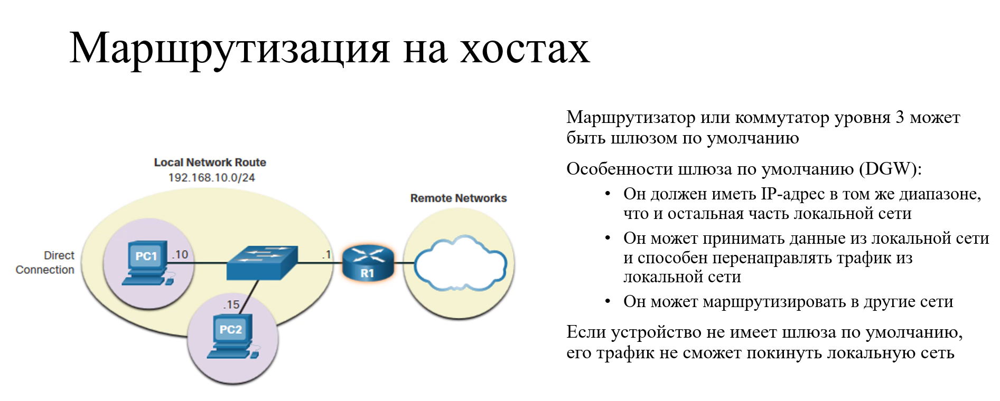

В таблице маршрутизации ПК при наличии настроенного шлюза по умолчанию создается маршрут по
умолчанию. Маршрут по умолчанию — маршрут или путь, по которому идет компьютер, когда он
пытается связаться с удаленной сетью.
И компьютер PC1, и компьютер PC2 будут иметь маршрут по умолчанию для отправки всего трафика,
предназначенного для удаленных сетей, к маршрутизатору R1.

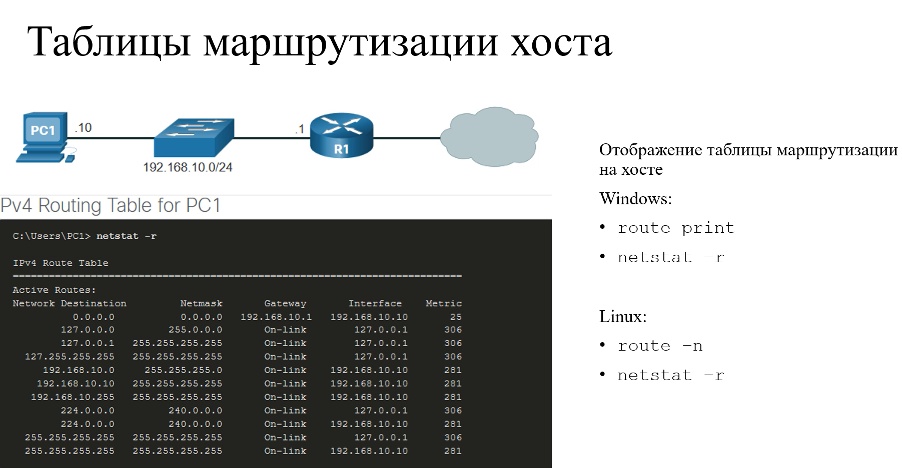

Столбцы таблицы маршрутизации:

* Список интерфейсов - MAC-адреса
* Таблица маршрутизации IPv4. Содержит все известные маршруты IPv4, включая
  прямые подключения, локальные сети и локальные маршруты, используемые по
  умолчанию.
* Таблица маршрутизации IPv6. Содержит все известные маршруты IPv6, включая
  прямые подключения, локальные сети и локальные маршруты, используемые по
  умолчанию.

Таблица маршрутизации содержит список маршрутов к известным сетям. Источником этой информации являются:

1. Сами подключенные сети
2. Статические маршруты
3. протоколы динамической маршрутизации

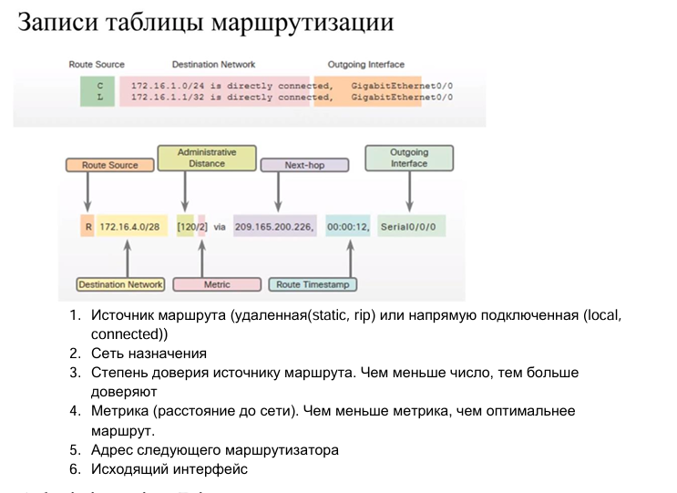

### Маршрутизация в общем смысле. Типы маршрутов.

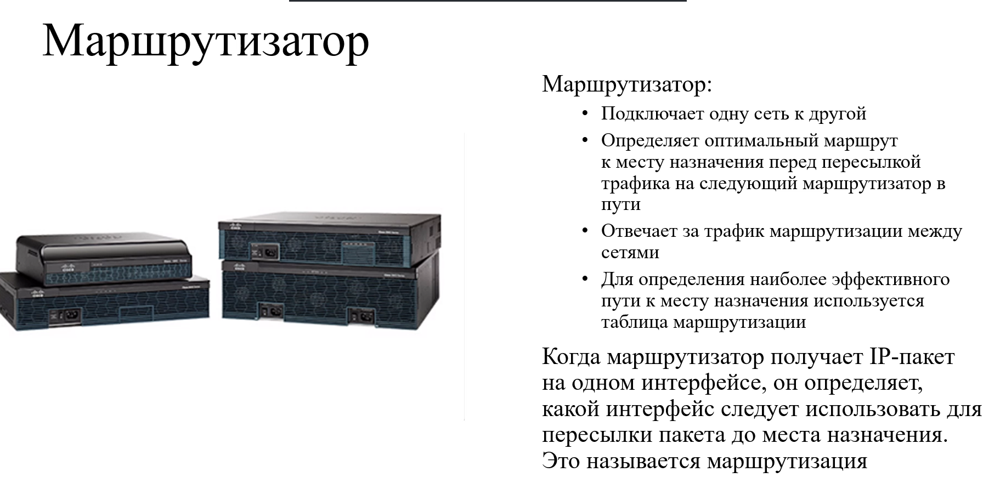

Построение крупной сети невозможно без маршрутизатора.

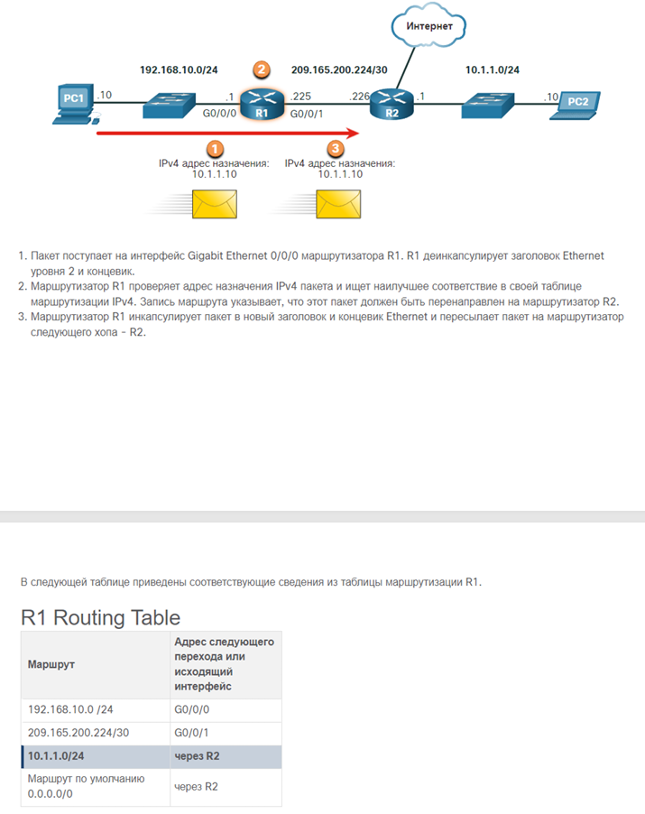

Маршрутизатор считывает IP-адрес назначения и просматривает свою таблицу
маршрутизации, определяя, куда нужно переслать пакет. Таблица маршрутизации содержит
список всех известных сетевых адресов (префиксов) и куда пересылать пакет. Эти записи
известны как записи маршрута или маршруты. Маршрутизатор пересылает пакет, используя
наилучшую соответствующую запись маршрута.

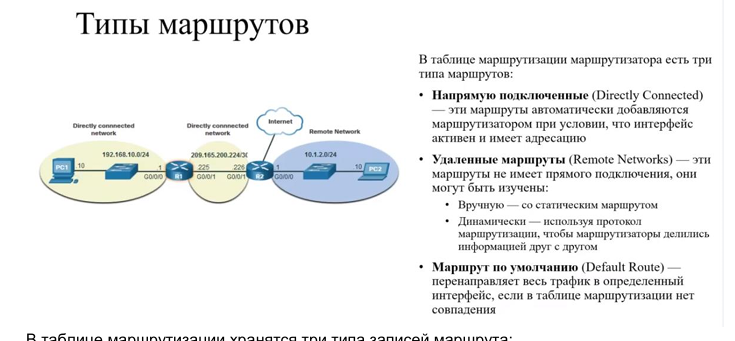

Правило ! Отдельный интерфейс - отдельная сеть

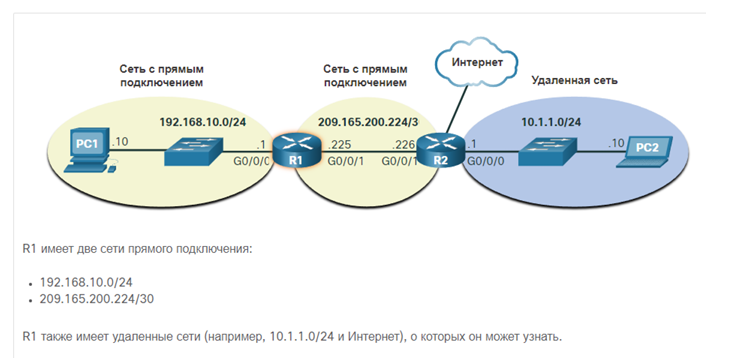

Маршрутизатор может узнать о удаленных сетях одним из двух способов:

* Вручную. Данные об удаленных сетях вручную вводятся в таблицу маршрутов с
  использованием статических маршрутов.
* Динамически. Удаленные маршруты автоматически добавляются с использованием
  протокола динамической маршрутизации.

### Статическая и динамическая маршрутизации.

Статические маршруты - это записи маршрутов, которые настраиваются вручную. На
рисунке показан пример статического маршрута, настроенного вручную на маршрутизаторе
R1. Статический маршрут включает в себя адрес удаленной сети и IP-адрес
маршрутизатора следующего перехода.

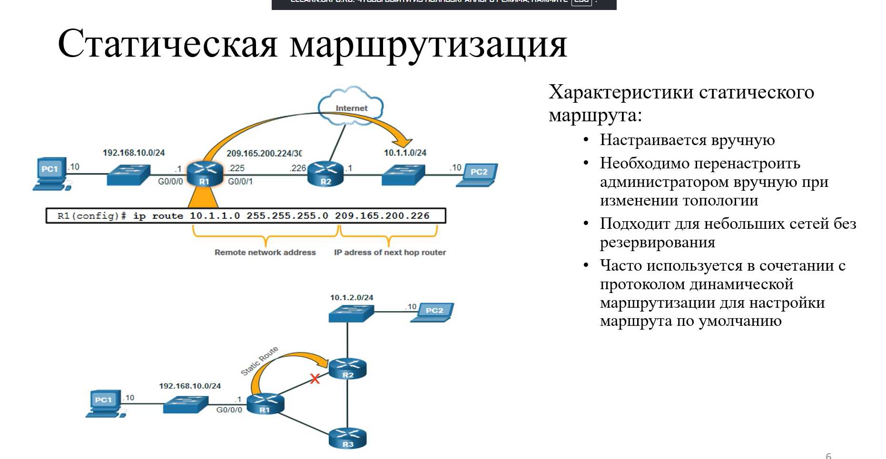

Протокол динамической маршрутизации позволяет маршрутизаторам автоматически получать
информацию о удаленных сетях, включая маршрут по умолчанию, от других маршрутизаторов.
Маршрутизаторы, использующие протоколы динамической маршрутизации, автоматически
обмениваются информацией о маршрутизации с другими маршрутизаторами и выполняют
обновления в случае каких-либо изменений в топологии без участия сетевого администратора. При
изменении топологии сети маршрутизаторы совместно используют эту информацию с помощью
протокола динамической маршрутизации и автоматически обновляют свои таблицы маршрутизации.
Протоколы динамической маршрутизации включают OSPF и расширенный протокол маршрутизации
внутреннего шлюза (EIGRP). На рисунке показан пример того, как маршрутизаторы R1 и R2
автоматически используют сетевую информацию с помощью протокола маршрутизации OSPF

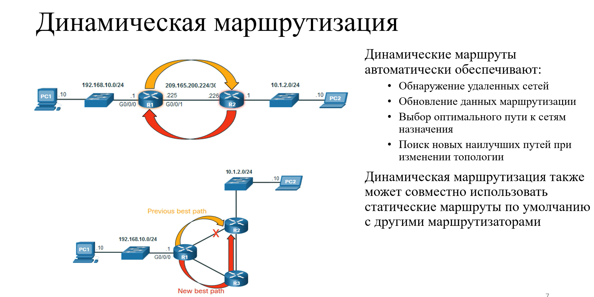

**Таблица маршрутизации**

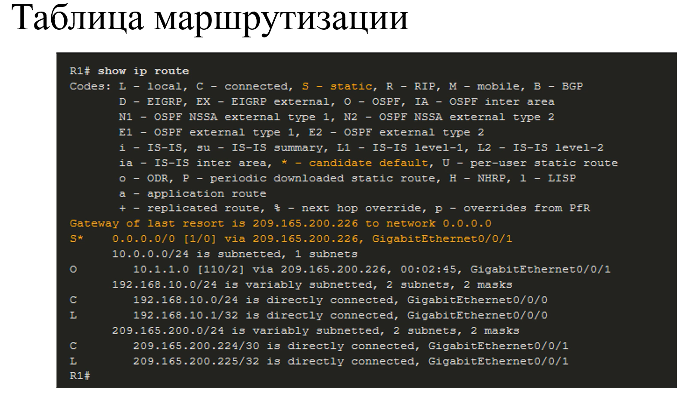

Команда show ip route привилегированного режима EXEC используется для просмотра
таблицы маршрутизации IPv4 на маршрутизаторе Cisco IOS. В примере показана таблица
маршрутизации IPv4 маршрутизатора R1. В начале каждой записи таблицы маршрутизации
находится код, который используется для идентификации типа маршрута или способа его
изучения. К общим источникам маршрутов (кодам) относятся следующие:

* "*" - маршрут по умолчанию
* L - IP-адрес локального интерфейса с прямым подключением
* C – Присоединенная напрямую сеть
* S — Статический маршрут был вручную настроен администратором
* O - OSPF
* D - EIGRP

В таблице маршрутизации отображаются все известные маршруты назначения IPv4 для R1.
Маршрут по умолчанию (default route) имеет сетевой адрес всех нулей. Например, сетевой
адрес IPv4 — 0.0.0.0. Статическая запись маршрута в таблице маршрутизации начинается с
кода S\ *, как показано в примере.

### Механизмы пересылки пакетов.

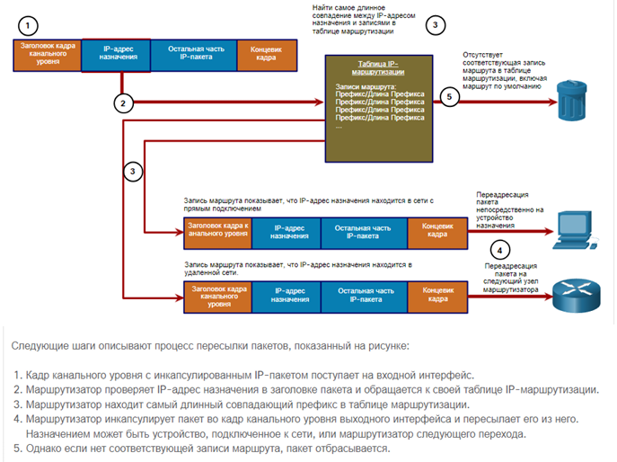

Основной задачей функции пересылки пакетов является инкапсуляция пакетов в соответсвующий тип кадра канала передачи
данных для исходящего интерфейса.

Маршрутизаторы поддерживают 3 механизма пересылки пакетов:

* Программная коммутация
* Быстрая коммутация
* CEF

#### Программная коммутация

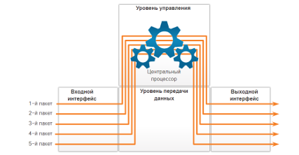

Механизм пересылки пакетов, прибывающий на интерфейс пакет пересылаться на уровень управления, где центральный процессор
сопоставляет адрес назначения с записью в таблице маршрутизации, а затем определяет выходной интерфейс и пересылает
пакет.

Нагруженный и медленный метод - устаревший метод

#### Быстрая коммутация

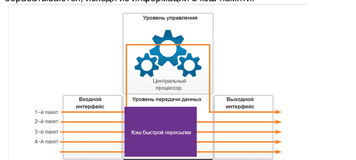

Маршрутизатор получает на входной интерфейс

#### CEF

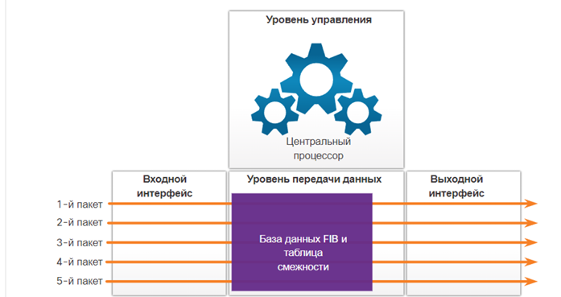

CEF создает таблицу для быстрой пересылки пакетов(FIB) и таблицу смежности. Записи таблицы инфицированны изменениями -
например изменения в сетевой топологии. По завершении сходимости сети в базе
данных FIB и таблице смежности содержится вся информация, необходимая
маршрутизатору при пересылке пакета.

Три механизма пересылки пакетов можно описать, проведя следующую аналогию:

* Программная коммутация делает все расчеты каждый раз, даже в случае решения
  идентичных проблем.
* Быстрая коммутация делает расчеты один раз, запоминая ответ для последующих
  идентичных случаев.
* Механизм CEF решает каждую из возможных проблем заранее, внося ее в
  электронную таблицу.

### Базовая настройка маршрутизатора

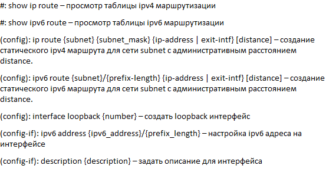
