# Маршрутизация

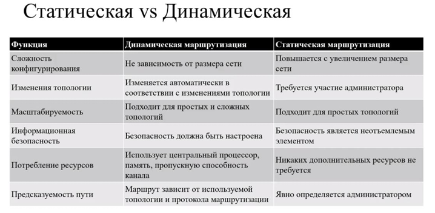

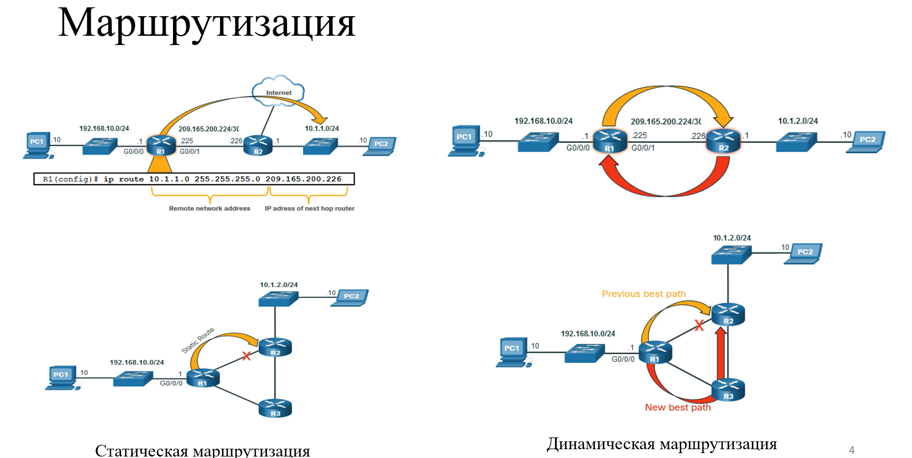

### Статическая маршрутизация. Типы статических маршрутов.


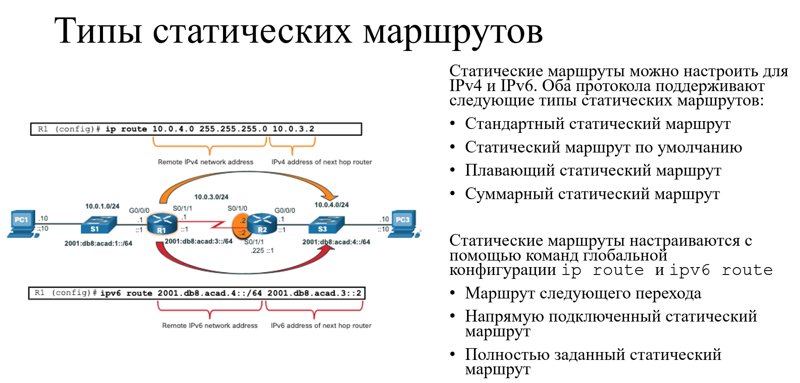

```
config()# ip route address maska {address} [disctance]  

{address} - адрес следующего маршрута 
[distance] - административная дистанция
```

**Маршрут следующего перехода.** Указывается только IP-адрес следующего перехода.

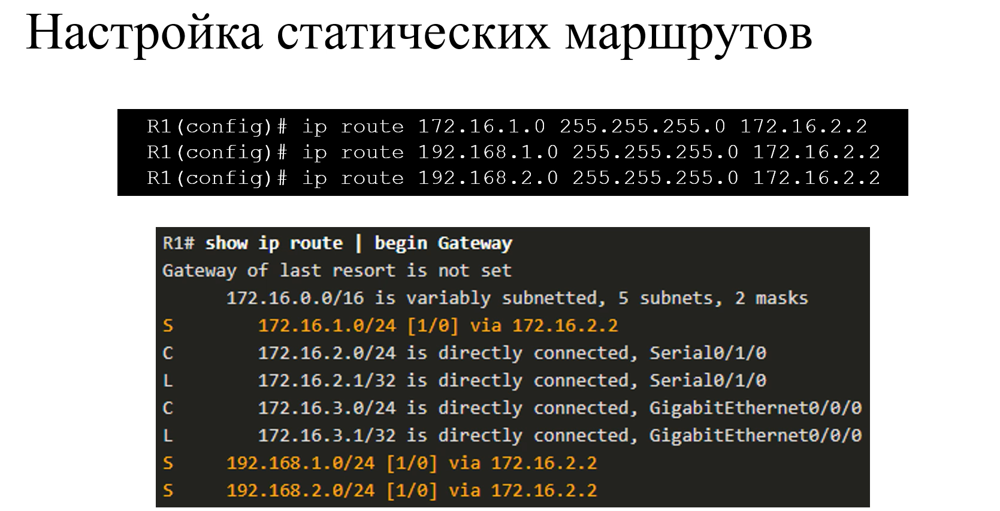

!!!Только для serial!!!

**Полностью заданный статический маршрут.** Указывается только интерфейс выхода
маршрутизатора.


При использовании Ethernet маршрутизатор не знает, что на конце одно устройство, а не множество, поэтому потребуется в
конце передавать IP-адрес следующего маршрутизатора.

**Статический маршрут по умолчанию**

```
ip route 0.0.0.0 0.0.0.0
```

**Плавающий статический маршрут**

Плавающие статические маршруты — это статические маршруты, используемые для
предоставления резервного пути основному статическому маршруту или динамическому маршруту
на случай сбоя в работе канала. Плавающий статический маршрут используется только тогда, когда
основной маршрут недоступен.
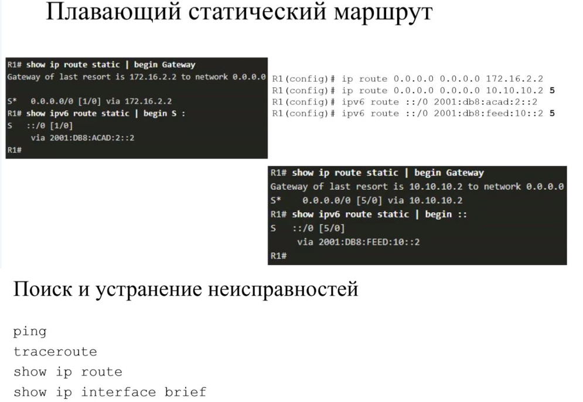

### Динамическая маршрутизация. Классификация протоколов маршрутизации.

Протокол RIP стал одним из первых протоколов маршрутизации. Первая версия (RIPv1) появилась в
1988 г
Наряду с развитием и усложнением сетей возникла необходимость в новых протоколах
маршрутизации. Позднее протокол RIP был обновлен до версии RIPv2, которая лучше
соответствовала потребностям новых крупных сетей того времени.

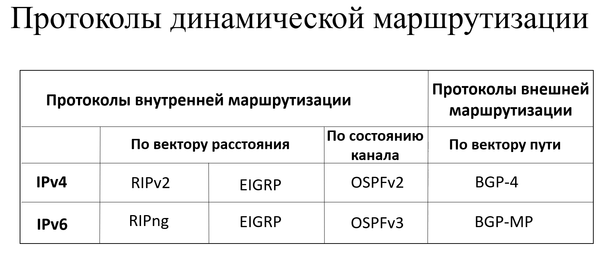

Протоклы внутреннего шлюза (IGP) — это протоколы маршрутизации, используемые для обмена информацией о маршрутизации в
домене маршрутизации, управляемом одной организацией. Существует только один EGP и это BGP.

BGP используется для обмена информацией о маршрутизации между различными организациями,
известными как автономные системы (AS)

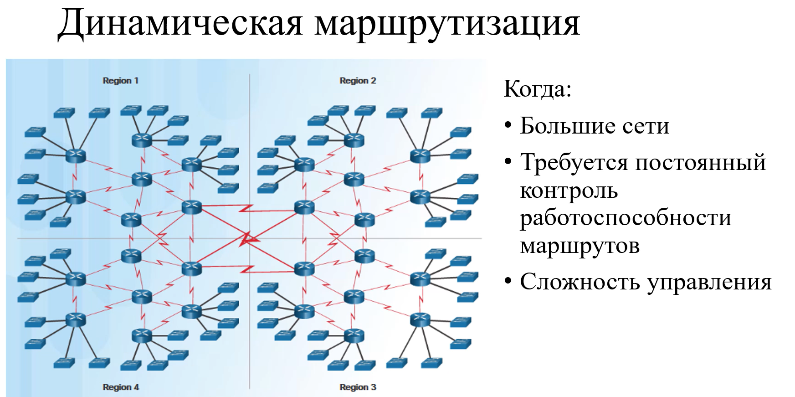

В динамической маршрутизации в больших сетях подразумевается частое изменение топологии, т.е какие-то сети могут
добавляться/отпадывать сети.

### Задачи протоколов маршрутизации. Компоненты.


Протоколы динамической маршрутизации включают в себя следующие компоненты:

*	Структуры данных: таблицы/базы данных (в RAM).
*	Сообщения протокола маршрутизации: для обнаружения соседей, обмена информацией.
*	Алгоритм: для обмена данными и определения оптимального пути.


### Алгоритм работы протокола маршрутизации

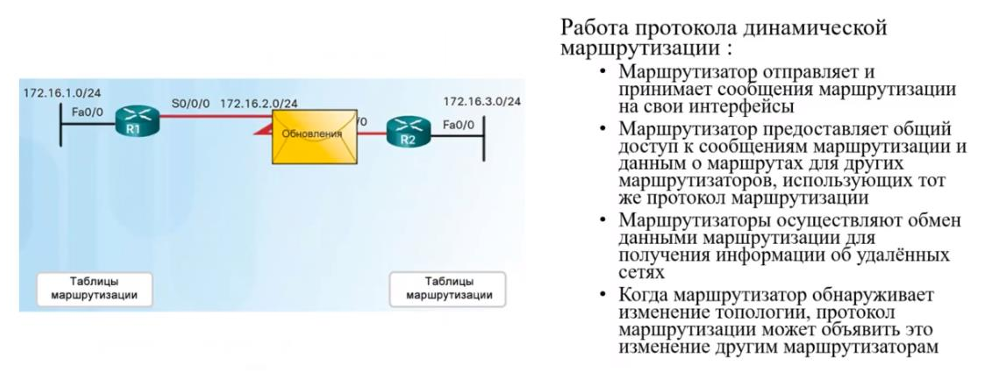

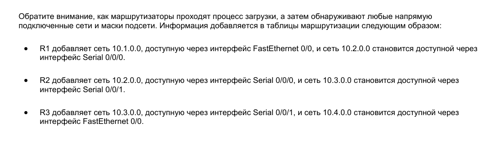

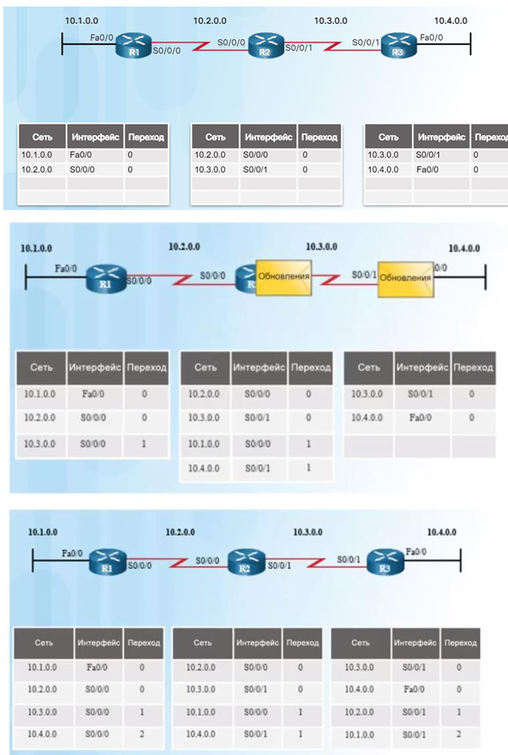

### RIP: определение, описание, версии, принцип работы

Протокол RIP — протокол маршрутизации первого поколения для среды IPv4, изначально указанный в RFC 1058.
Настройка этого протокола достаточно проста, что делает его оптимальным протоколом для реализации в небольших
сетях.

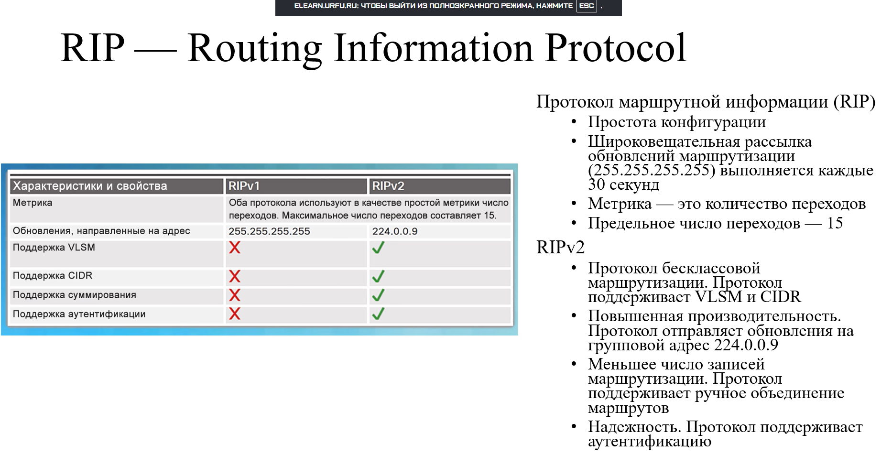

``` 
(config)# router rip
(conf-router)# version 2
network ip_network  - какие сети участвуют в обмене сообщениями.  
  2 функции: указать какие сети будут вещать и указать какие интерфейсы
      являются частью домена маршрутизации выбранного протокола
```

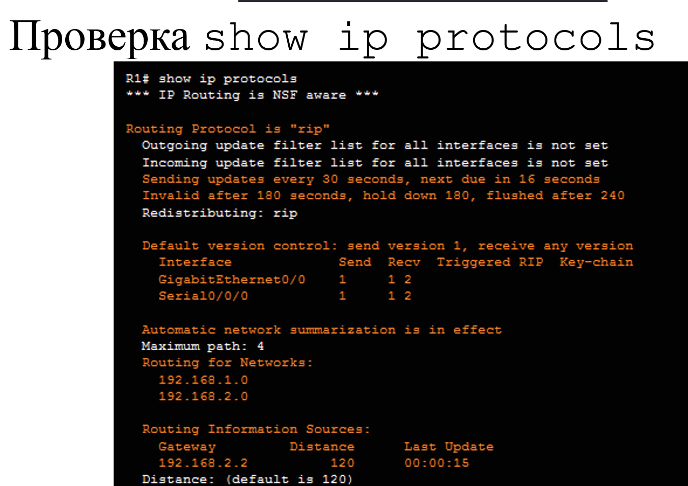

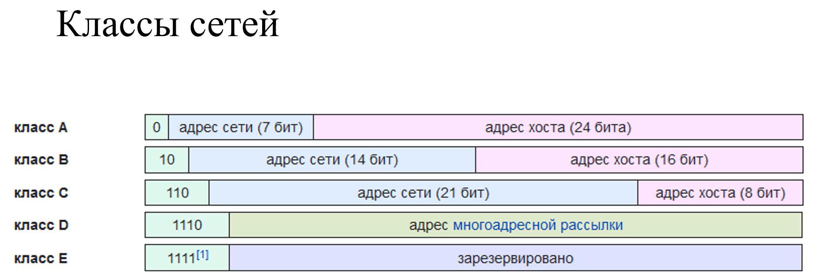

Класс определяется по первым битам.
Сеть – это классовая сеть. Все сети, которые не относятся к классовому разделению, являются
подсетями.

Если хотим отдельно учитывать адреса на каждом интерфейсе:

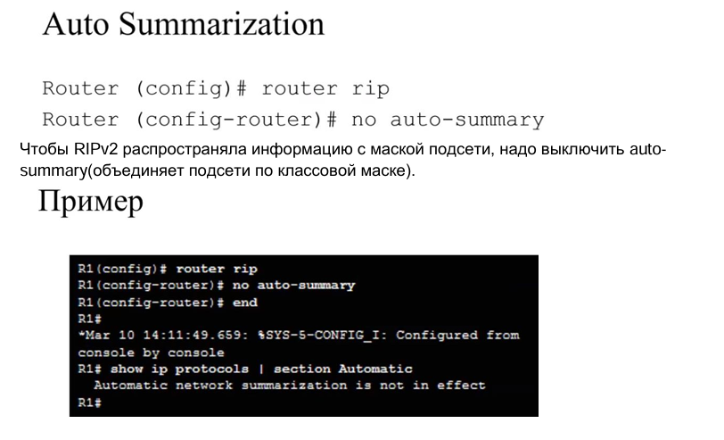

Интерфейсы в которые мы не хотим распространять служебные сообщения протоколов
маршрутизации, но хотим рассказывать об этих сетях. Не хотим посылать в сеть где клиенты
подключены служебные сообщения.

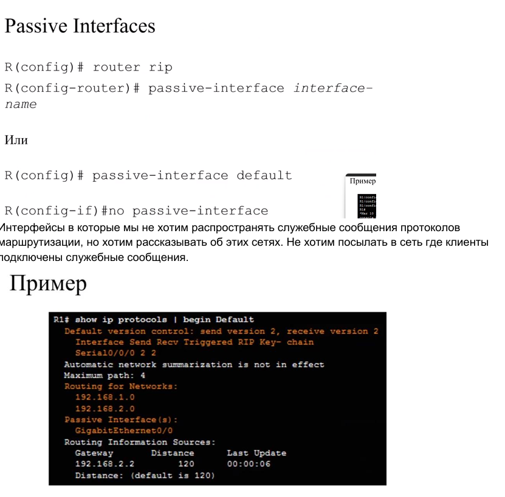

Нужно для увелечения безопасности.

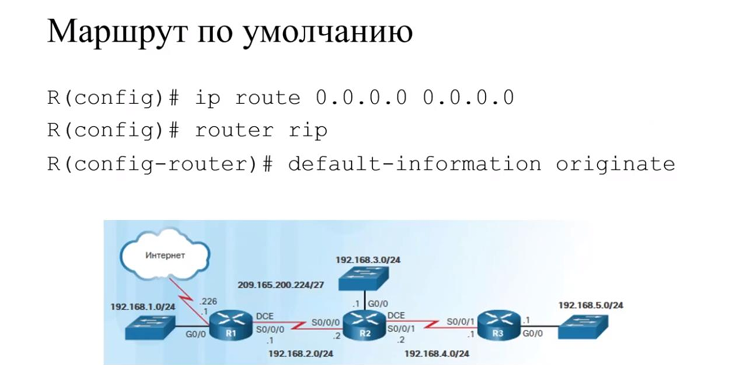

default-information originate - позволяет протоколу rip распространить маршрут по умолчанию

### Записи таблицы маршрутизации. Вид и устройство таблицы маршрутизации.

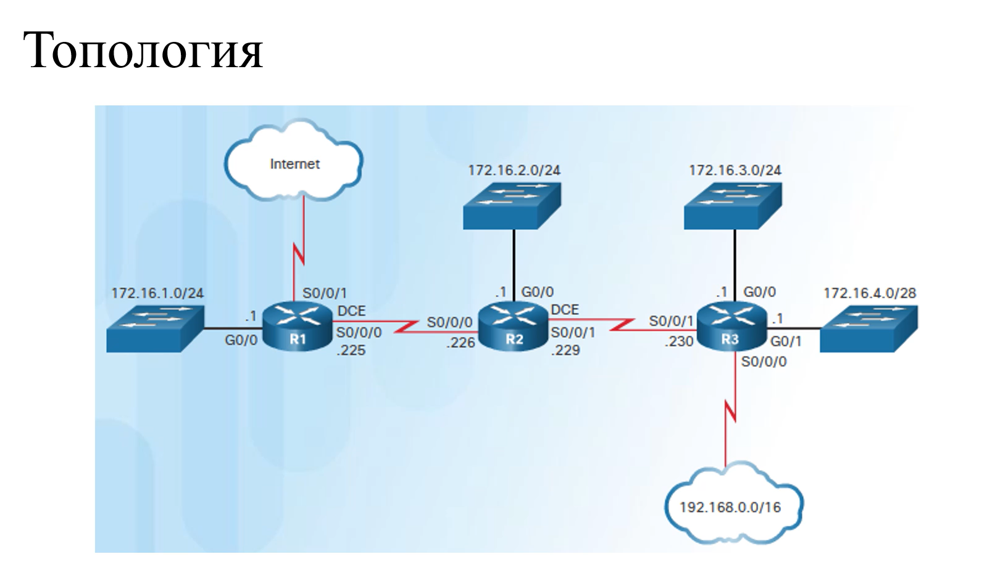

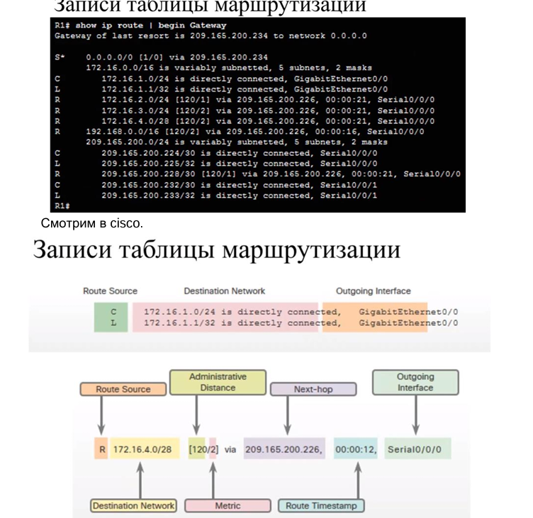

1. Источник маршрута(удаленная(static, rip) или напрямую подключенная (local,
   connected))
2. Сеть назначения
3. Степень доверия источнику маршрута. Чем меньше число, тем больше
   доверяют
4. Метрика (расстояние до сети). Чем меньше метрика, чем оптимальнее
   маршрут.
5. Адрес следующего маршрутизатора
6. Исходящий интерфейс

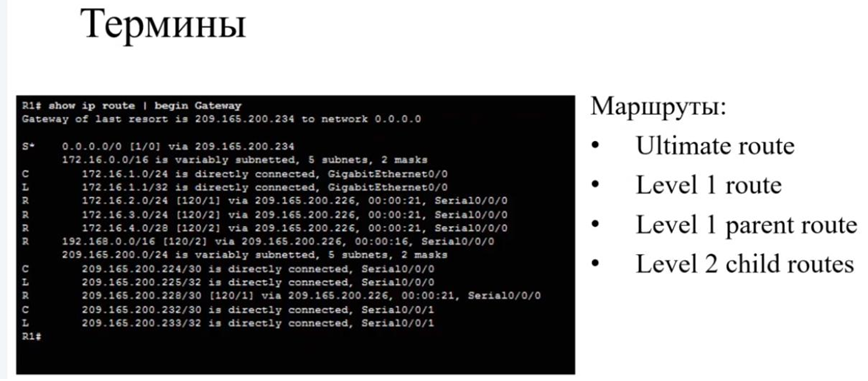

Вертикальная иерархия. Смещение слева (неровные столбики)

1. Окончательные маршруты
2. Маршруты уровня 1
3. Родительский маршрут уровня 1
4. Дочерние маршруты второго уровня

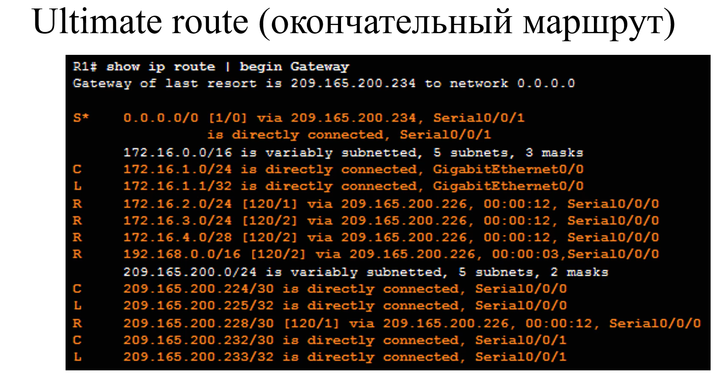

Строчка которой можно воспользоваться для отправки трафика. По ней сразу известно куда
отправить трафик. Оранжевым цветом. Указан либо интерфейс, либо адрес следующего
маршрутизатора, либо и то и другое

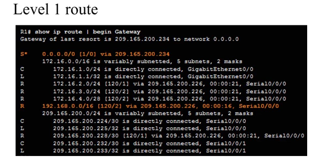

Маска меньше чем классовая.
Либо классовая сеть, либо объединение сетей, либо маршрут по умолчанию.

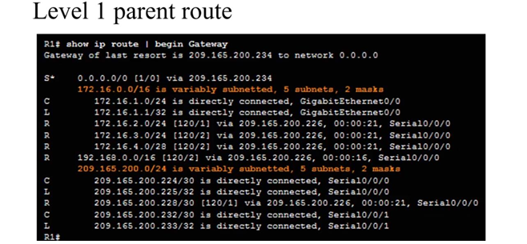

Классовая сеть, которая не указывает куда дальше отправиться трафику. Ей нельзя
воспользоваться, чтобы отправить трафик.

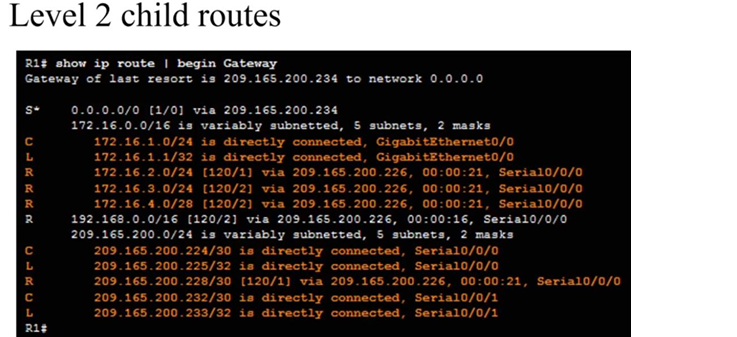

Подсети родительских сетей. Являются окончательными.

### Процесс поиска маршрута по таблице маршрутизации.

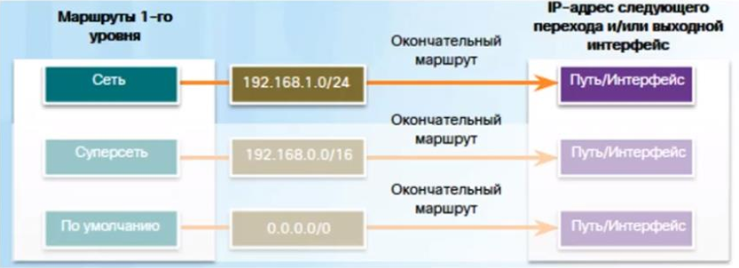

Пришел пакет. Сперва просматриваются маршруты первого уровня, которые окончательные. С
наилучшим совпадением по маске.


В первый уровень также попадают родительские маршруты. Если совпали с записью родительского
маршрута (который не является окончательным), тогда смотрим по дочерним маршрутам.

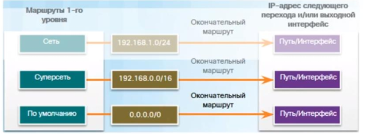

Дальше переходим к следующей записи. Суперсеть – объединение сетей. Маска меньше и
совпадение требуется то.е меньше. Если не совпали и нет маршрута по умолчанию, то отбрасываем
пакет.  
Плюс в том, что если нет совпадений по родительским маршрутам, то и дочерние смотреть не
нужно. А это большой блок данных.
Статический маршрут лучше указывать полностью, иначе придется делать поиск по таблице
маршрутизации 2 раза. Второй чтобы найти выходящий интерфейс.
