# IP-адресация

### Определение IP-протокола. Его задачи.

IP – основной протокол сетевого уровня.

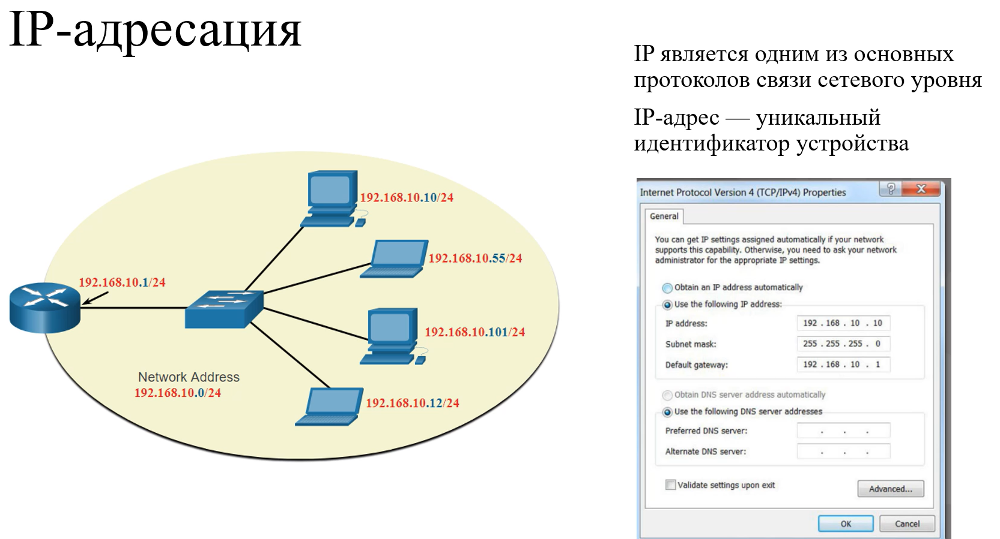

Протоколы сетевого уровня (IPv4 и IPv6) указывают структуру пакета и тип обработки, которые используются для перемещения
данных от одного узла к другому.

Основные характеристики IP:

* Без установления соединения - означает, что перед отправкой пакетов данных соединение с
  хостом назначения не устанавливается.
* Негарантированная доставка - показывает, что IP-протокол по своей сути неустойчив, так как
  доставка пакетов не гарантируется.
* Независимость от среды - работа не зависит от средства подключения (медный,
  оптоволоконный кабель или беспроводная среда).

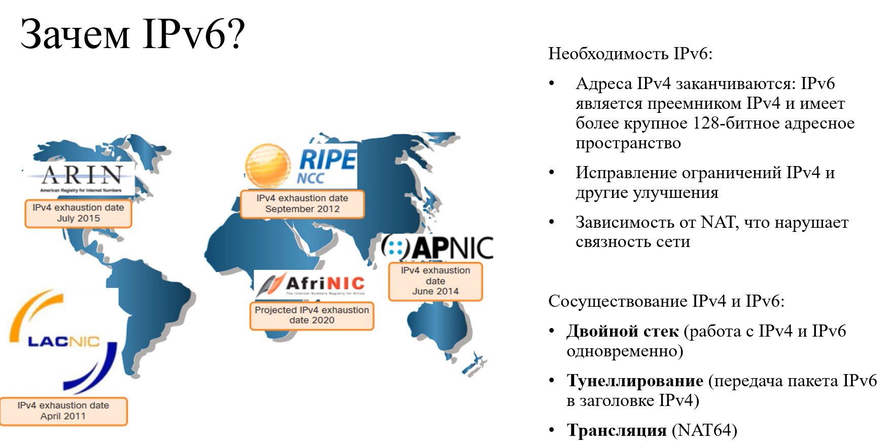

NAT - технология, которая преобразует локальные адреса в глобальные адреса.

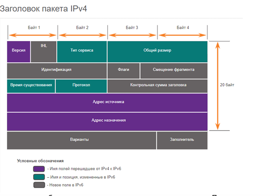

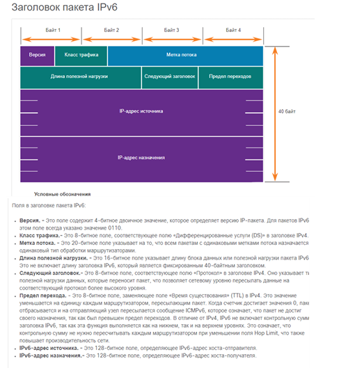

### Версии IP. Формат адресов.

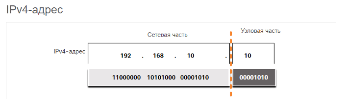

Маска подсети IPv4 — это 32-битовое значение, которое отделяет сетевую часть адреса от хостовой
части. При назначении устройству IPv4-адреса для определения адреса сети, к которому относится
данное устройство, используется маска подсети. Сетевой адрес представляет все устройства в одной
сети.

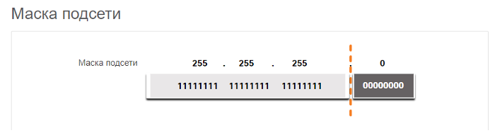

Для назначения адреса IPv4 узлу требуется следующее:

* IPv4 адрес - это уникальный IPv4 адрес хоста.
* Маска подсети - используется для определения сетевой части и части хоста адреса IPv4

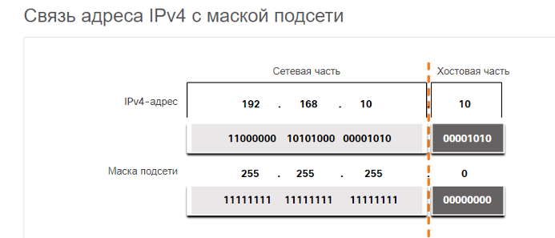

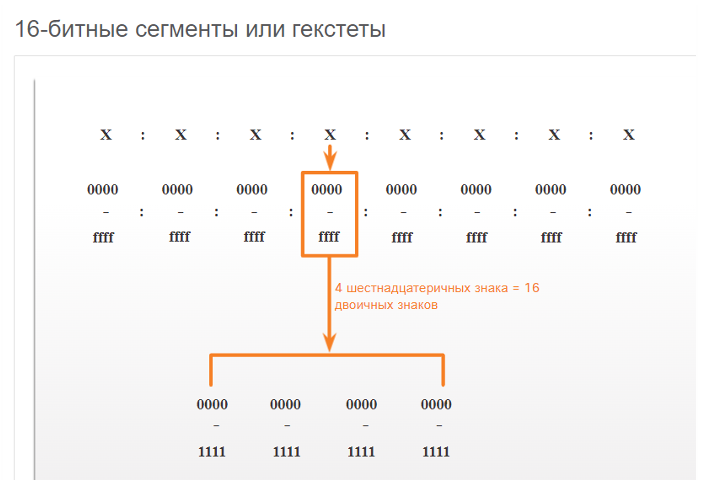

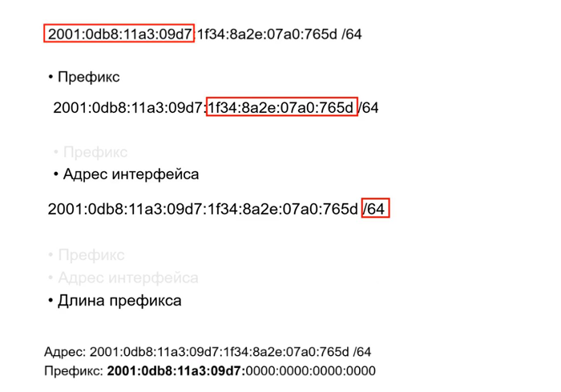

### Типы рассылки IPv4 и IPv6.

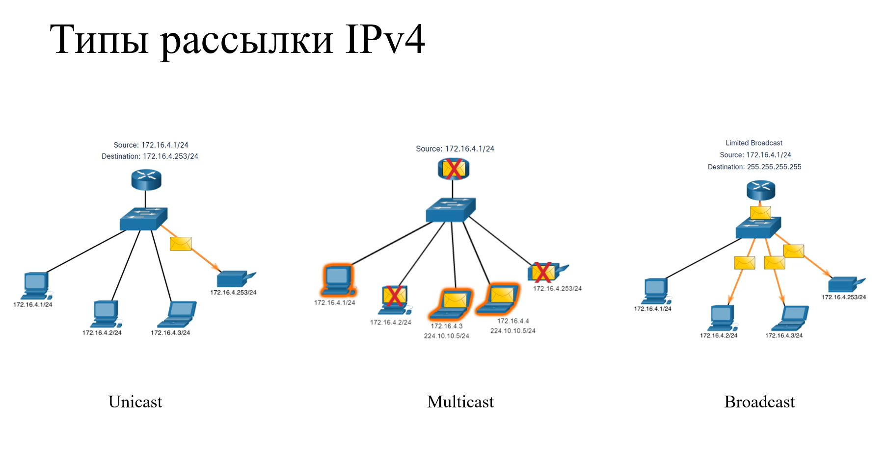

Одноадресная передача - относится к одному устройству, отправляющее сообщение другому устройству. Один-в-Один

Широковещательная передача - Один ко всем в сети.

* Направленная широковещательная рассылка (все единицы в хостовой части).
* Ограниченная широковещательная рассылка (255.255.255.255).

Многоадресная передача - один к выбранной группе.

Как и в случае IPv4, существуют различные типы адресов IPv6. На самом деле, существует три широкие
категории адресов IPv6:

* Индивидуальный (или одноадресной рассылки, unicast) : служит для однозначного
  определения интерфейса на устройстве под управлением протокола IPv6.
* Групповой (или адрес многоадресной рассылки) : используется для отправки одного IPv6
  пакета на несколько адресов назначения.
* Произвольный (или адрес произвольной рассылки) : любой индивидуальный IPv6-адрес,
  который может быть назначен нескольким устройствам. Пакет, отправляемый на адрес
  произвольной рассылки, направляется к ближайшему устройству с этим адресом. Произвольные
  адреса в данном курсе не рассматриваются.

В отличие от IPv4, IPv6 не использует широковещательный адрес. Однако есть групповой IPv6-адрес для
всех узлов, который дает аналогичный результат

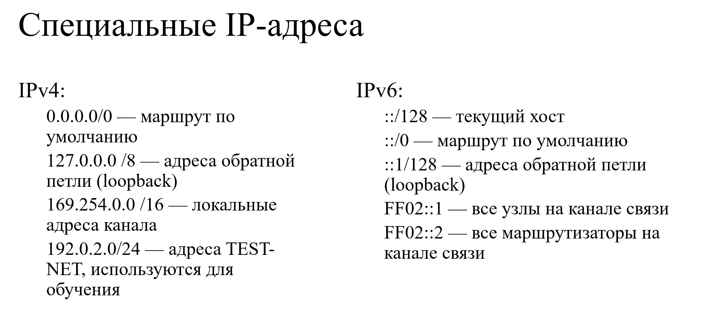

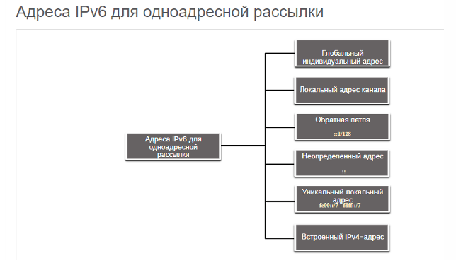

### Области действия IPv4 и IPv6.

Ipv4 делится на частные и публичные.

Публичные IPv4-адреса представляют собой адреса, на глобальном уровне маршрутизируемые между маршрутизаторами
интернет-провайдеров. Но есть частные адреса, которые в больших компаниях назначаются в качестве внутренних хостов.

**Сетевой и широковещательный адреса** - первый и последний адрес сети не могут быть назначены конечным узлам

**Loopback** - 127.0.0.1 спец адрес, который отправляет все сообщения на узел
отправителя. [127.0.0.1-127.255.255.255 зарезервированы]

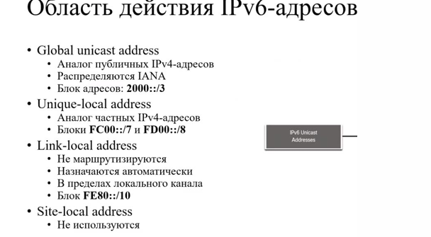

Адреса IPv6 обычно имеют два одноадресных адреса:

* Глобальный индивидуальный адрес(GUA) аналогичен публичному IPv4-адресу.
* Локальный адрес канала (LLA) — это необходимо для каждого устройства с поддержкой IPv6.

**Глобальные индивидуальные IPv6-адреса (GUA)**

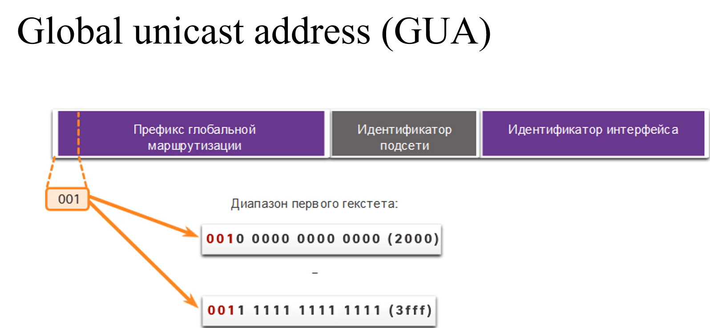

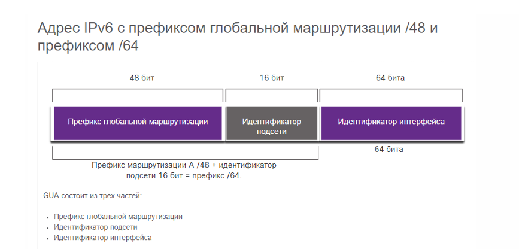

**Локальный адрес канала (LLA)**

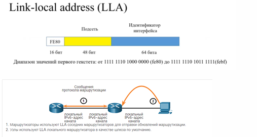

### Способы назначения адресов IPv4 и IPv6.

#### Статическая настройка адресов:

IPv6 не работает без глобальной маршрутизации.

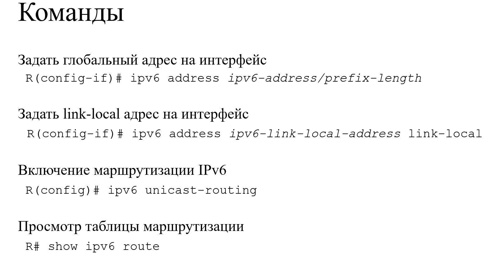

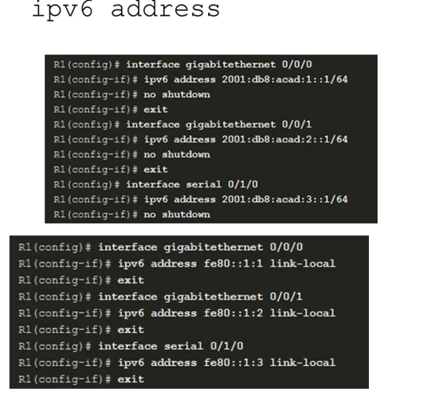

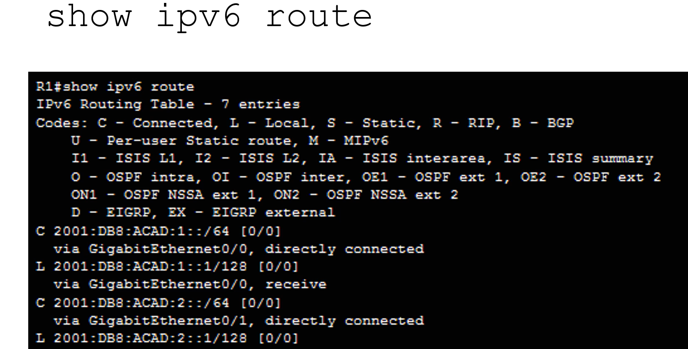

Задание IPv6 на хосте:

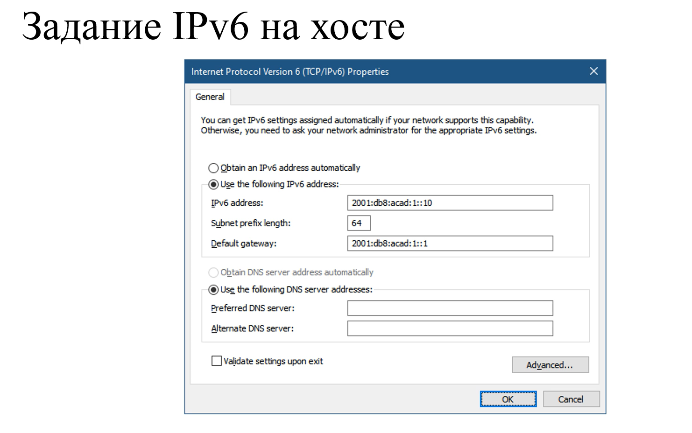

#### Динамическая настройка адресов

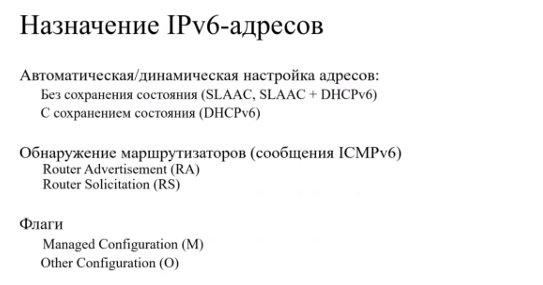

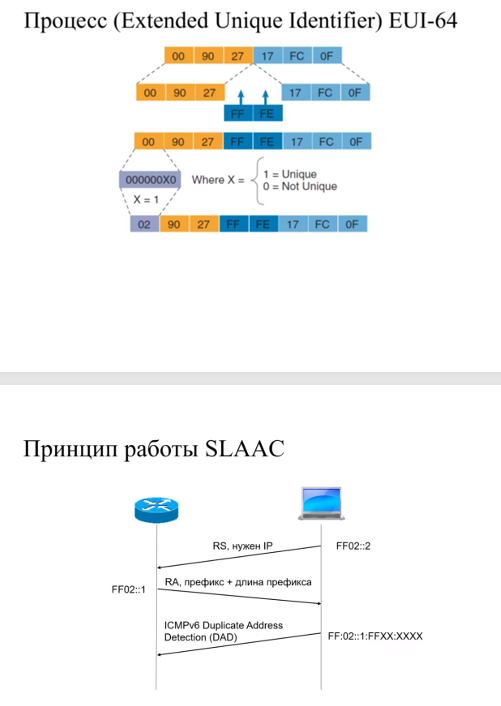

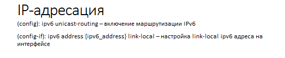