# DHCP

### Определение. Алгоритм работы DHCP. Ретрансляция DHCP.

#### DHCPv4

Протокол динамической конфигурации хоста (DHCP), DHCPv4 - сетевой протокол, который динамически назначает IPv4-адреса и
другую
информацию о конфигурации сети устройствам в сети. Он работает по модели "клиент-сервер", что позволяет сетевым
администраторам экономить время, особенно в сетях с большим количеством стационарных устройств.

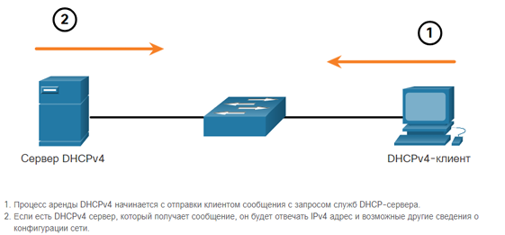

**Алгоритм работы DHCPv4**

1. DHCPDISCOVER: Клиент отправляет широковещательный запрос для обнаружения DHCP-сервера при подключении к сети.
2. DHCPOFFER: Сервер отвечает предложением адреса из пула, отправляя его в виде одноадресной или широковещательной
   рассылки в соответствии с IETF RFC 2131.
3. DHCPREQUEST: Клиент запрашивает предложенный адрес, подтверждая его прием.
4. DHCPACK: Сервер подтверждает запрос, завершая аренду, которая обычно длится от 24 часов до недели, как определено
   администратором.

**Продление аренды**: До истечения срока аренды клиент инициирует двухэтапный процесс продления

1. DHCPREQUEST: Отправляется первоначальному серверу; при отсутствии ответа отправляется широковещательный запрос для
   поиска другого сервера.
2. DHCPACK: Сервер подтверждает продление, возвращая адрес в пул, если клиент больше не нуждается в нем.

*Для настройки DHCPv4 Cisco IOS нужно*:

* Исключить IPv4 адреса
* Определить имя пула DHCPv4
* Создание пула DHCPv4

**Создание пула DHCPv4**

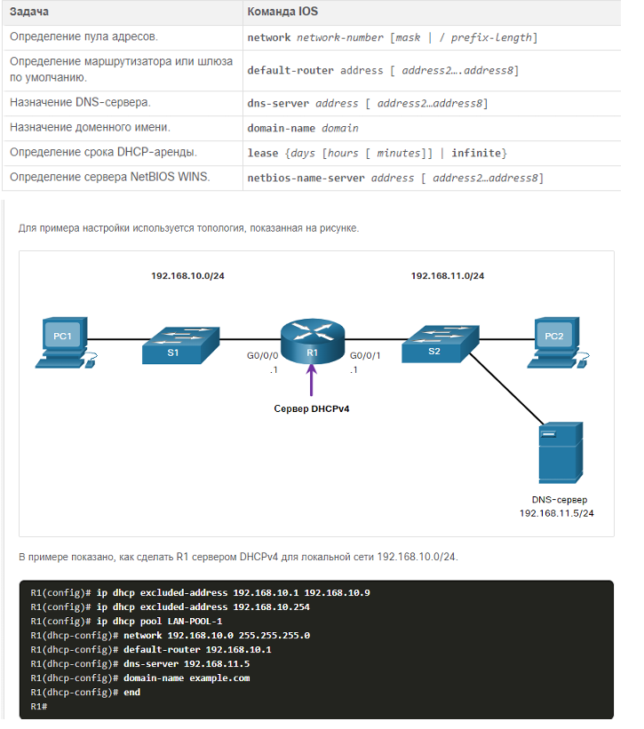

(config-if): ipv6 dhcp relay destination {ipv6_address} {exit_intf} – настройка ipv6 ретрансляции на интерфейсе

Команды проверки:

**show run | section dhcp** -

**show ip dhcp binding**

**show ip dhcp server statistics** - показывает кол-во пакетов которые были получены и переданы dhcp сервером

На клиенте:

**ipconfig /all**
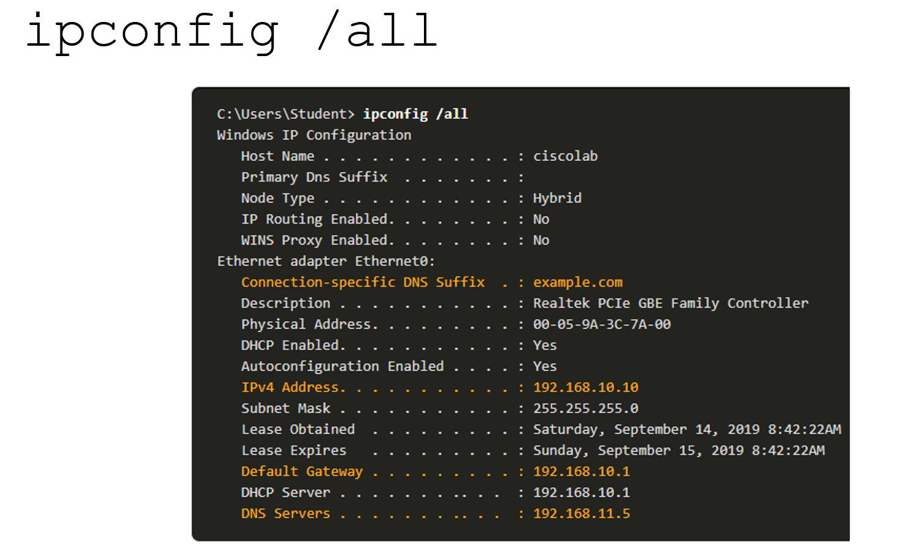

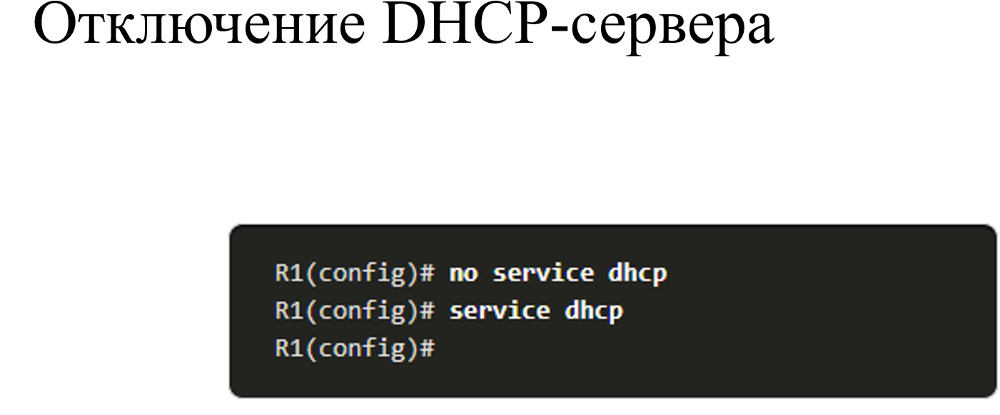

**DHCPv4-ретрансляция**

Определение: В сложных сетях серверы DHCP часто находятся в других подсетях. Ретрансляция DHCP позволяет роутеру
передавать широковещательные запросы клиентов на удаленный DHCP-сервер.

Включение ретрансляции:

**ip helper-address address**

Интерфейс который мы должны настраивать - это интерфейс подключенный к локальной сети.

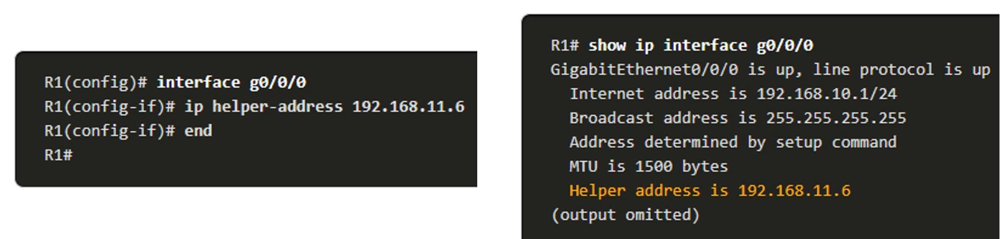

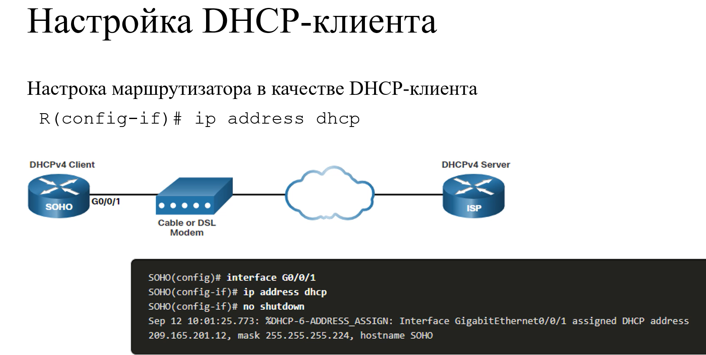

### Методы назначения IPv6. Алгоритмы работы.

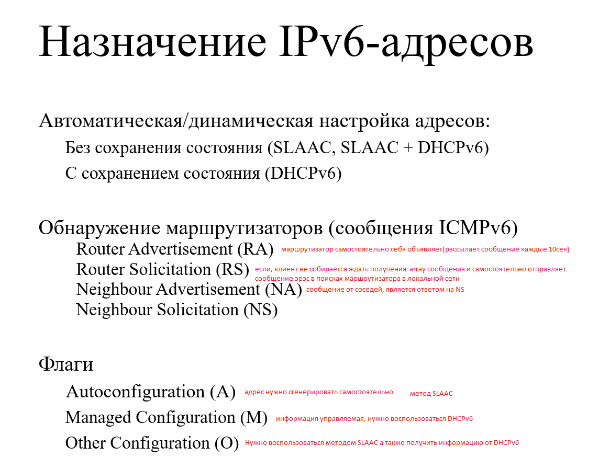
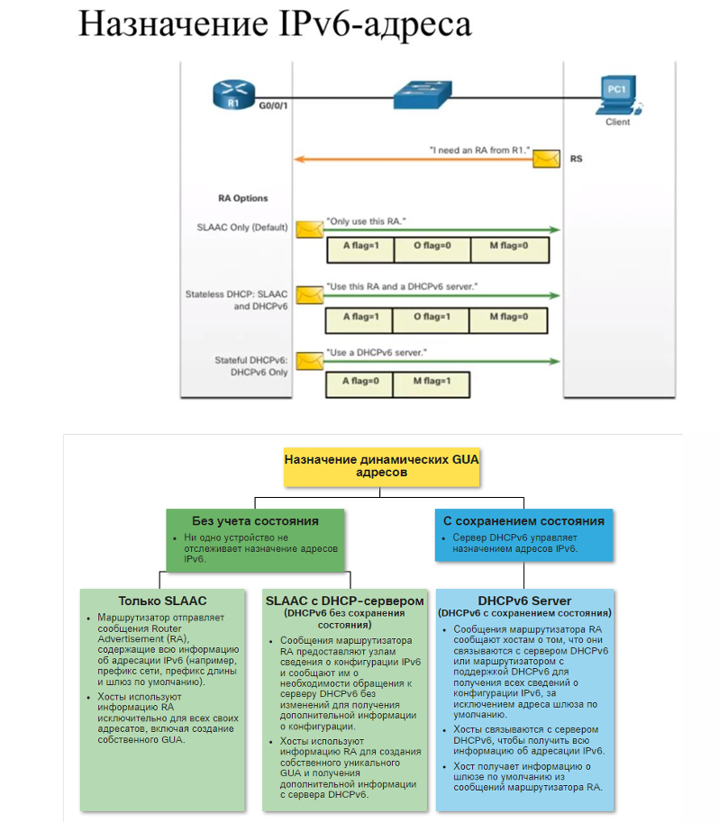

#### SLAAC

Алгоритм:

* Маршрутизатор отправляет RA каждые 200 секунд или по запросу Router Solicitation (RS) на FF02::2.
* Хост формирует адрес, комбинируя 64-битный префикс из RA с 64-битным IID.
* DAD (Duplicate Address Detection): Хост отправляет Neighbor Solicitation (NS) на адрес многоадресной рассылки
  запрашиваемого узла (последние 24 бита дублируют адрес) для проверки уникальности.

**Метод SLAAC** только включен по умолчанию при настройке команды **ipv6 unicast-routing**

Флаг A = 1 предлагает клиенту создать свой собственный IPv6 GUA, используя префикс, объявленный в
RA.

#### DHCPv6

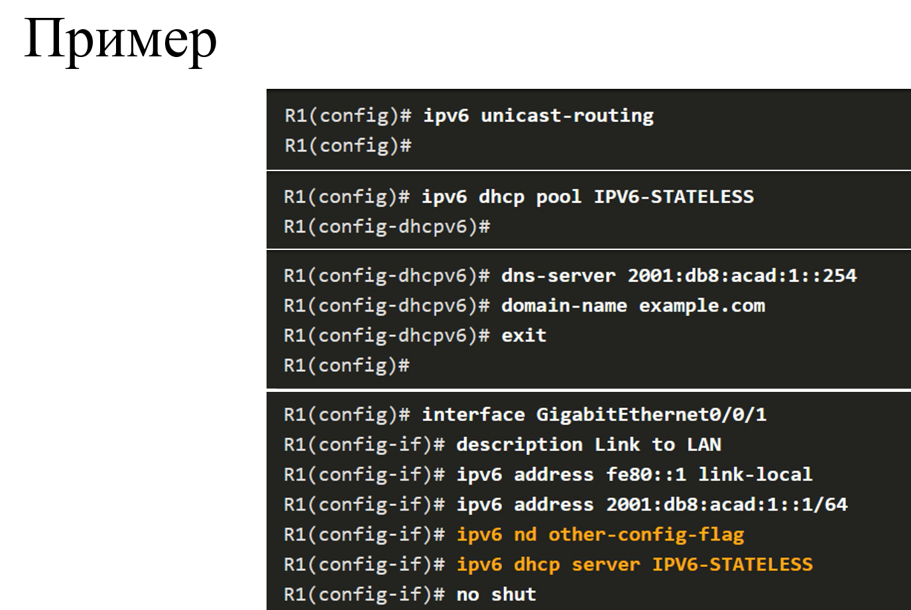

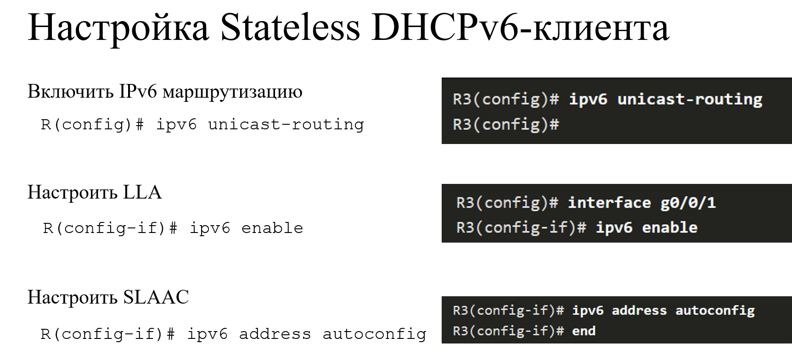
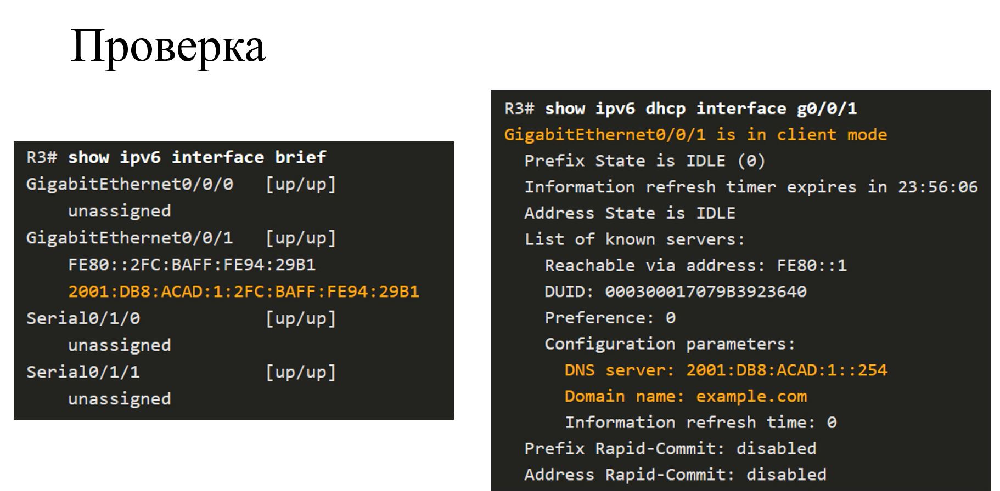

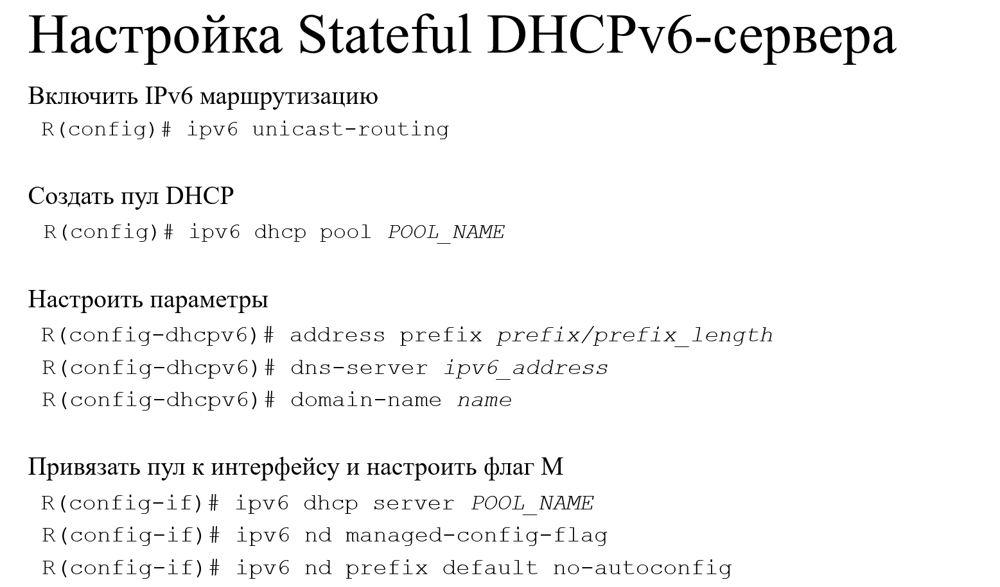
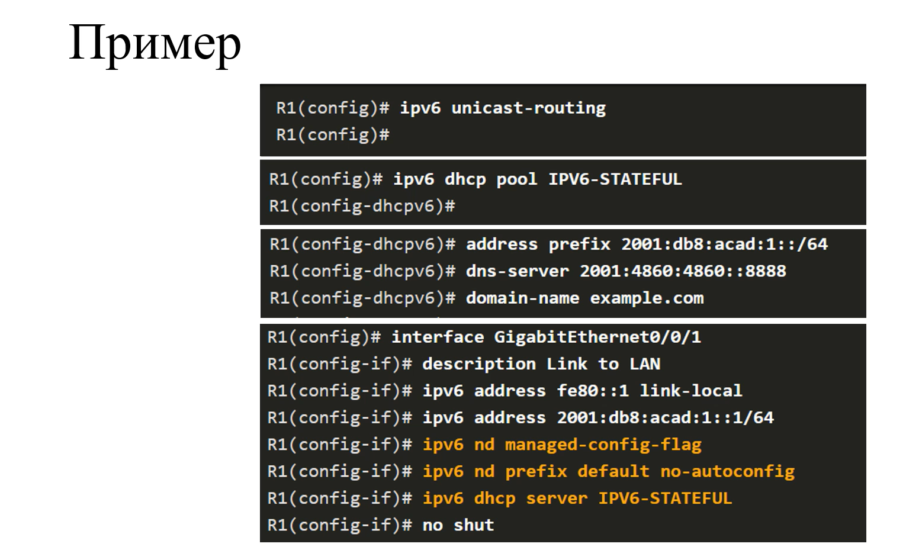

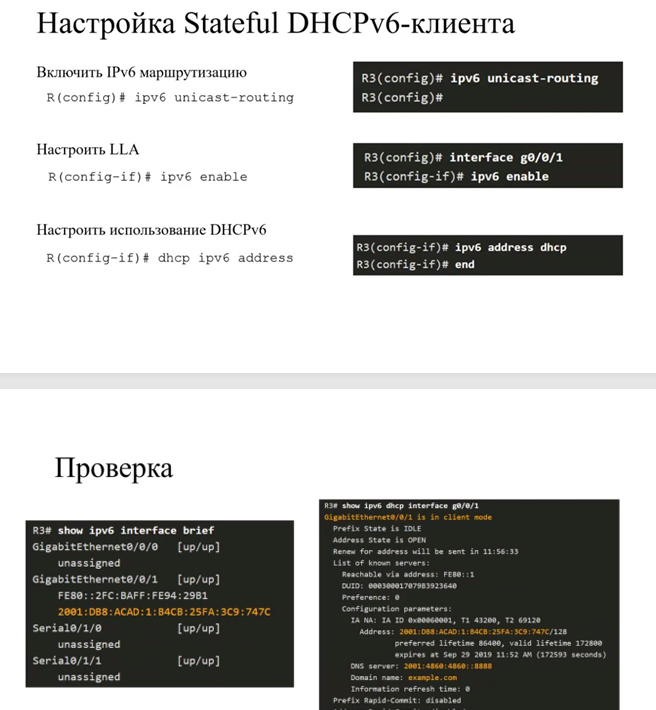

#: show ipv6 dhcp pool – посмотреть настройки пулов ipv6 адресов

### Использование сообщений ICMPv6 для работы IPv6.

Роль ICMPv6: Протокол ICMPv6 обеспечивает диагностику и управление в IPv6, инкапсулируясь в IPv6-пакеты. Он расширяет
функциональность ICMPv4, включая Neighbor Discovery Protocol (NDP).
Основные Сообщения:

* Router Solicitation (RS) и Router Advertisement (RA): RS (на ff02::2) запрашивает RA, содержащее префикс, шлюз и
  флаги (
  A, O, M) для SLAAC или DHCPv6.
* Neighbor Solicitation (NS) и Neighbor Advertisement (NA): Используются для разрешения адресов и DAD.
* Достижимость Узла: Эхо-запросы (ping) проверяют доступность.
* Destination Unreachable: Указывает на недоступность узла (коды: 0 — нет маршрута, 1 — запрещено, 3 — адрес недоступен,
  4 — порт недоступен).
* Time Exceeded: Отправляется при истечении Hop Limit, аналогично TTL в IPv4, используется в traceroute.

*Пример: Хост отправляет RS, маршрутизатор отвечает RA с префиксом 2001:db8::/64, хост создает адрес и проверяет его
уникальность через NS/NA.*
