# Управление устройствами

### Протоколы обнаружения устройств: определение, принцип работы, характеристики.

CPD - протокол, используемый для обнаружения и сбора информации о подключенных устройствах Cisco в одной сети. Он
помогает создать карту сети, определяя соседние устройства, их типы и подключения.

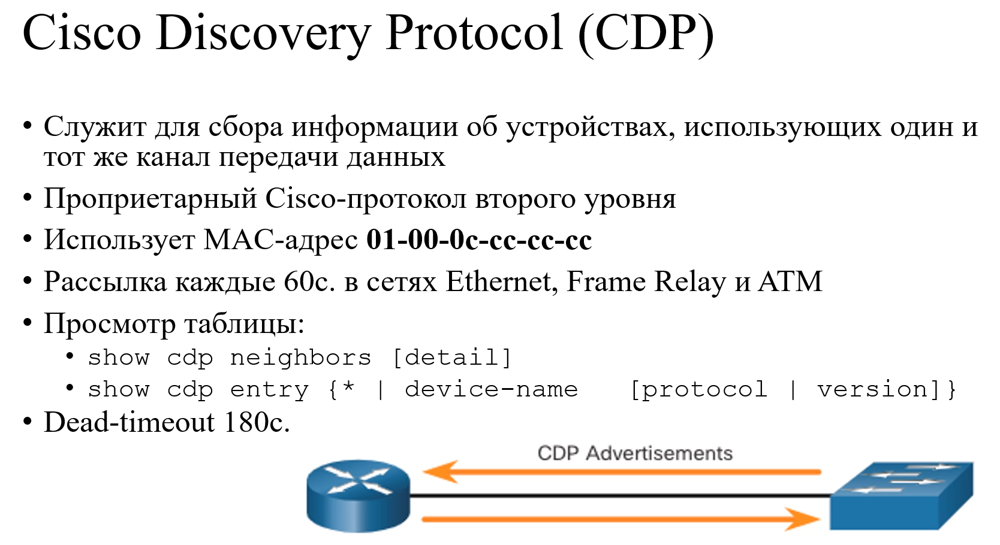
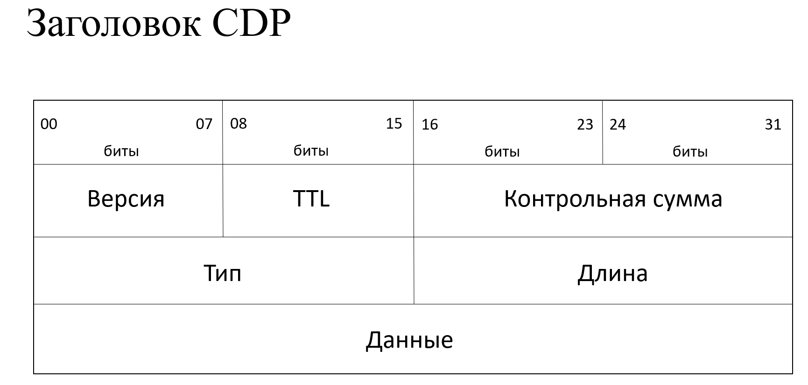
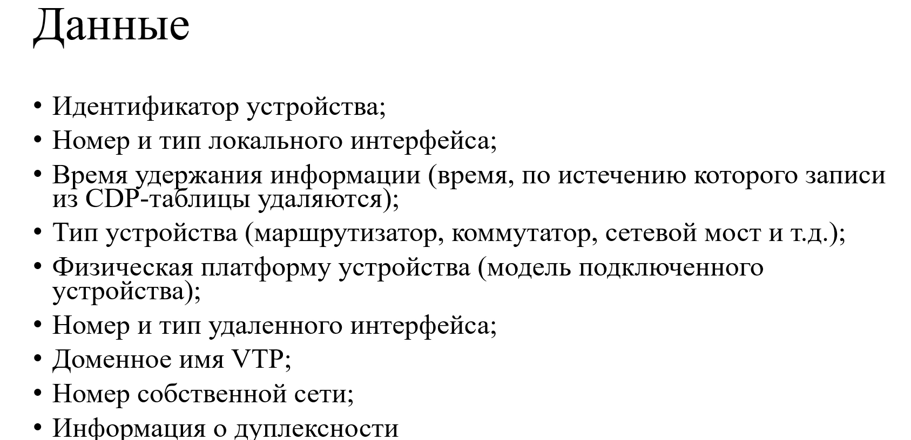
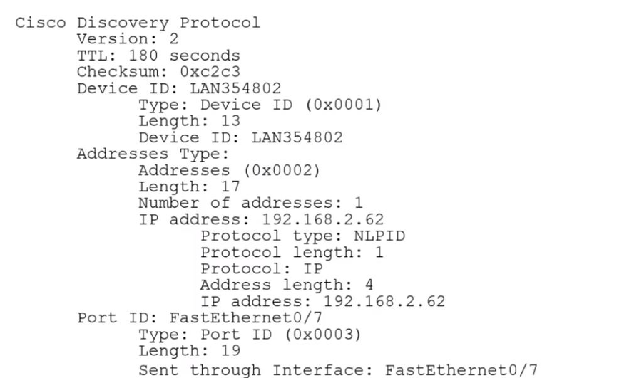

**show cdp** - покажет общую настройку протокола
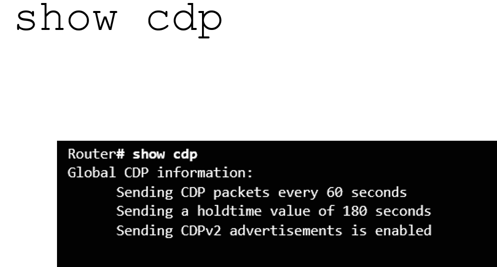

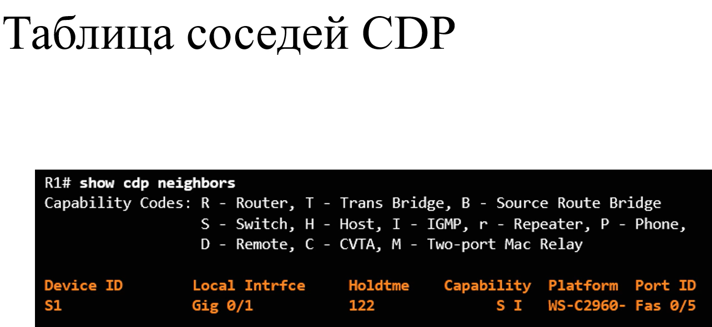

Команда show cdp neighbors отображает полезную
информацию о каждом соседнем устройстве CDP, в том числе следующие данные:

* Идентификатор устройства — имя хоста соседнего устройства (S1).
* Локальный интерфейс
* Время ожидания - сколько считаем времени устройства является подключенным
* Список возможностей — сведения о том, является ли устройство маршрутизатором или
  коммутатором (S обозначает коммутатор; I обозначает IGMP и в данном курсе не
  рассматривается).
* Платформа — аппаратная платформа устройства (WS-C3560 обозначает коммутатор Cisco
  3560).
* Идентификатор порта — имя локального или удаленного порта (Gig 0/0/1 и Fas 0/0/5
  соответственно).

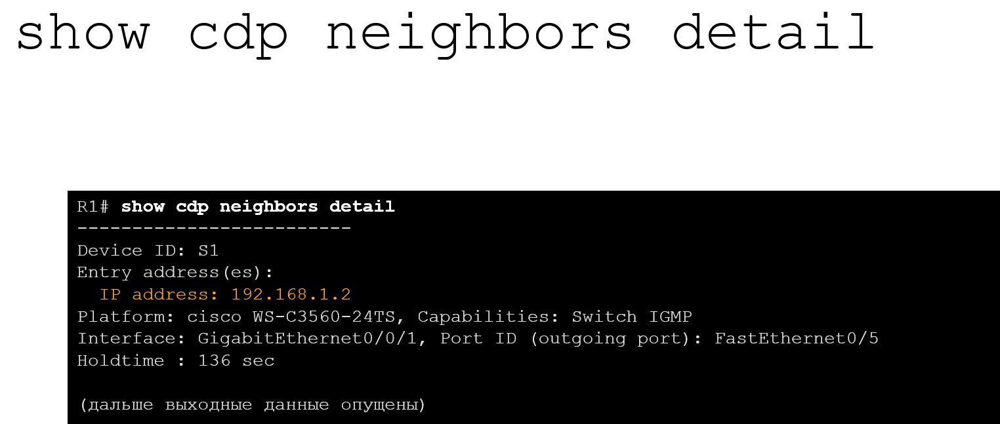

CDP на устройствах Cisco запущен по умолчанию

Существует еще 1 протокол выполняет ту же функции в сети

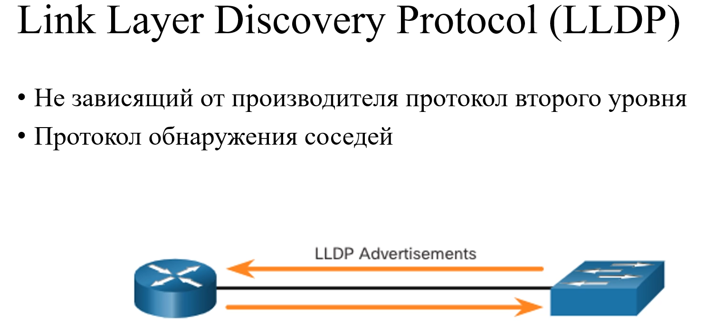

Протокол обнаружения уровня канала (LLDP) делает то же самое, что и CDP, но он не специфичен для
устройств Cisco.

LLDP - не зависящий от производителя протокол обнаружения соседей, подобный CDP. LLDP работает с
сетевыми устройствами, такими как маршрутизаторы, коммутаторы и точки доступа к беспроводной сети
LAN. Этот протокол объявляет себя и свои возможности другим устройствам и получает данные от
физически подключенных устройств уровня 2.

Отличие от CDP нужно на передачу и получение сообщений нужно настраивать отдельные команды

**lldp transmit**

**lldp receive**

### Службы времени: способы настройки системных часов, протокол NTP, его характеристика и принцип работы.

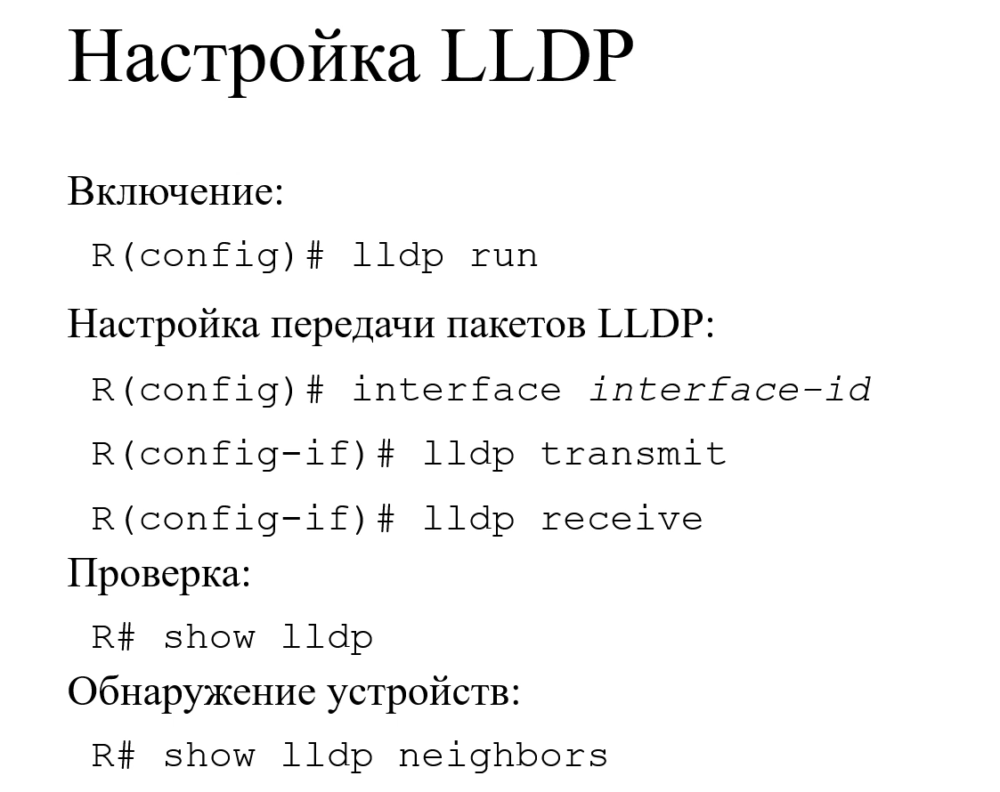

Минусы:

1. Точность
2. Настройка на каждом устройстве
3. Если устройства выключили и включили, таймер пойдет с момента последнего
   выключения

**NTP** - сетевой протокол настройки времени. Служба устроена иерархически.

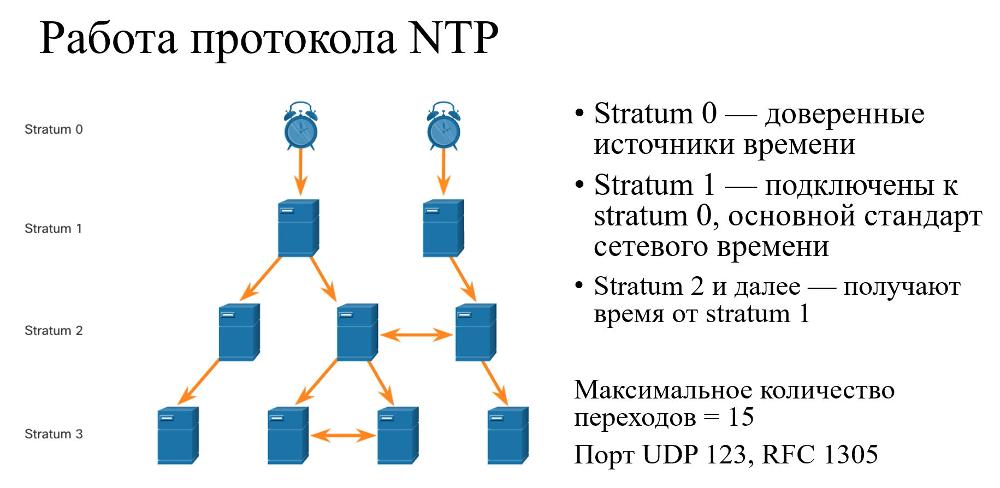

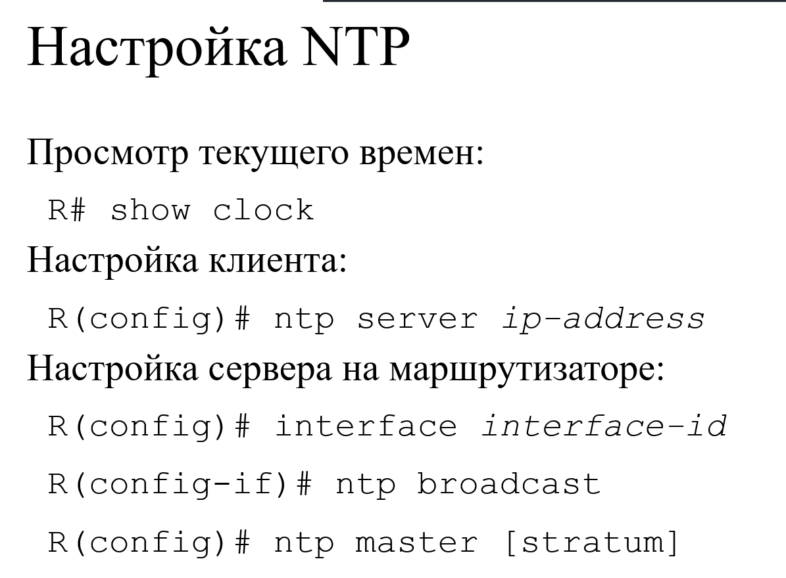

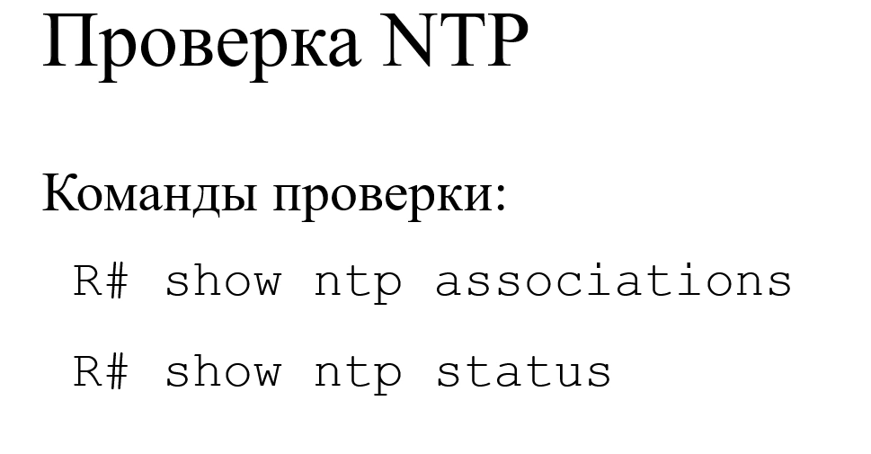

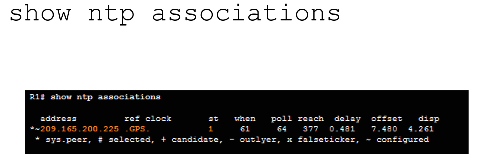

* address - ip адрес устройства с которым мы синхронизируем часы (является сервером для нас)
* ref clock - показывает устройство которое выступает NTP сервером для сервера с которого мы получаем время
* st - на каком стратуме находится сервер от которого мы получаем время

### Системный журнал: протокол Syslog, характеристика и принцип работы, формат сообщений Syslog, уровни важности.

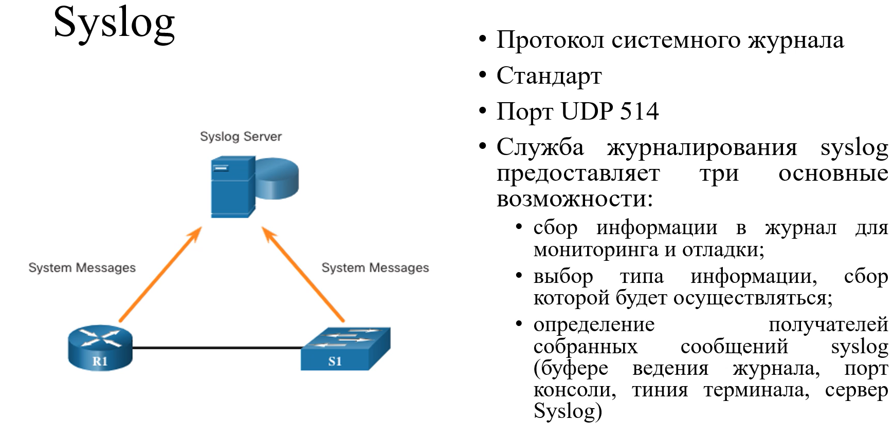

* level 0 - ситуация критическая и система не работает
* level 1 - 
* level 2 -
* level 3 -
* level 4 - критическое сообщение которое требует немедленных действий. Например стал не доступен интерфейс

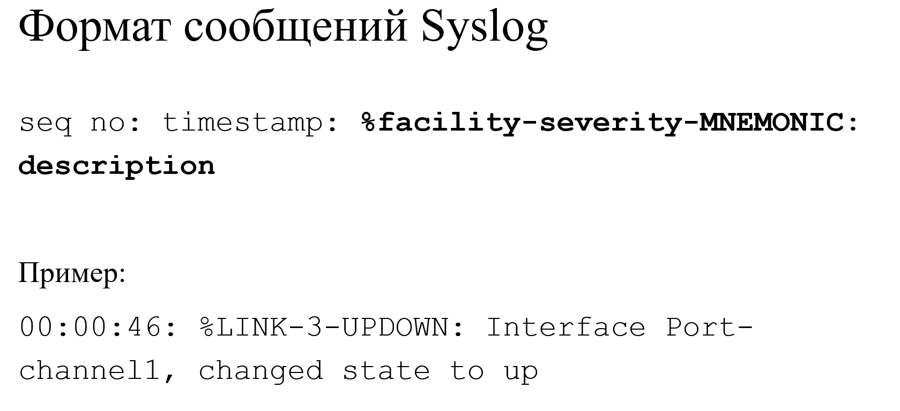

**service timestamps log datetime** - включение метки времени (Как в примере)

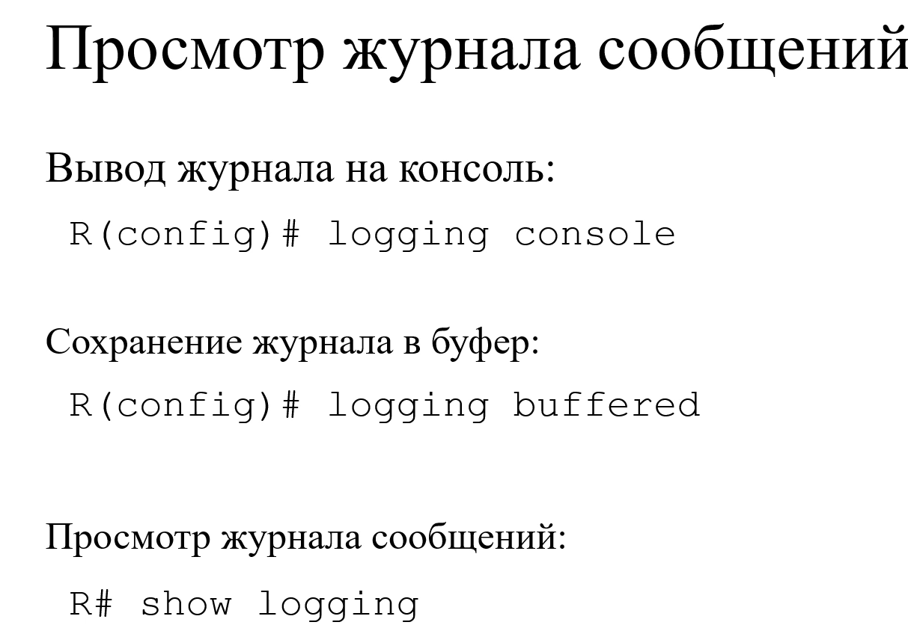

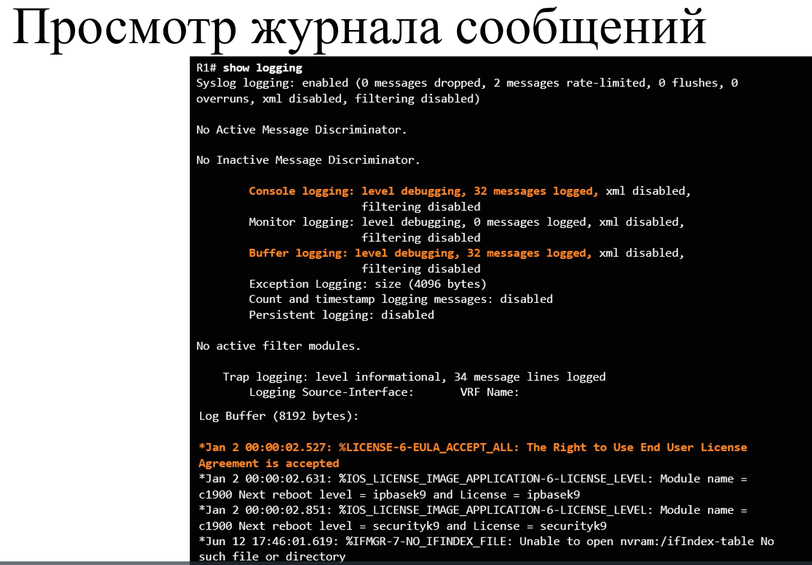

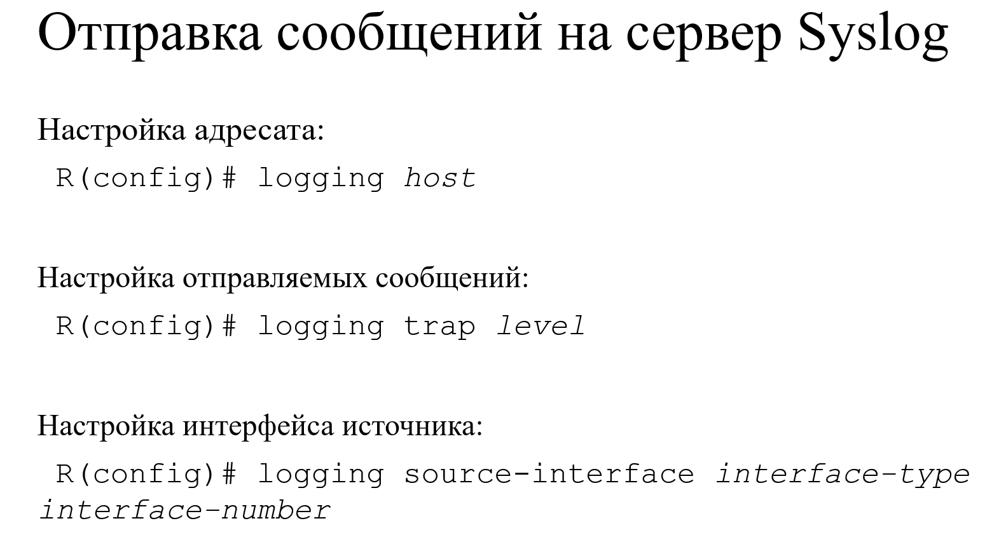
