# Обслуживание устройств

### Операционные и файловые системы сетевого оборудования.

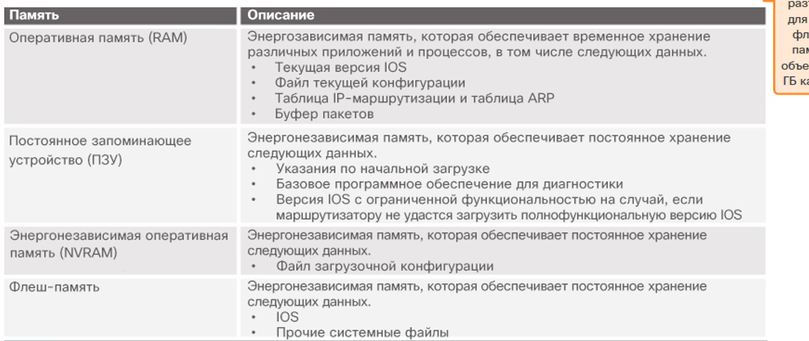

**show file systems** - выводит список всех доступных файловых систем на маршрутизаторе

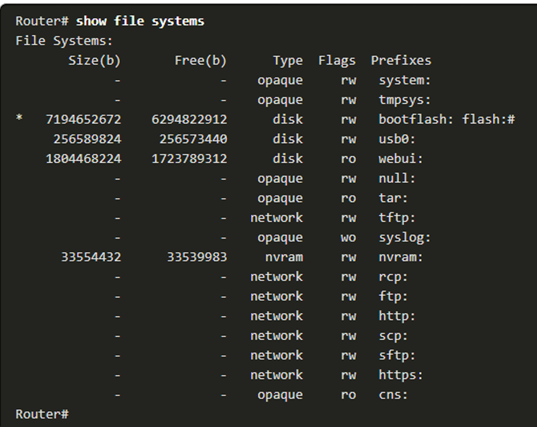

#### flash

**dir** - посмотреть содержимое flash памяти

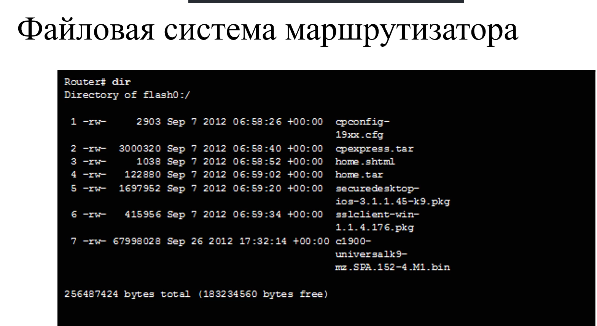

**!Важный файл - файл ISO образа**

#### nvram

**cd nvram** - переход в новую файловую систему
**pwd** - показать в какой файловой системе находишься

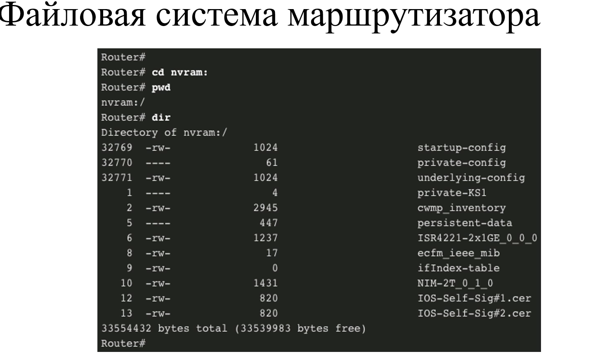

**!Важный файл - startapp config**

### Загрузка коммутатора и маршрутизатора. Начальный загрузчик.

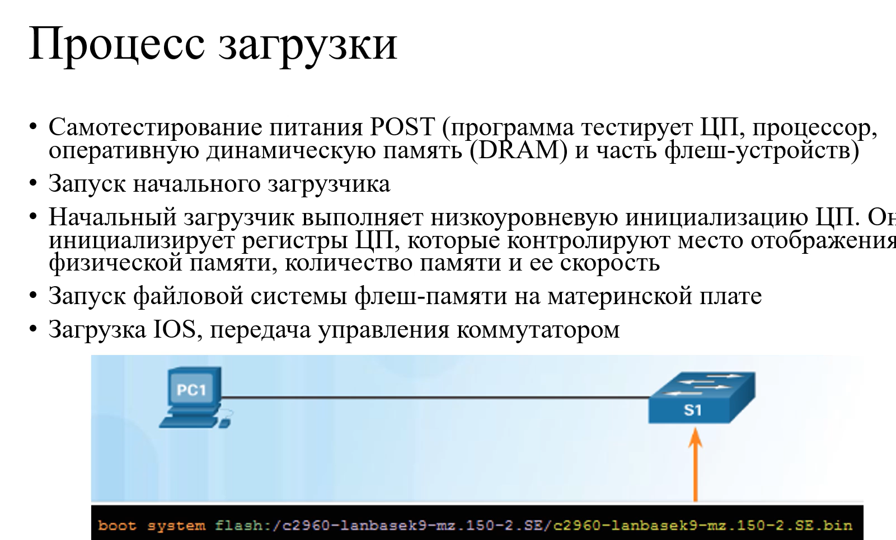
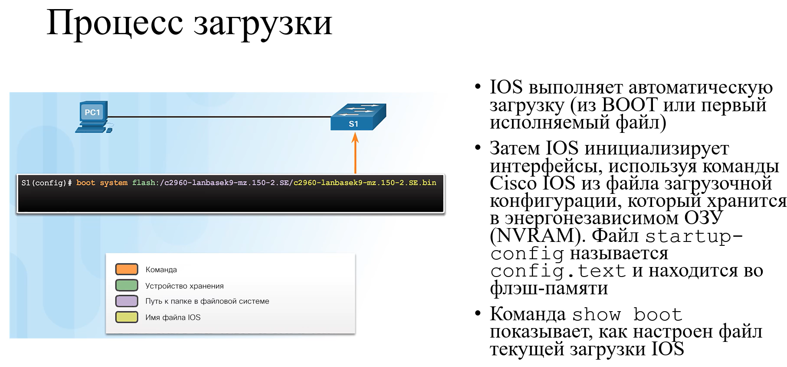

#### Светодиодные индикаторы коммутатора

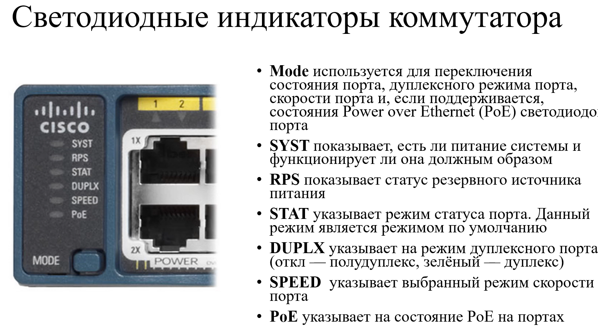

### Резервное копирование и восстановление конфигурации.

Самый простой способ резервного копирования - это прописать команду **show running-config** и скопировать все в
текстовый файл. Далее при необходимости просто вставить содержимое текстового файла в интерфейс командной строки.

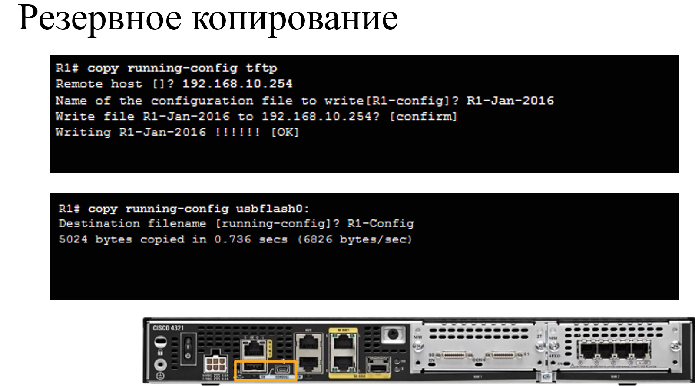

**Вход в режим ROMMON**

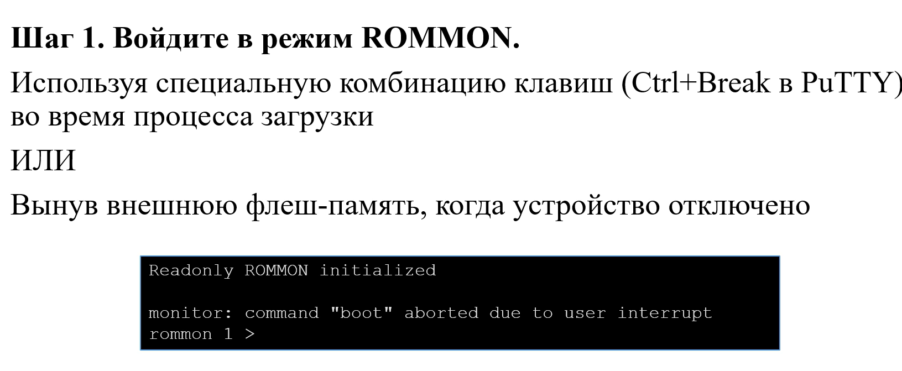

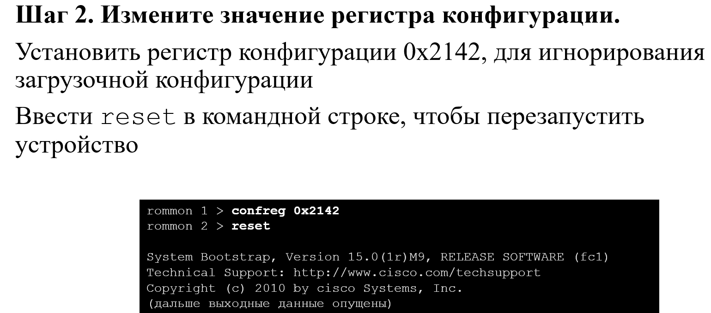

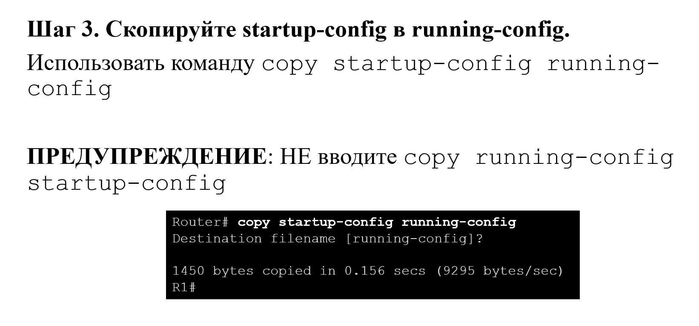

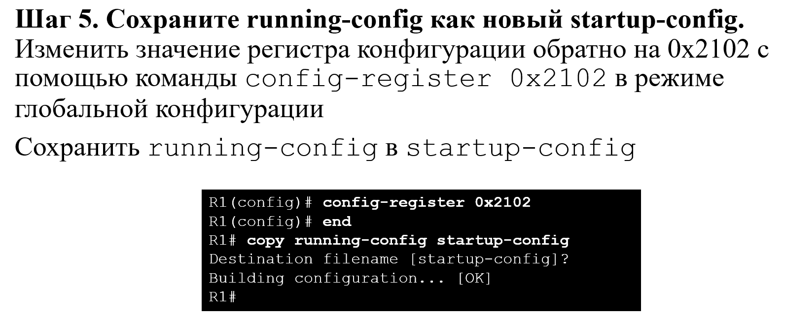

**Начальный загрузчик коммутатора**
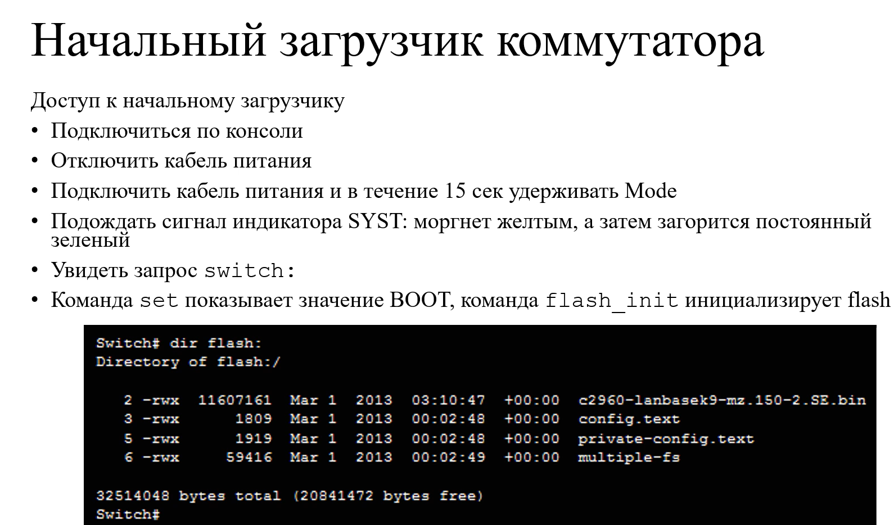

### Управление образами IOS. Имена файлов образов. Резервное копирование и восстановление образов IOS.

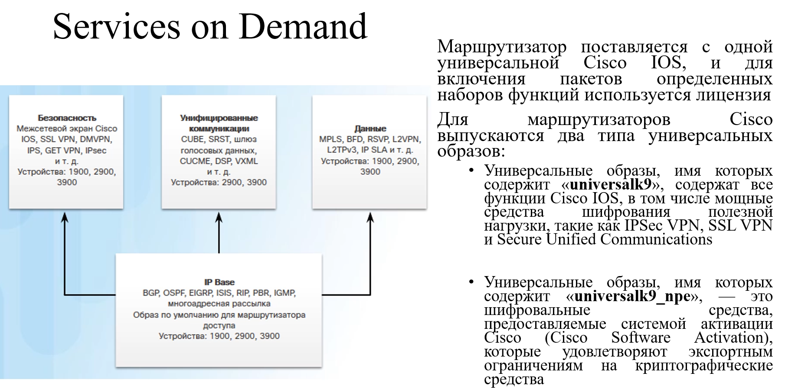

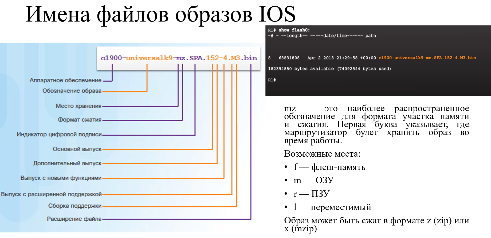

#### Резервное копирование образов IOS

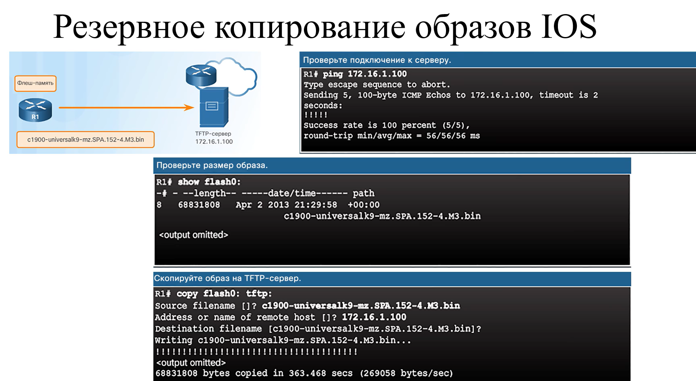

#### Восстановление образов IOS

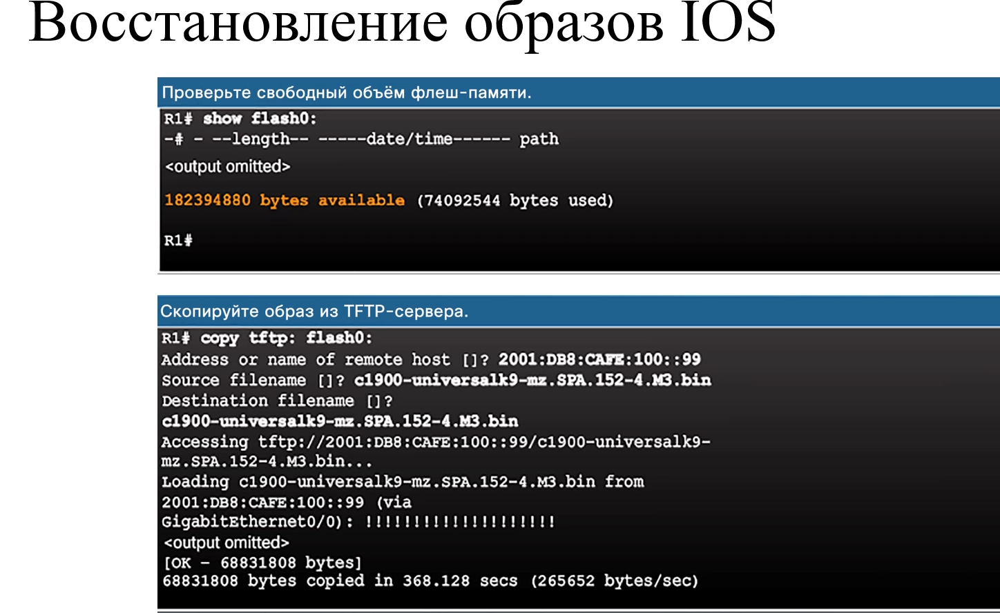

Просто скопировать образ недостаточно, нужно назначить какой образ должен быть использован при загрузке.

**R1(config)# boot system flash0://образ**

**copy running-config startapp-config** - нужно сохранять boot

Если boot не указан, то при загрузке устройство ищет первый доступный файл образа операционной системы.

**show version** - можно посмотреть какой файл образа запущен 