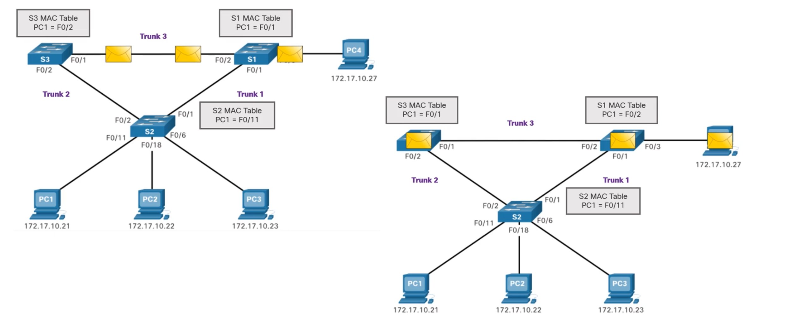
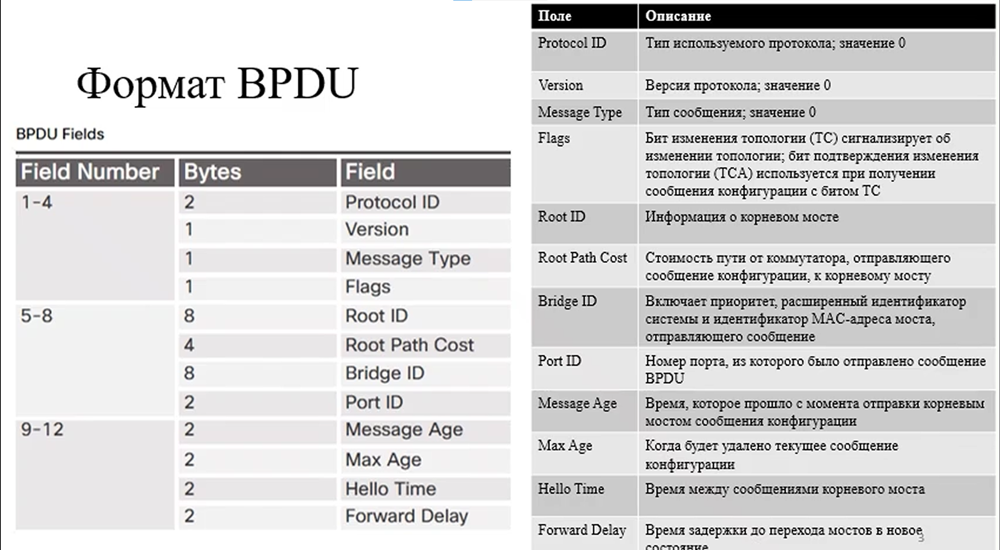
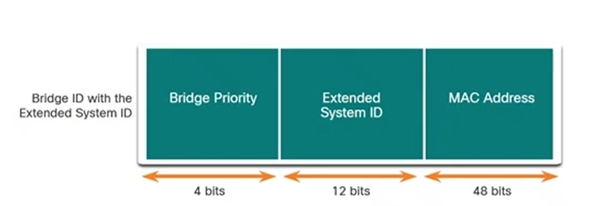

# Spanning-Tree Protocol

## Необходимость использования STP и принцип его работы

Эталон построения локальные комп сетей является трехуровневая иерархическая модель построения сети
которая подразумевает наличие избыточности оборудования и каналов связи это позволяет нам создавать резервные пути для
трафика, чтобы сети были всегда доступны.

Но наличие избыточности ведет к проблемам в такой локальной сети, которые могут привести сеть к неправильной работе или
вообще к отказу обслуживанию. Такими проблемами могут быть:
1. Нестабильность базы данных MAC-адресов(копии одного кадра принимаются на разных портах)
2. Широковещательные штормы(широковещательные рассылки распространяются непрерывно, что вызывает нарушение в сети)
3. Множественная передача кадров(*несколько копий одноадресных кадров направляются в один пункт назначения)

### Неустойчивость таблицы MAC-адресов

### Широковещательный шторм

###  Множественная передача кадров

### Алгоритм работы STP

## Формат BPDU

1-4 

Главные поля
- Root ID
- Root Path Cost
- Bridge ID
- Port ID

9-12 поля описывающие данные которые используются при работе алгоритма STP 

в WireShark

**!Важно понимать что все эти таймеры задаются на корневом коммутаторе**

### Что такое Bridge id

[**]
### Алгоритм STP: Root Bridge 

## Эволюция STP

## Настройка и отладка STP
