# Spanning-Tree Protocol

## Необходимость использования STP и принцип его работы

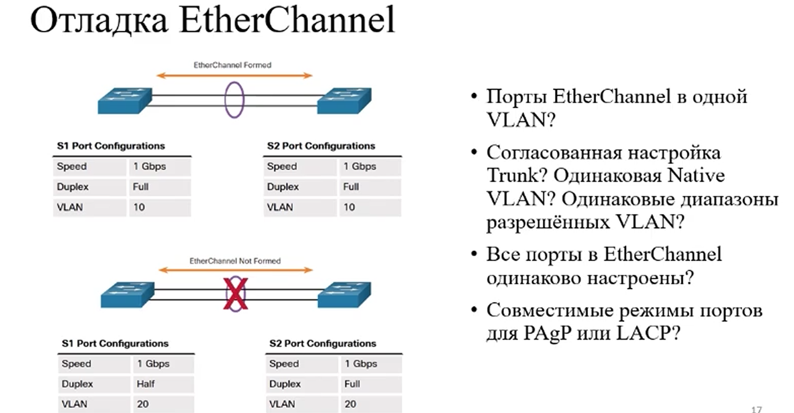

Эталон построения локальные комп сетей является трехуровневая иерархическая модель построения сети
которая подразумевает наличие избыточности оборудования и каналов связи это позволяет нам создавать резервные пути для
трафика, чтобы сети были всегда доступны.

Но наличие избыточности ведет к проблемам в такой локальной сети, которые могут привести сеть к неправильной работе или
вообще к отказу обслуживанию. Такими проблемами могут быть:

1. Нестабильность базы данных MAC-адресов(копии одного кадра принимаются на разных портах)
2. Широковещательные штормы(широковещательные рассылки распространяются непрерывно, что вызывает нарушение в сети)
3. Множественная передача кадров(*несколько копий одноадресных кадров направляются в один пункт назначения)

### Неустойчивость таблицы MAC-адресов

### Широковещательный шторм

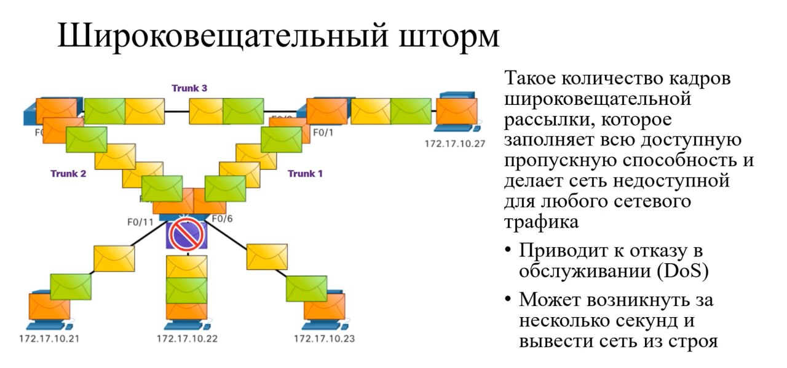

### Дублирование кадров

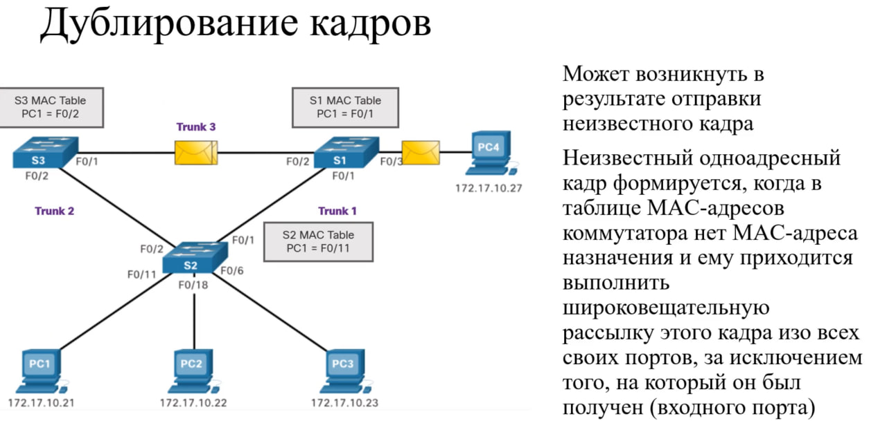

### STP

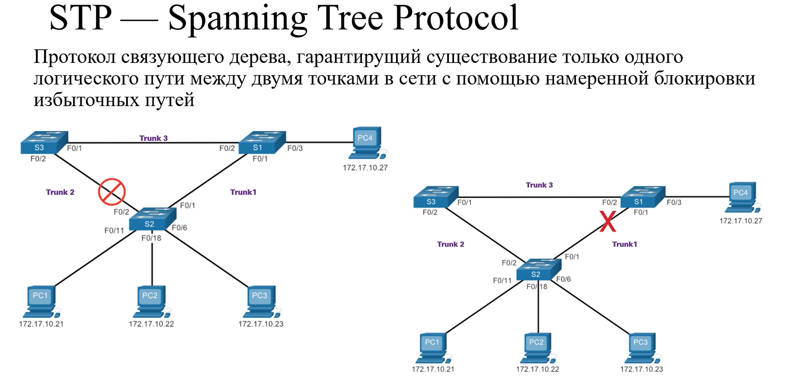

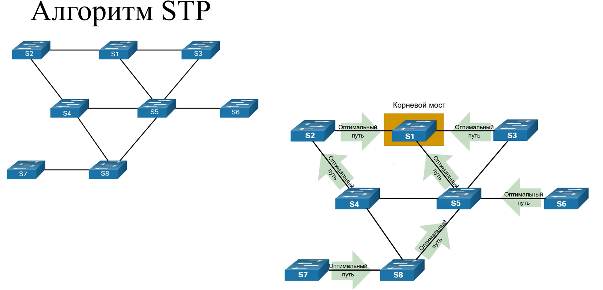

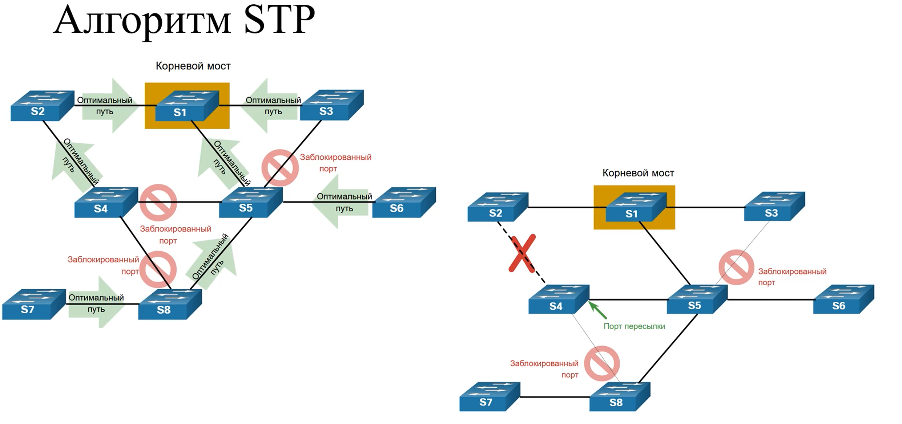

## Алгоритм работы STP

## Формат BPDU

Все процессы STP происходят благодаря обмену коммутаторами информации BPDU

1-4 -

Главные поля 5-8

- Root ID  (Информация корневого порта)
- Root Path Cost (стоимость пути до корневого порта)
- Bridge ID (Идентификатор конкретного коммутатора)
- Port ID (Идентификатор порта с которого получено сообщение)

9-12 поля описывающие данные которые используются при работе алгоритма STP

в WireShark

**!Важно понимать что все эти таймеры задаются на корневом коммутаторе**

### Что такое Bridge id

Bridge ID имеет 3 поля:

1. Приоритет моста - 4 бит значение по умолчанию - 32768
2. Расширенный Идентификатор сети - необязательное, т.к в ранних версиях было только 2 поля (12 бит равняется номеру
   VLAN к которому строится дерево)
3. MAC-address - мак адрес коммутатора

### Алгоритм STP: Root Bridge

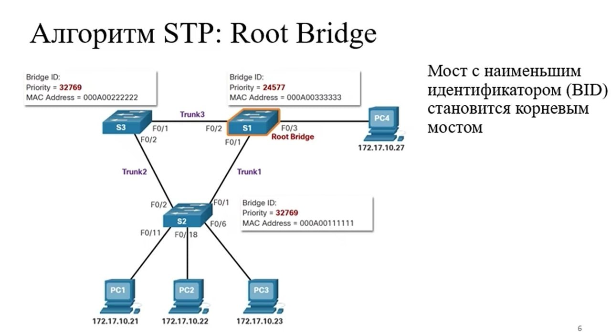

Приоритеты меняются вручную значения от 0 до 61440 с шагом 4096

Главный мост - наименьший приоритет среди всех. Если значение приоритета не менялось, то будет выбор по мак адресу

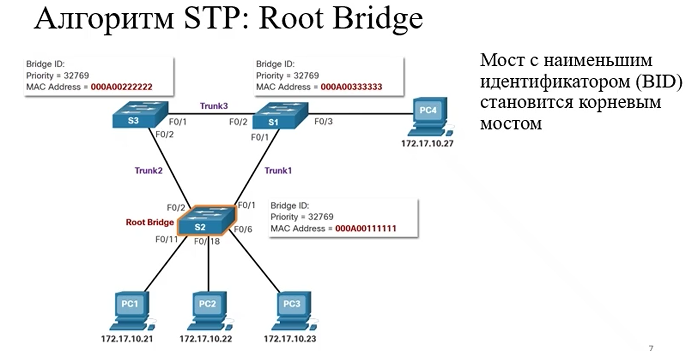

Лучше всегда вручную ставить приоритет, чтобы выбрать главный коммутатор.

**Подробный алгоритм:**

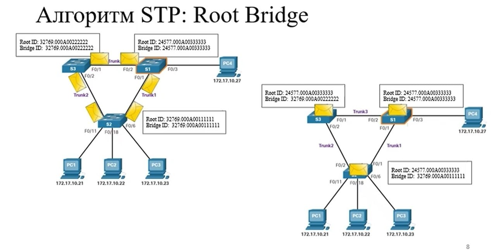

На первом этапе каждый коммутатор объявляет себя рутом и далее BPDU рассылаются всем коммутаторам в сети(левый рисунок).

Коммутаторы получив значения от других коммутаторов сравнивают пришедшие ROOT_Id со своими BRIDGE_Id.

Если собственный bridgeid меньше чем rootid, то в новом рассылаемом BPDU указывается собственный bridgeid в качестве
rootid и начинает такое сообщение BPDU рассылаться дальше по сети.

Если ситуация обратная (bridgeid > rootid), то мы оставляем rootid который получили и оставляем свой bridgeid.

### Агоритм STP: Стоимость корневого пути

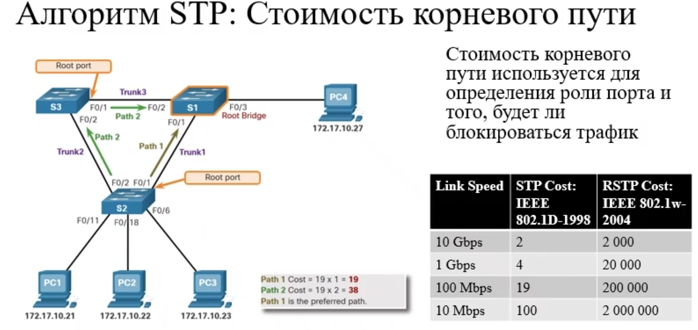

После выбора Root Bridge, все процессы регулируются именно этим коммутатором. Т.е все что дальше происходит в алгоритме
STP, происходит за счет тех сообщений, которые были отправлены корневым коммутатором.

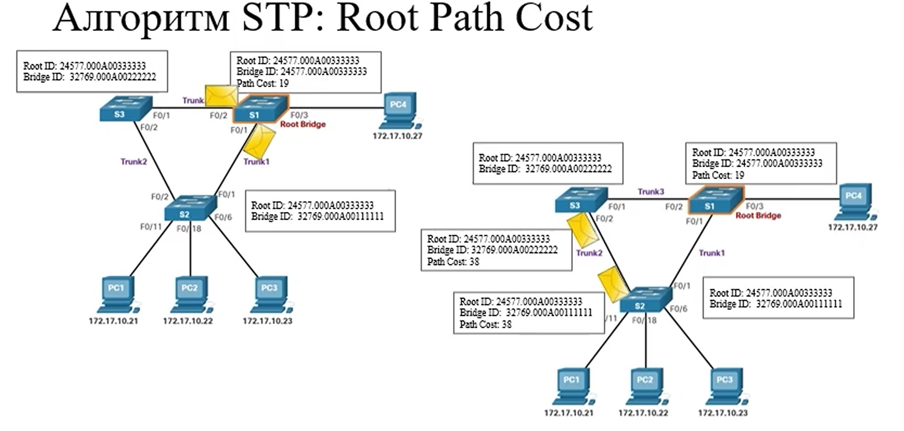

### Роли портов STP

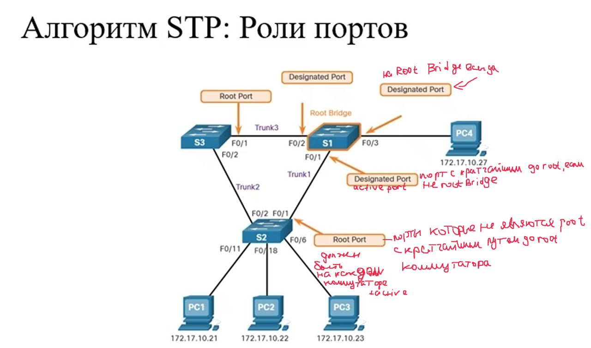

Всего 3 вида роли портов:

1. Designated Port - назначенный порт, **Активный порт**. Также является портом с минимальной стоимостью пути.
2. Root Port - порты коммутаторов, которые не являются корневым коммутатором, а также Root port выбираются для
   коммутаторов с минимальной стоимость до корневого пути. **Всегда должен быть в активном состоянии, т.к он включен в
   процесс построения дерева**
3. Alternate Port - резервный порт, для назначения порта, если другая сторона не является корневым портом

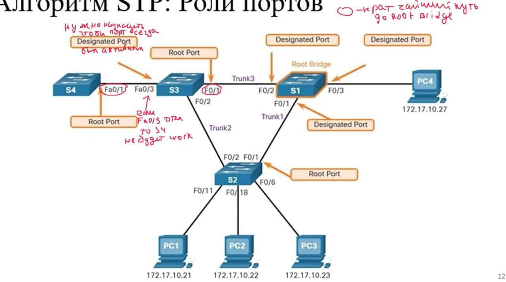

У нас в сети есть еще сегмент, где 2 активных порта S2 S3 и если мы их оставим активными, то мы оставим циклирование
трафика и другие различные проблемы.

Нам надо выбрать какой порт будет заблокированным, а какой активным.

Alternate Port будет выбираться там где большее значение Bridge_ID. Он не полностью блокирует порт, если дерево будет
перестроено, то этот порт станет активным, т.к был настроен.
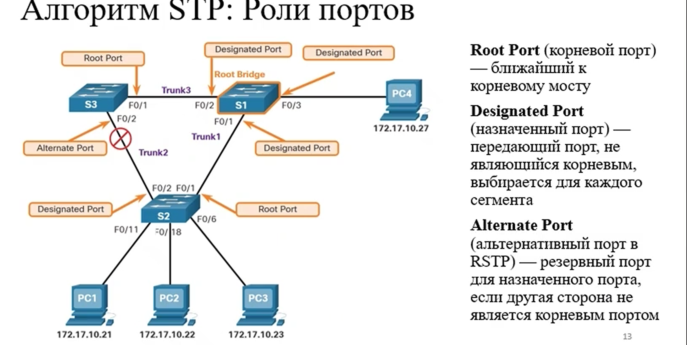

### Выбор Designated и Alternate портов

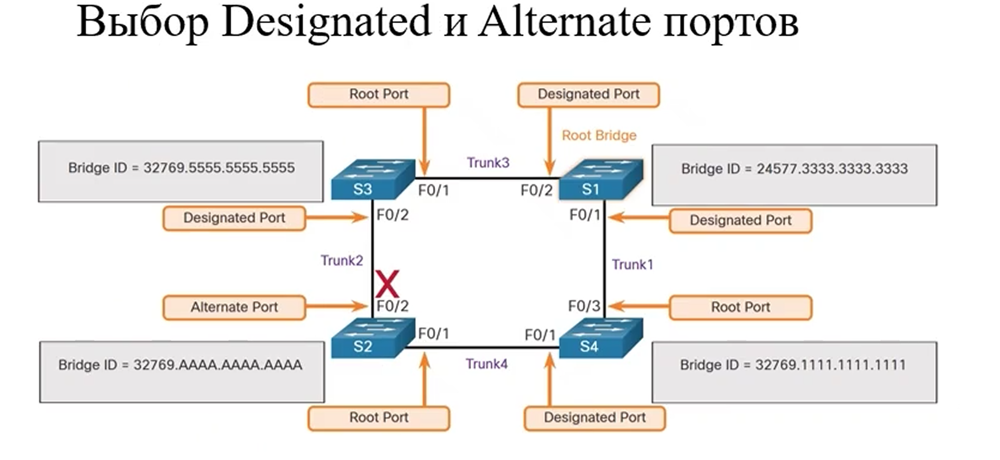

### Состояние порта

Прежде чем будет происходить отправка данных через каждый порт коммутатора этот порт должен пройти через несколько
состояний:

* Канал поднимается
* Переходит в **Блокирующий режим** - через этот режим у нас не отправляются и не получаются данные
* Переходит сразу в **Режим Прослушивания** - чтобы изучить как построено и построить дерево STP и понять роль этого
  порта. Получает BPDU, чтобы определить путь корня и передает собственный BPDU соседним коммутаторам, чтобы они тоже
  участвовали в построении топологии
* переход в состояние **Обучения** - здесь порт получает обрабатываемый BPDU и готовится к пересылке кадров, если он
  переведен в активный режим. Но при этом обычный трафик клиентов все еще не передается
* **Режим пересылки** - передает трафик клиентов, является активным состоянием порта

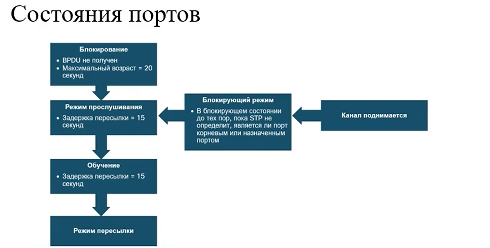

## Виды STP

### Типы STP

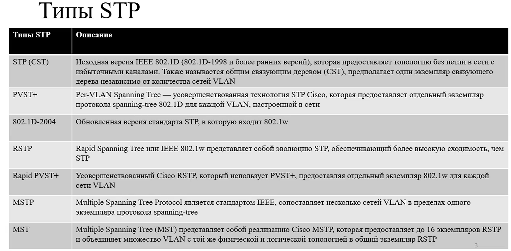

* STP - имеет упрощенный вид Bridge ID(состоит из двух полей) т.к не предполагало множество vlan
* PVST+ (cisco) - улучшенный STP, который подразумевает для каждого VLAN отдельное дерево STP
* RSTP - является таким же STP, только быстрее в работе
* RAPID PVST+ (cisco) - делает тоже самое что и RSTP, который подразумевает для каждого VLAN отдельное дерево STP
* Современные MSTP и MST (cisco) - строят деревья для каждой отдельной VLAN, но сохраняет отдельный экземпляр для
  повторяющихся
  деревьев, что сохраняет ресурсы.

### Характеристики STP

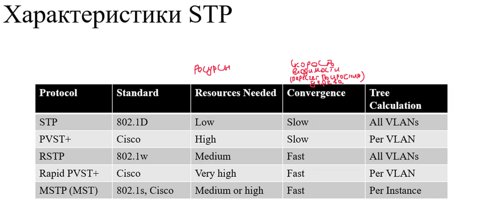

### Состояния и роли портов в RSTP(Rapid PVST+)

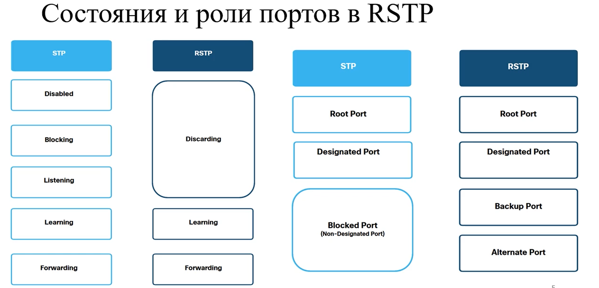

**Backup port** - может быть назначен если у нас разделяемая среда и к ней есть доступ к резервным каналам связи.

### PortFast и BPDU Guard

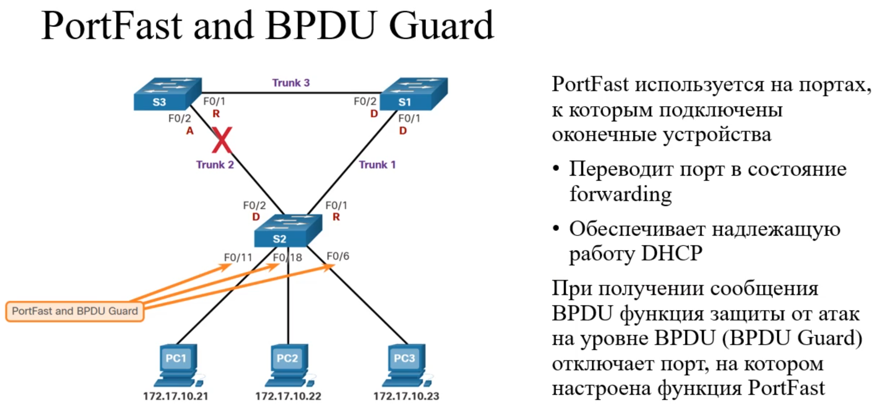

PortFast - пограничный порт который подключен к клиентам

## Настройка и отладка STP

### Настройка BID

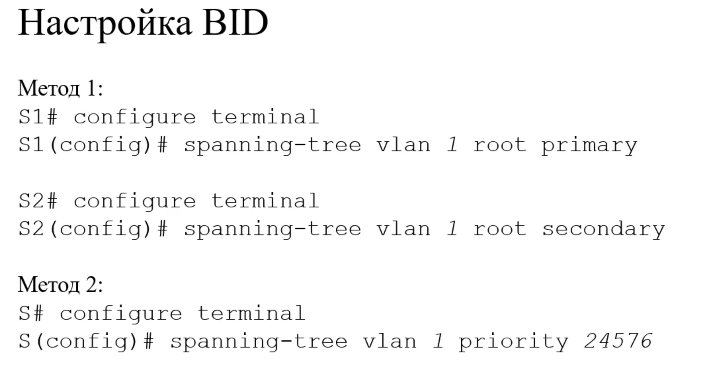

### Настройка стоимости порта

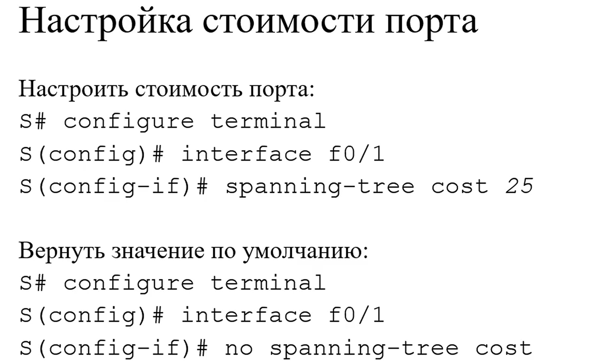

### Настройка PortFast и BPDU Guard

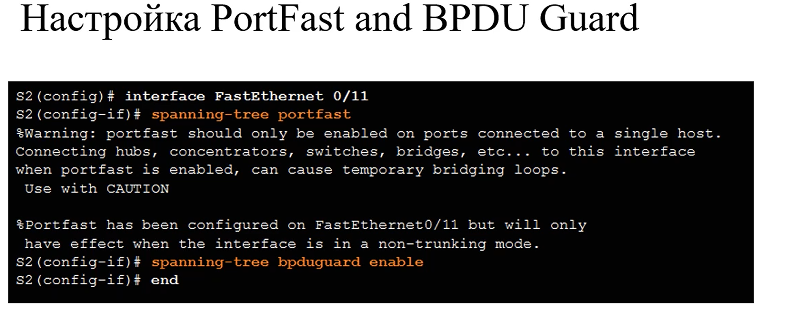

### Настройка Rapid PVST+

### Отладка STP

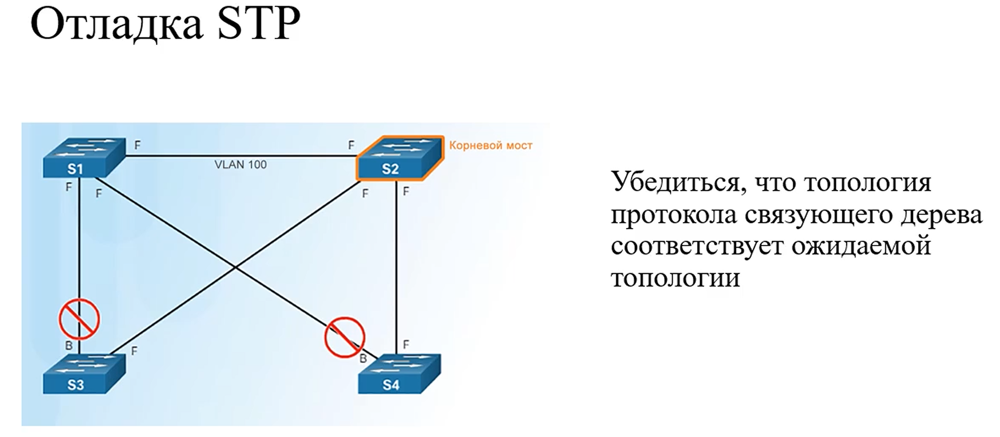

**show spanning-tree**

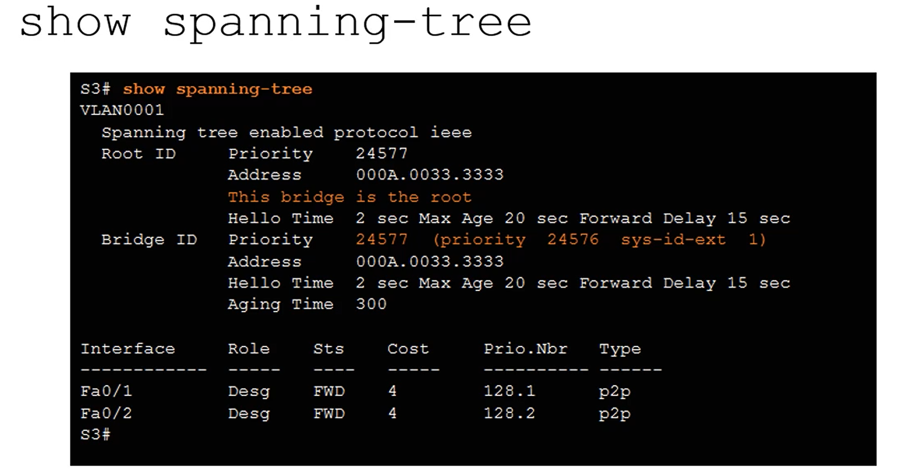

**show spanning-tree active**

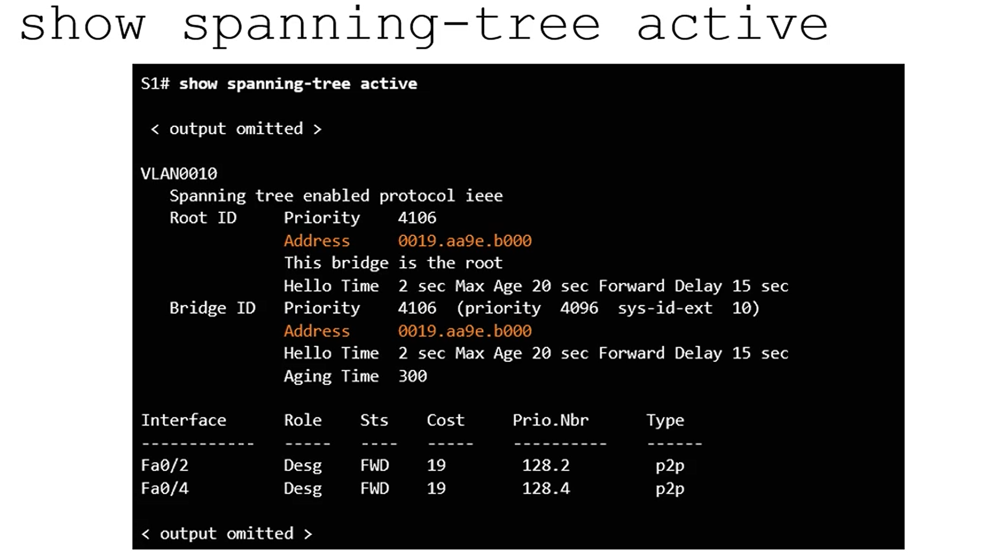

**show spanning-tree vlan**

### Диаметр STP - 7 коммутаторов

