# EtherChannel & HSRP

## EtherChannel

Для хорошего и эффективного создания коммутированных сетей, надо использовать трехуровневую или сдвоенную иерархическую
модель сети

Эти модели подразумевают различные варианты резервирования, в том числе резервирование каналов для увеличения надежности
такой сети, на случай если какой либо канал будет сломан или выключен.

### Агрегация трафика

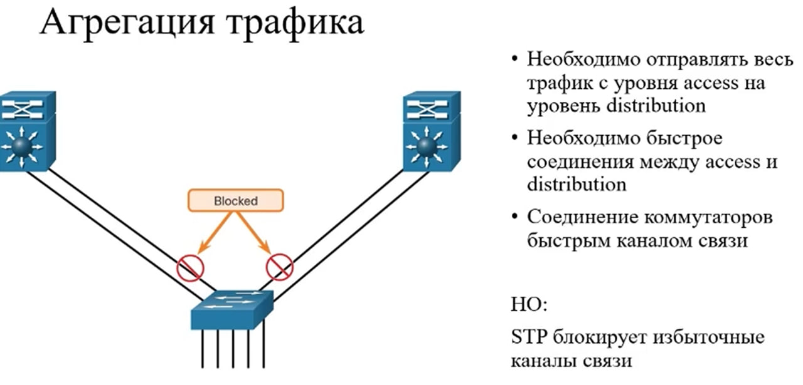

Из-за STP такое резервирование каналов будет блокироваться, поэтому была придумана технология EtherChannel

### EtherChannel

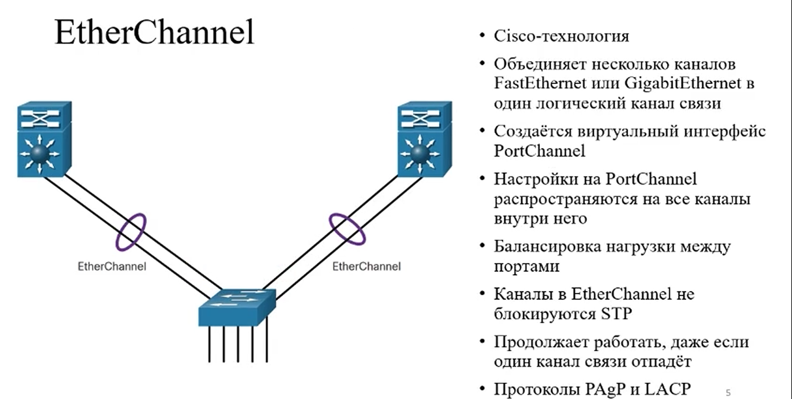

в один EtherChannel можно объединить только каналы связи работающие на одной скорости. Нельзя объединить в 1 канал Fa и
Ge порты.

Есть 3 варианта настройки EtherChannel:

1. Статическая настройка
2. Протоколы согласования:
    * PaGP
    * LACP

В EtherChannel можно объединить до 8 портов, настройка дуплека должна быть настроена одинакова на обоих портах.

Max EtherChannel до 6

### PAgP

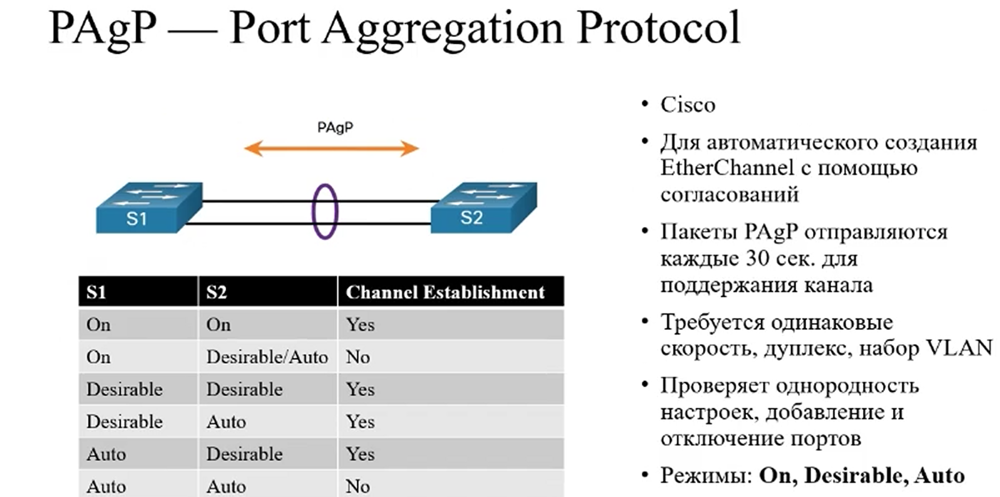

Режим **on** - используется для статической настройки.

**Desirable** - отвечает за активное согласование каналов. Будет активно рассылать сообщение на установку EtherChannel.
Если на другом конце коммутатора/порта тоже будет Desirable, то он примет этот EtherChannel

**Auto** - ничего не отправляет, только принимает сообщения. Ждет сообщения от другого коммутатора

### LACP

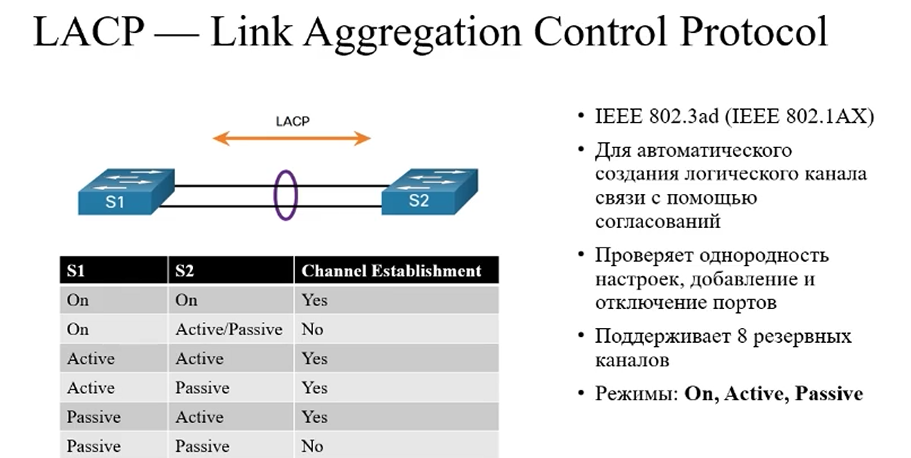

### Настройка PAgP

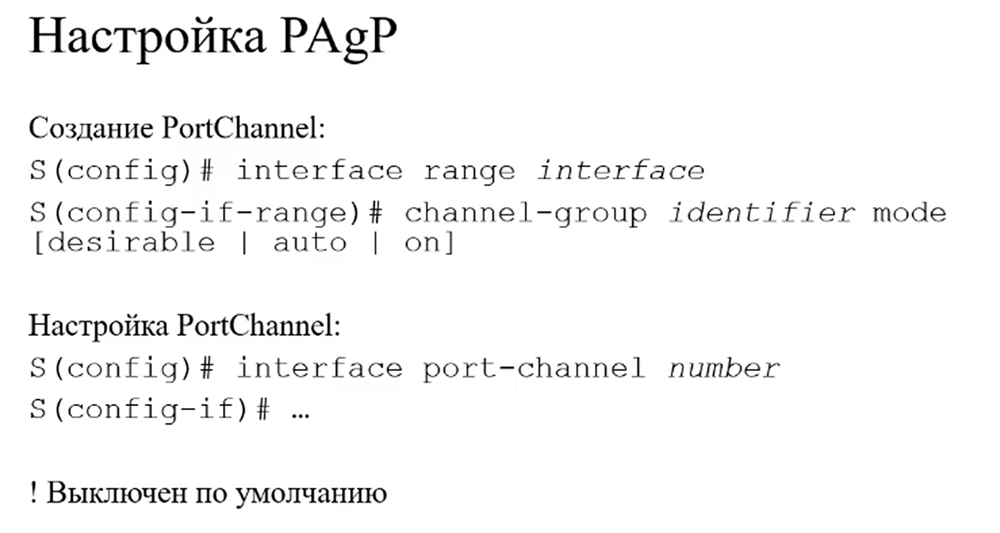

### Настройка LACP

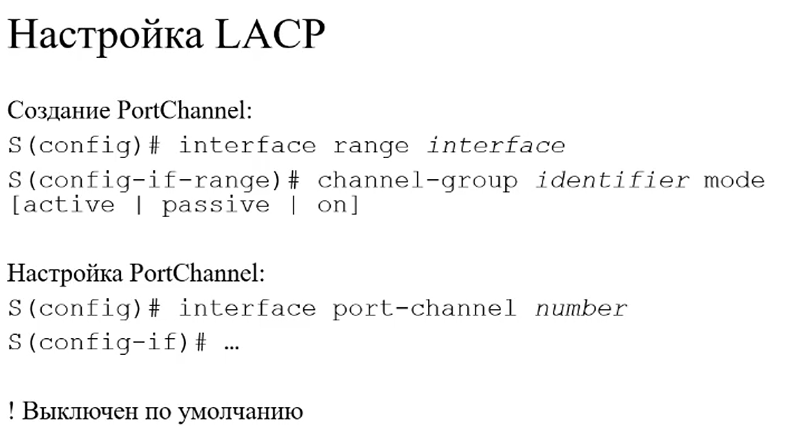

## Команды проверки

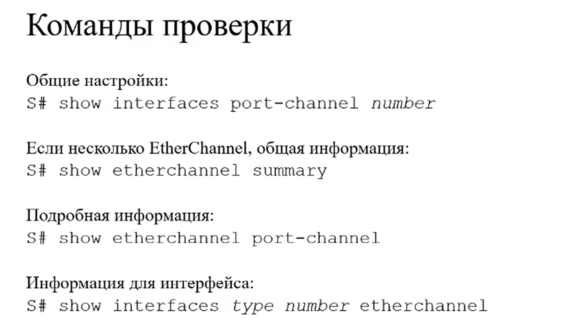

**show interfaces port-channel**

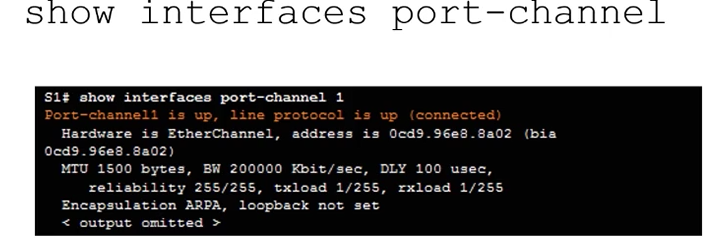

**show etherchannel summary**

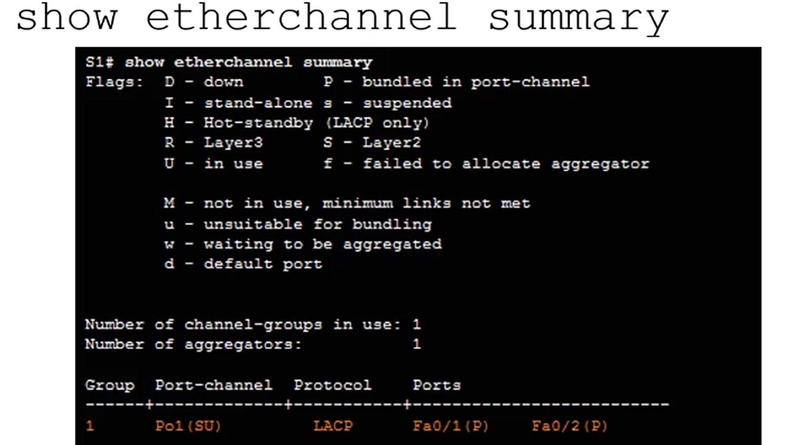

**show etherchannel port-channel**

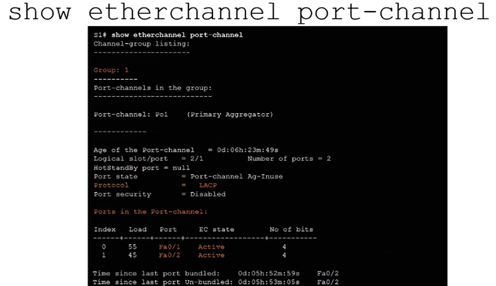

**show int etherchannel**

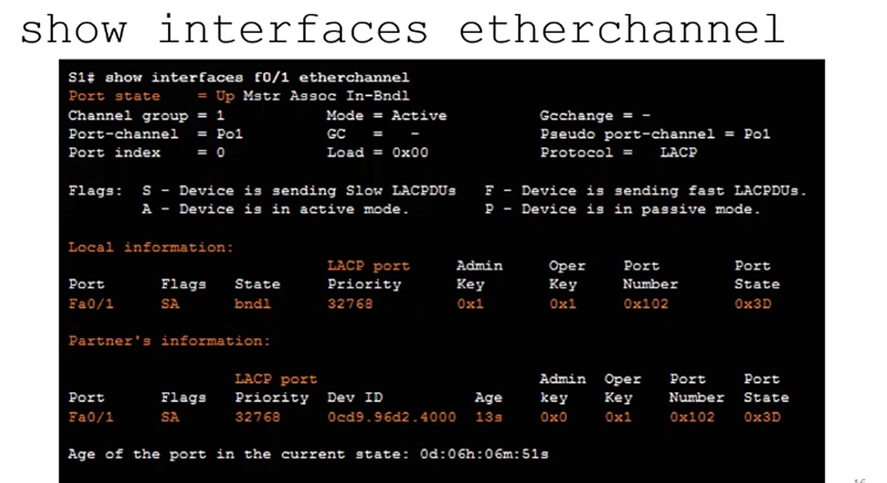

### Отладка EtherChannel

## FHRP

Рассмотрим что бывает если мы резервируем оборудование. Мы резервируем default gateway(L3 коммутатор или маршрутизатор)

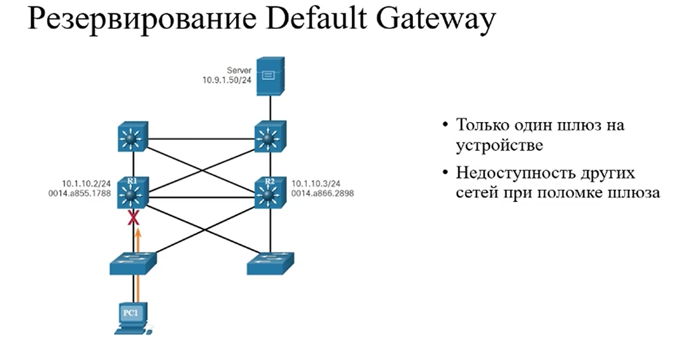

Из-за софтовых ограничений мы не можем использовать физически резервный маршрутизатор

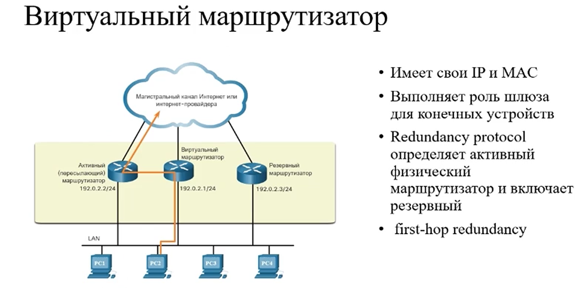

Для решения этой проблемы придумали инструмент first hop redundancy protocol - протокол избыточности первого перехода

если у нас есть несколько маршрутизирующих устройств мы можем с помощью протокола FHRP чтобы они работали как один
маршрутизатор, чтобы они подстраховывали друг друга в случае поломок.

Как работает протокол:
У нас настраивается специальный виртуальный IP-address и MAC-адрес которые будут работать с клиентами. Т.е с клиентами
мы задаем в качестве default gateway придуманный нами виртуальный адрес из нужной подсети.

Соответственно когда ПК попытается RP запрос отправить, то ему будет возвращаться виртуальный мак адрес.

Если активный перестает отправлять запросы, то включается резервный и забирает на себя эту ответственность.

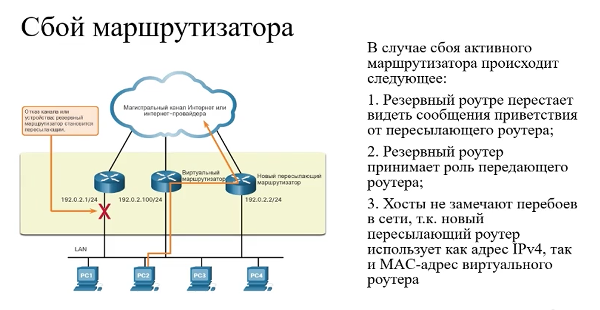

### FHRP 

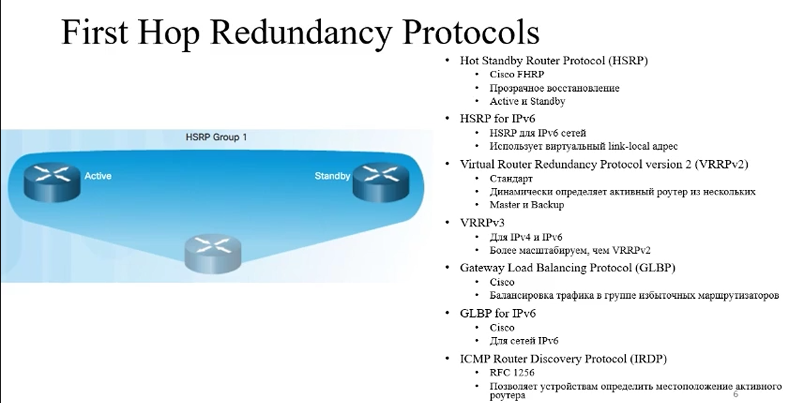

HSRP работает когда есть 1 активный (active) и 1 резервный (standby). 

### HSRP 

Работает также как FHRP

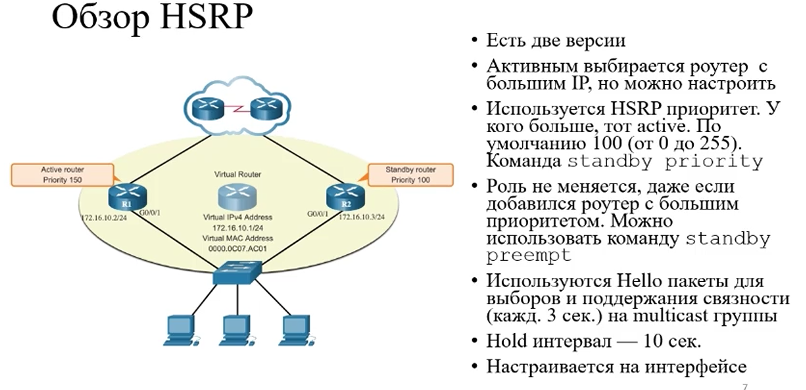

### HSRP v1 vs v2

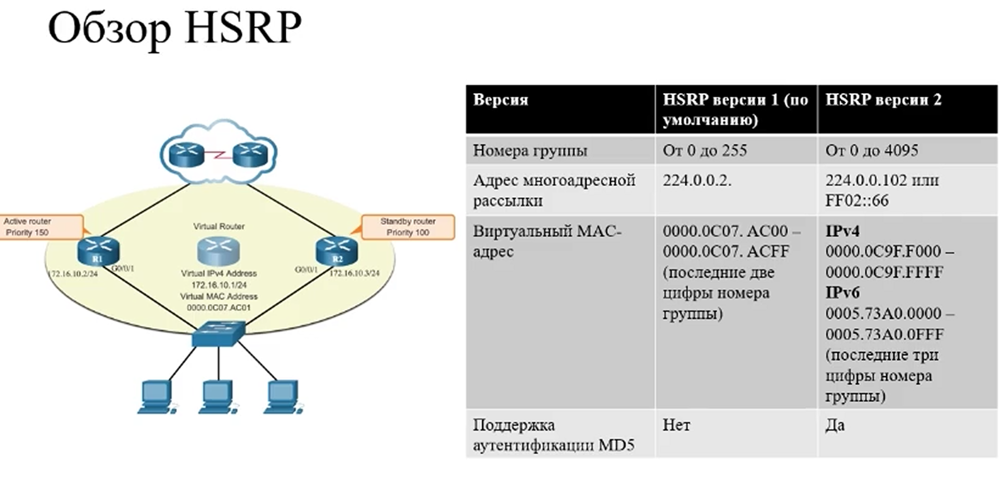

### Состояния HSRP

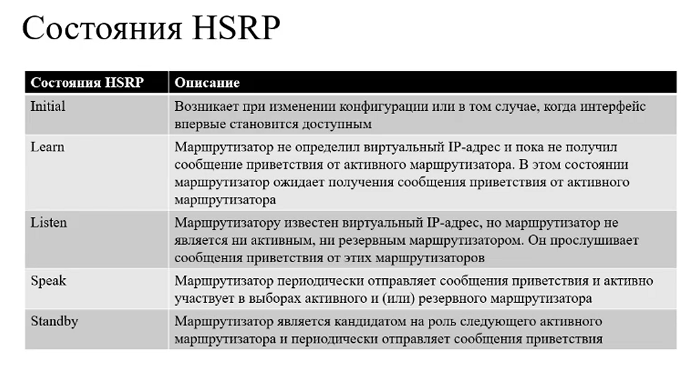

### Настройка HSRP

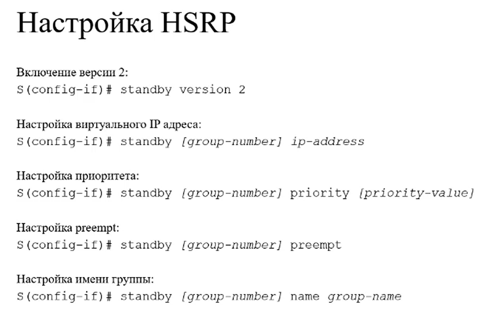