# Динамическая маршрутизация. Протокол EIGRP

## Динамическая маршрутизация

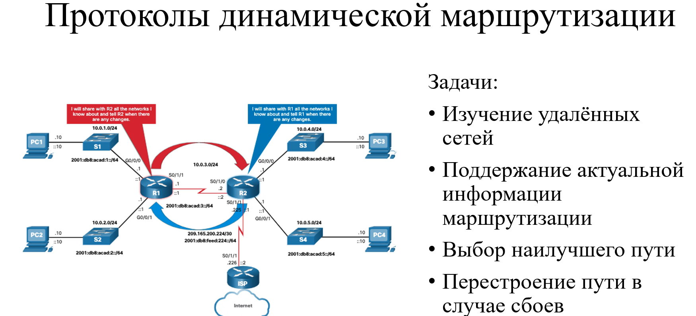

**Протоколы внутренней маршрутизации (IGP, англ. Interior gateway protocol — «протокол внутреннего шлюза»)** — это
протоколы, которые используются для обмена информацией о маршрутизации между шлюзами (обычно маршрутизаторами) в
автономной системе (например, системе корпоративных локальных сетей)

**Протоколы внешней маршрутизации (Exterior Gateway Protocols, EGP)** — это протоколы, которые используются для обмена
маршрутной информацией между автономными системами в Интернете

### Бесклассовые протоколы

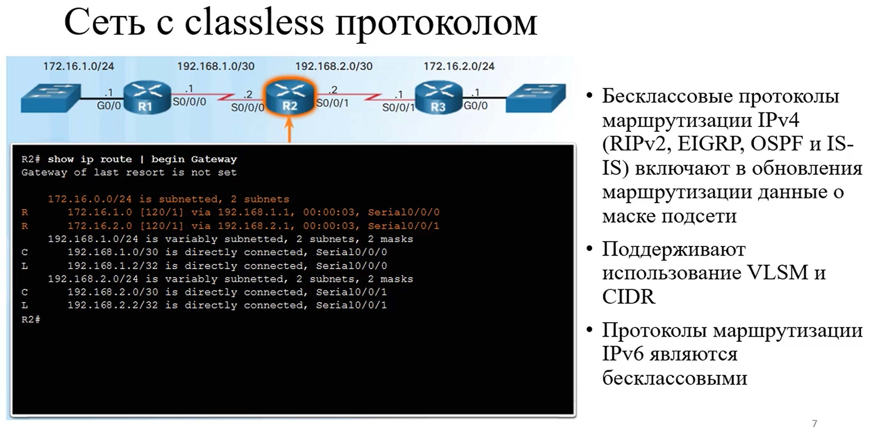

### Характеристика протоколв маршрутизации

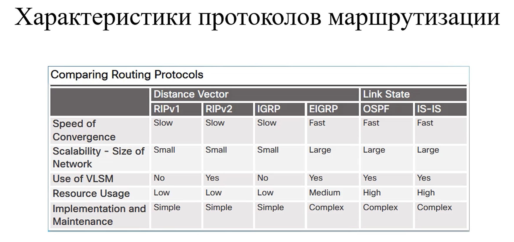

### Протоколы вектора расстояния

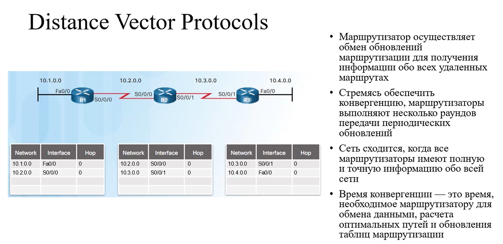

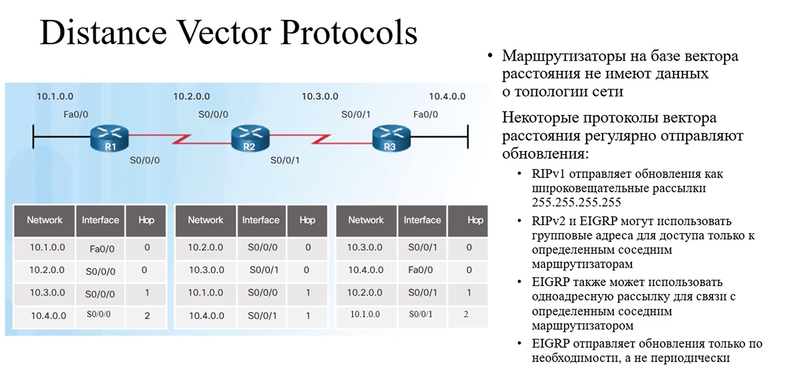

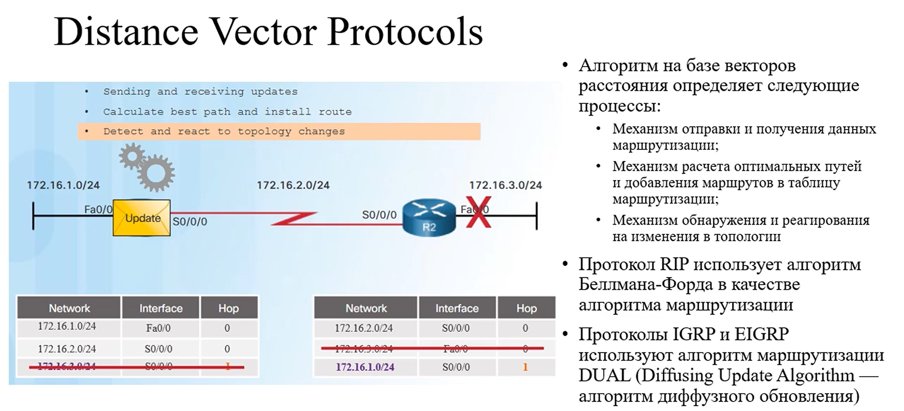

## Характеристики EIGRP

### IGRP and EIGRP

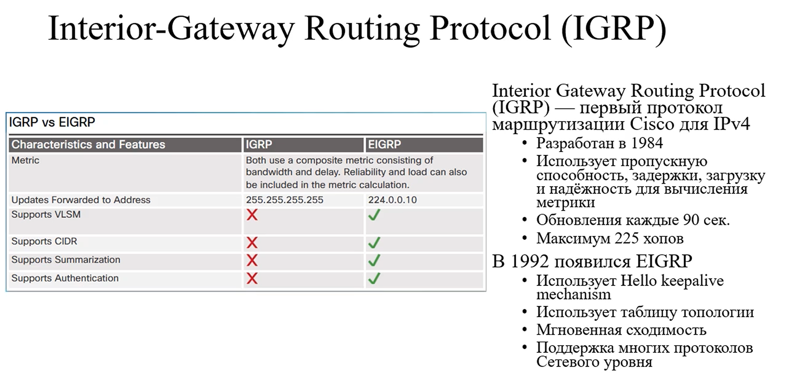

### EIGRP

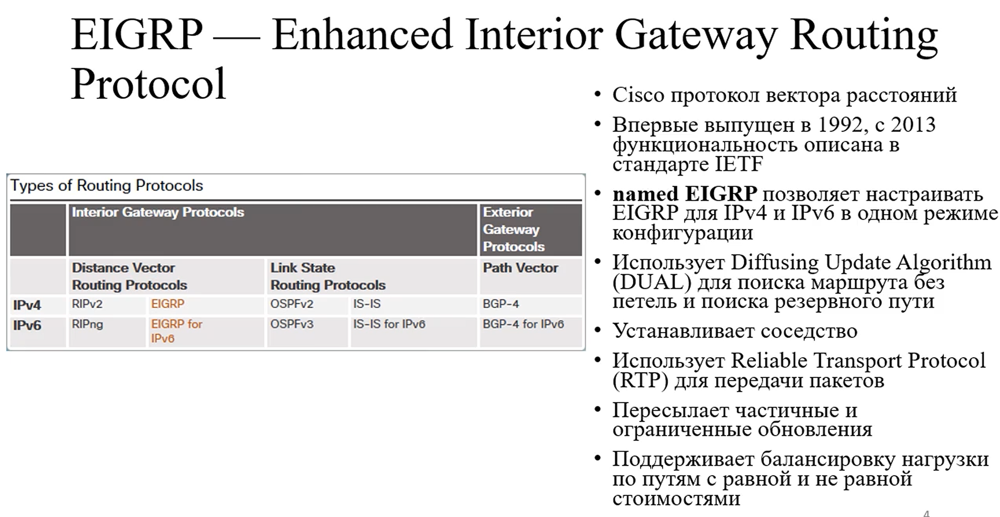

### RTP

Т.к EIGRP стеконезависмый протокол то он не может использовать протоколы UDP и TCP

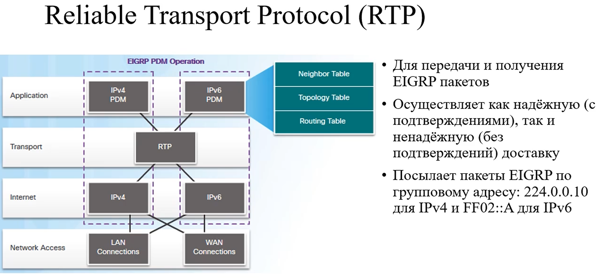

### Аунтификация

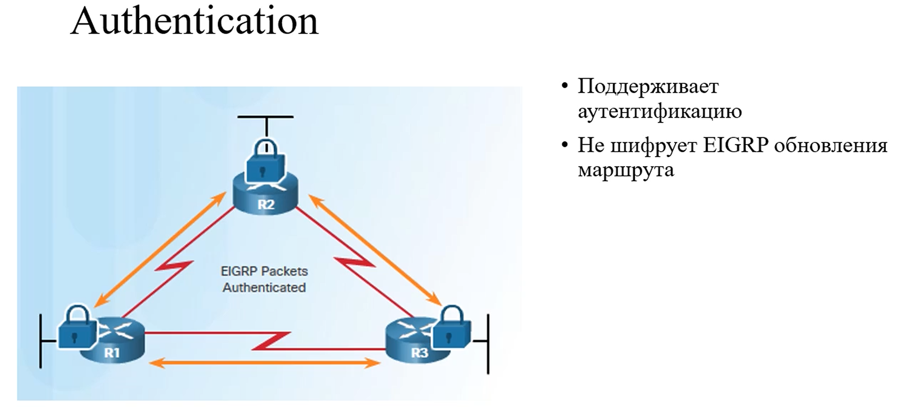

### Типы пакетов EIRGP

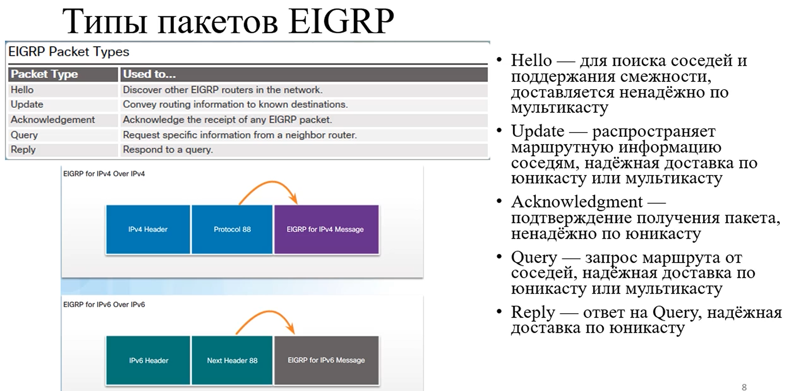

### Заголовок пакета EIGRP

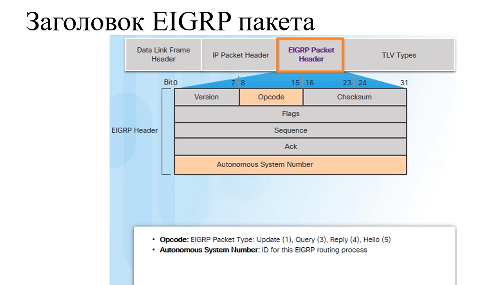

### EIGRP TLV: внутренние маршруты

### EIGRP TLV: внешние маршруты

-------------------------------------------------------------

## Алгоритм работы EIGRP

### Поиск соседей

Работа протокола начинается с обнаружения соседей с помощью пакетов Hello

На Hello соседний маршрутизатор должен ответить Update (т.е он отправляет свою таблицу маршрутизации, но подчиняясь
правилу расщепленного горизонта, нельзя отправлять сети которые были получены от первого маршрутизатора, **при первом
подключении такого не будет**)
Далее второй отправляет тоже пакет Hello и также ждет update от первого

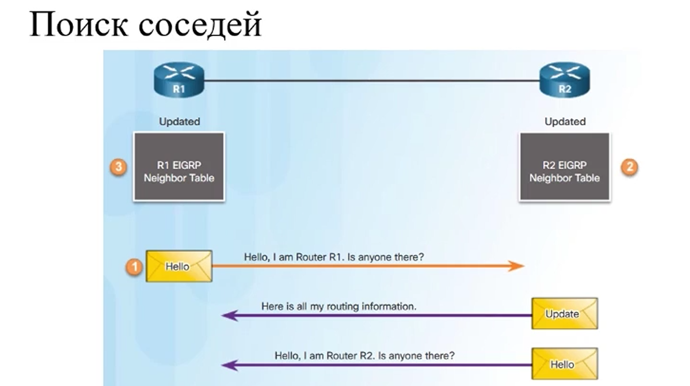

### Таблица Топологии

Каждый Update подтверждается ACK

Все полученные соседи добавляются в таблицу топологии, Таким образом на начальном этапе формируется таблица топологии,
по которой будут строиться маршруты и заполняться таблица маршрутизации

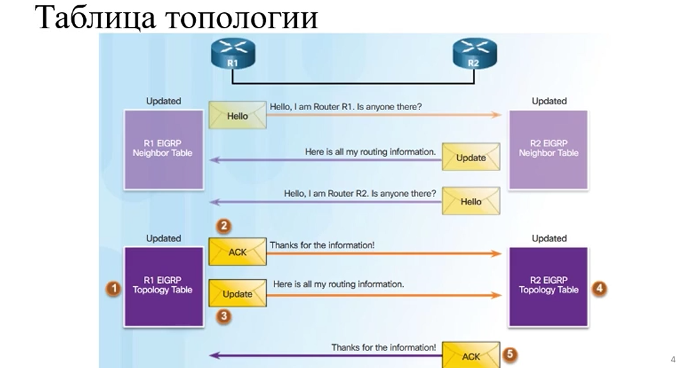

После обменами маршрутами и таблицы топологии были заполнены, считается, что сеть сошлась.

Задача: как же вычисляются маршруты

### Метрика

EIGRP использует составную метрику

Для метрики используются: пропускную способность канала(K1), загрузка(K2), задержка(K3), надежность канала(K4).

Рекомендуется использовать K1 K3 коэффициенты, которые включают пропускную способность и задержку канала

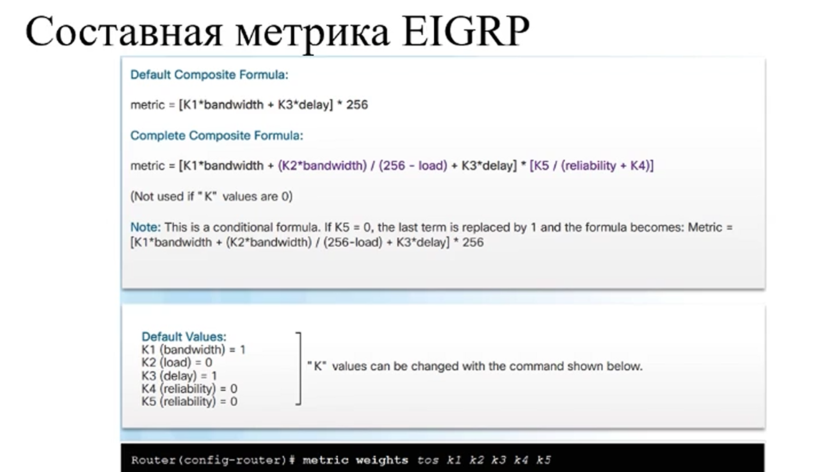

В формулу будут добавляться наименьшее значение пропускной способности, из тех что было получено. Задержка складывается
на всех этапах

### Bandwidth

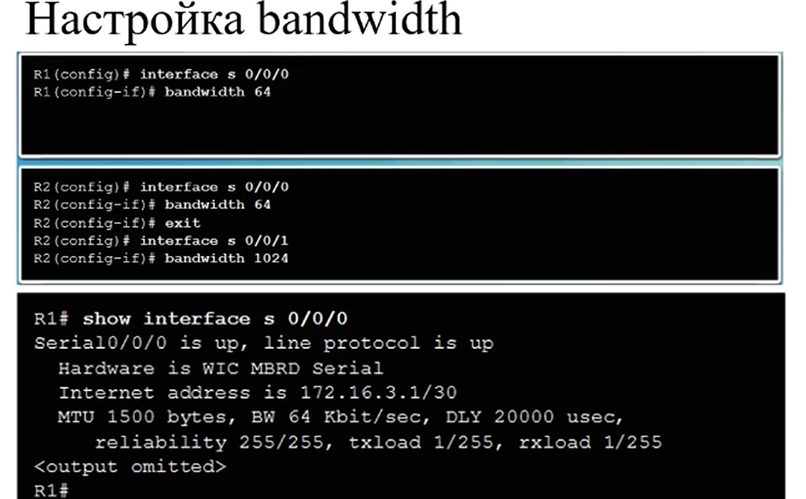

**Важно понимать** настройка не меняет физическое значение пропускной способности на маршрутизаторе, но меняет значение,
которое будет использоваться в формуле метрики, не только EIGRP, но и других протоколов маршрутизации(Например, OSPF)

### Вычисление метрики

Т.к нам нужно маленькое значение метрики, то мы берем в формуле обратное (т.к на хороших устройствах bandwidth имеет
большое значение)

### DUAL

Метрика - часть построения маршрута до сети, надо понять через какие направления можно добраться до указанной удаленной
сети - что делает DUAL

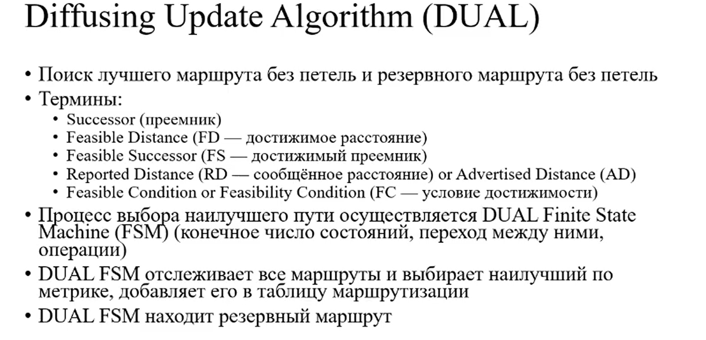

Резервный маршрут - позволяет быструю сходимость протокола.

### Как работает DUAL

**FD** - достижимое расстояние = метрика.

**Successor** - следующий маршрутизатор. Маршрутизатор, через который можно быстрее всего добраться до сети назначения (
Где метрика(**FD**) наименьшая)

**FS** - резервный маршрутизатор

**RD** - сообщенное расстояние, то расстояние, которое вычислил соседний маршрутизатор до указанной сети назначения.

Чтобы маршрут стал резервный он должен выполнять условие достижимости **FC**. Оно звучит так:
"Если сосед сообщает дистанцию до сети(**RD**) меньшую, чем моя текущая полная дистанция до неё, то этот сосед не
использует меня для достижения этой сети."

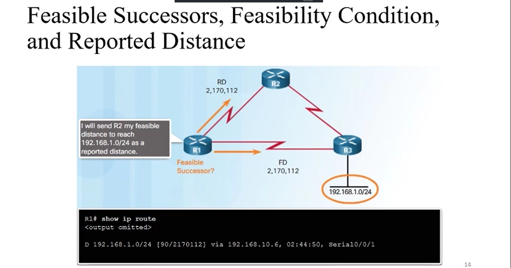

В нашем случае у нас для R3 есть какое-то сообщенное расстояние **RD** подключенной сети - оно наименьшее и для R2 есть
какое-то **RD** вычисленное до 192.168.1.0, сообщенным оно является только по отношению к R2, т.к этот маршрутизатор
сообщает свое расстояние до сети соседнему маршрутизатору. С точки зрения R1 это же самое сообщенное состояние является
достижимым расстоянием **FD**.

и наше условие **FC** предполагает **RD** < **FD**

Делается для избегания петель:
"Т.к если сообщенное расстояние => метрики, то мы не можем гарантировать, что оно не является частью пути до сети
назначения"

**show ip eigrp topology** - посмотреть таблицу топологии

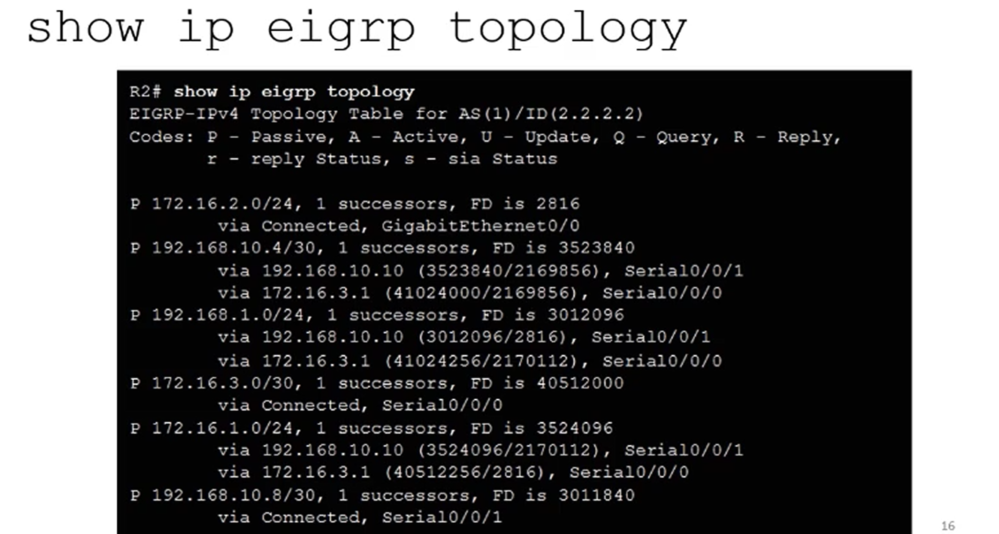

P - DUAL отработал, все пути в таблице маршрутизации
A - Сеть в активном состоянии пересчета. Маршруты только устанавливаются(Либо начало, либо поиск нового маршрута)

### Административное расстояние

Если маршрут внешний - 170
Если маршрут внутренний - 90

## Настройка и отладка EIGRP

autonomous-system - на всех маршрутизаторах должна совпадать чтобы создалась сеть

**show ip eigrp neighbors** - соседи

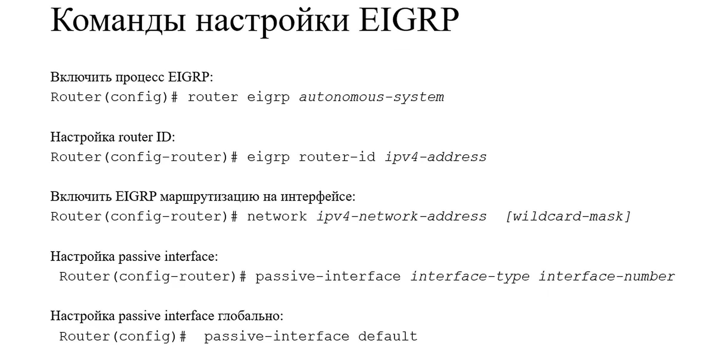

**show ip route**

-------------------------------------------------------------

## EIGRP в IPv6

### Ipv6

Также как и в IPv4 также ищем соседей, считаем метрику, кратчайшие маршруты добавляем в таблицу маршрутизации, все
маршруты в табилцу топологии

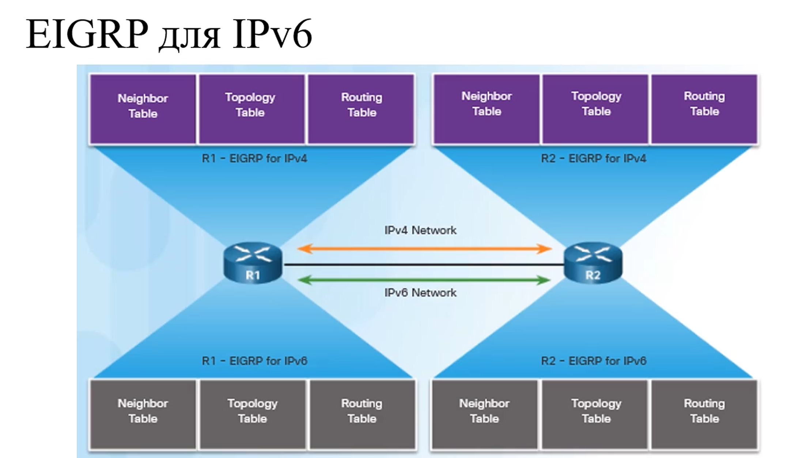

### Сравнение IPv4 и IPv6

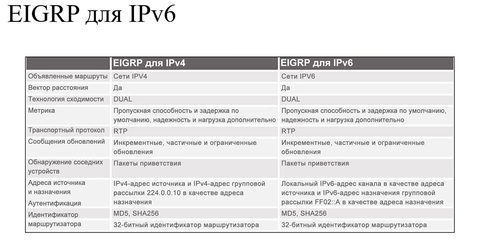

### Настройка EIGRP IPv6

**show ipv6 eigrp neighbors**

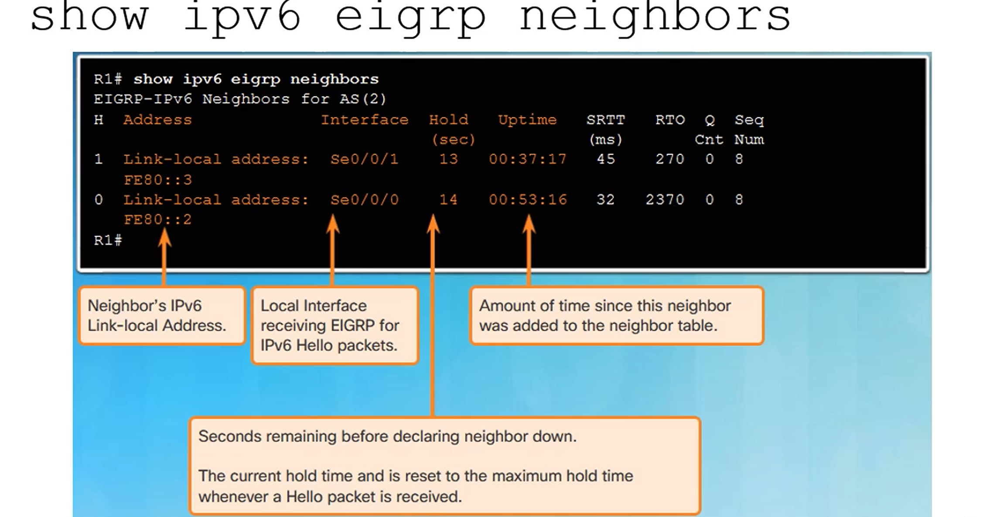

**show ipv6 protocols**

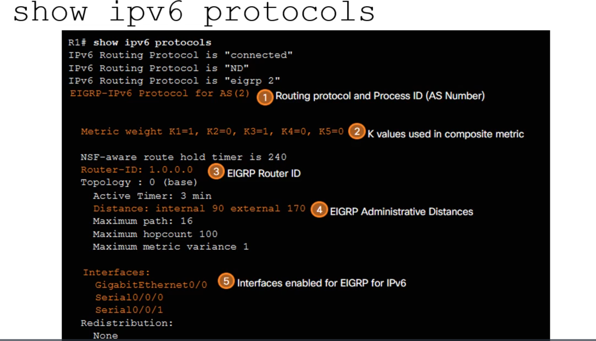