# Дополнительные настройки EIGRP

## Автоматическое объединение

Рассмотрим как работает автоматическое объединение в сети, на вот такой топологии

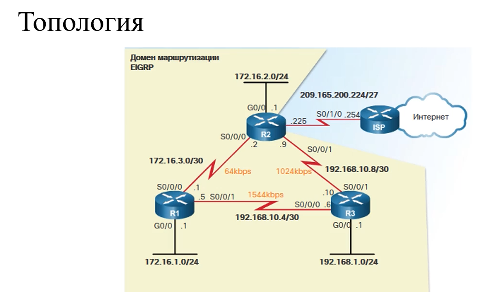

### Automatic Summarization EIGRP

Automatic Summarization - позволяет маршрутизаторам группировать сети и объявлять их как одну большую сеть по классу
сети. Т.е использовать 1 объединенный маршрут.

Удобно делать когда у нас есть 1 граничный маршрутизатор, например R1, который должен объявить свои маршруты вне домена
EIGRP.

Если бы мы не использовали суммаризацию, то пришлось бы объединять каждую подключенную сеть, которая используется в
домене, а их может быть множество, что увеличит таблицу маршрутизации, и увеличит поиск.

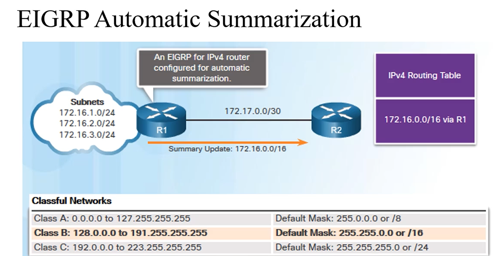

В Cisco сумаризация выключена по умолчанию.

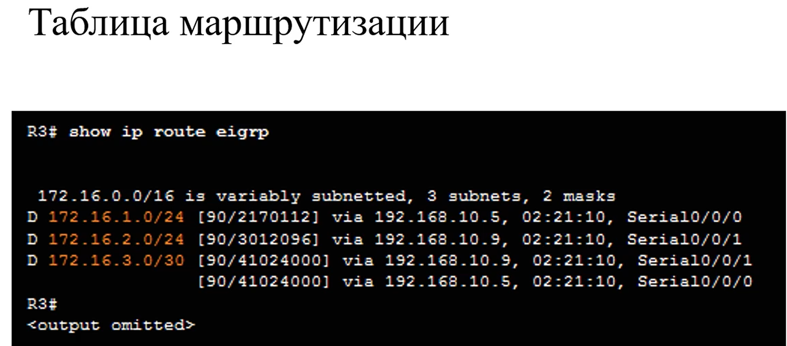

### Включение авто суммаризации

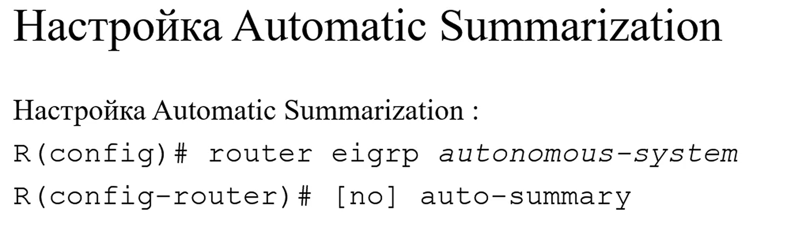

При настройке суммаризации работает правило:

"Не отправлять объявление маршрута до сети в интерфейсы входящие в данную сеть/подсеть"

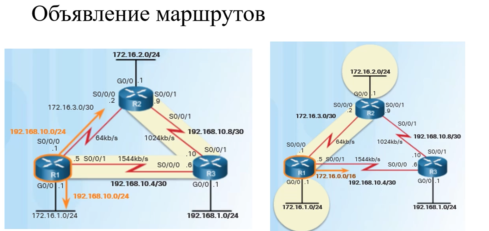

### Интерфейс Null0

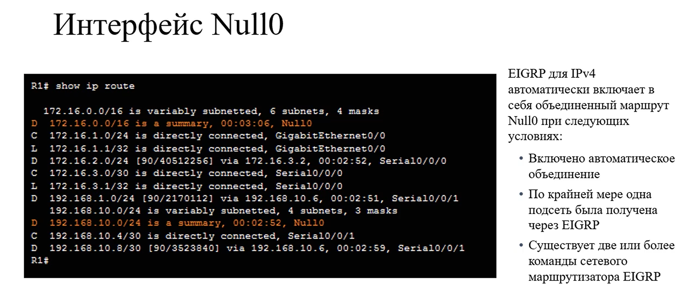

Null0 - виртуальный интерфейс, все пакеты, которые приходят на него, отбрасываются (еще приходит увед на соседний
маршрутизатор, что пакет отброшен)

### Возникновение петли

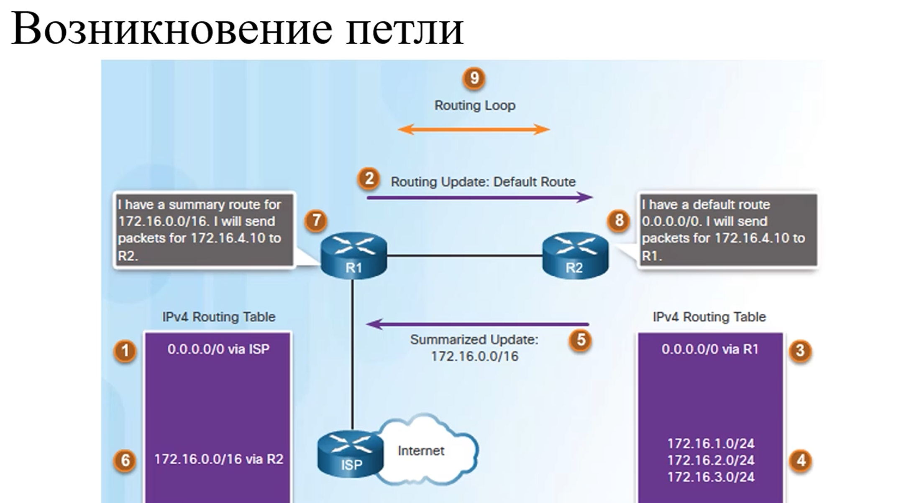

### Предотвращение петель с помощью Null0

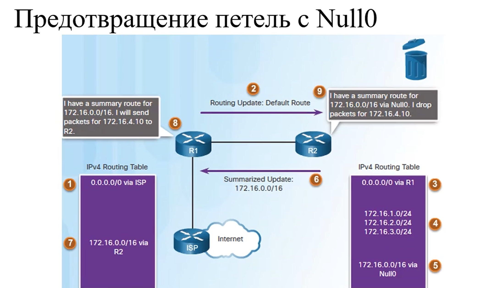

-------------------------------------------------------------

## Другие настройки EIGRP

### Распространение статического маршрута по умолчанию

Топология сети

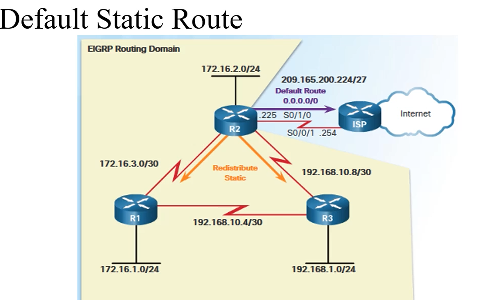

Главный момент: R2 подключен к провайдеру и имеет в его сторону маршрут по умолчанию, который настроен статически и
говорит о том, что все пакеты для которых не нашлось более точного адреса, отправляются провайдеру.

Всем остальным маршрутизаторам в домене EIGRP тоже нужно знать, где находится провайдер и в какую сторону отправляется
маршрут по умолчанию.

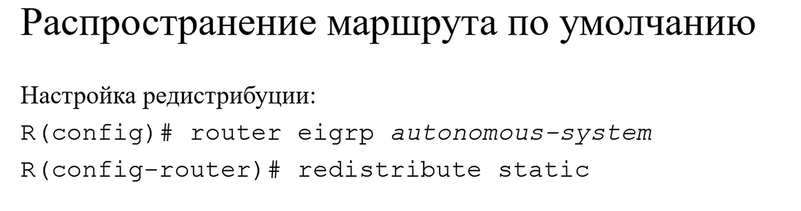

### Show ip route для статического маршрута по умолчанию

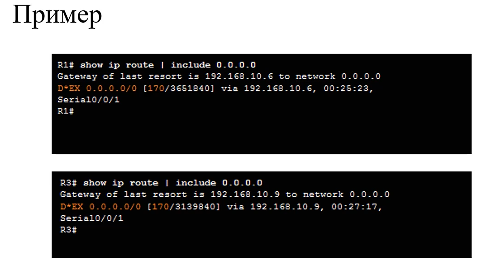

"*" это кандитат на маршрут по умолчанию
**EX** - маршрут вне домена eigrp

для IPv6 тоже самое

### Ограничение пропускной способности(bandwidth)

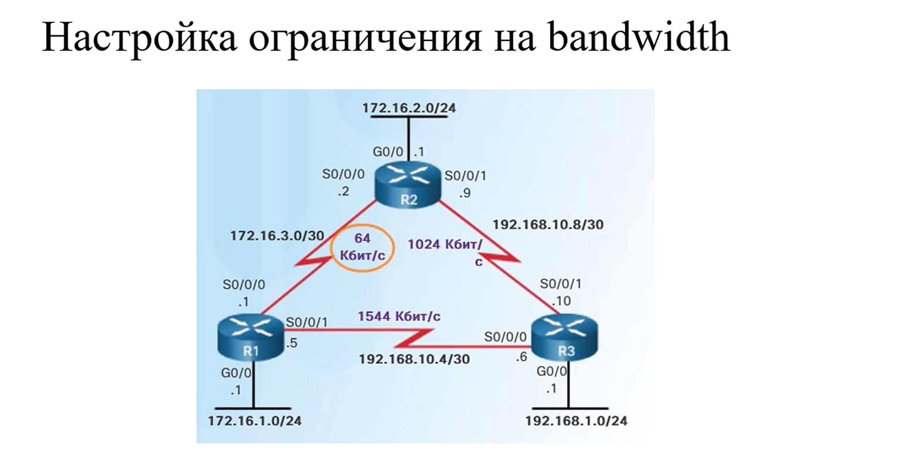

Ограничение на процент пропускной способности.

На сообщения в EIGRP уходит 50% пропускной способности(т.е 32 Кбит будут забраны для сообщений EIGRP)

Можно изменить %, изменяется от того, какую пропускную способность мы указали(т.е не от физического значения, а от того,
что мы сами указали)

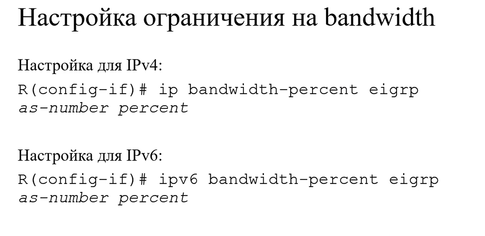

### Настройка Hello and Hold Timers

Можно задавать собственное значение таймеров, которые отвечают за то, как часто будут два соседних маршрутизатора
обмениваться приветственными сообщениями Hello и как долго каждый маршрутизатор будет ожидать от соседа приветственного
сообщения, прежде чем объявить своего соседа недоступным.

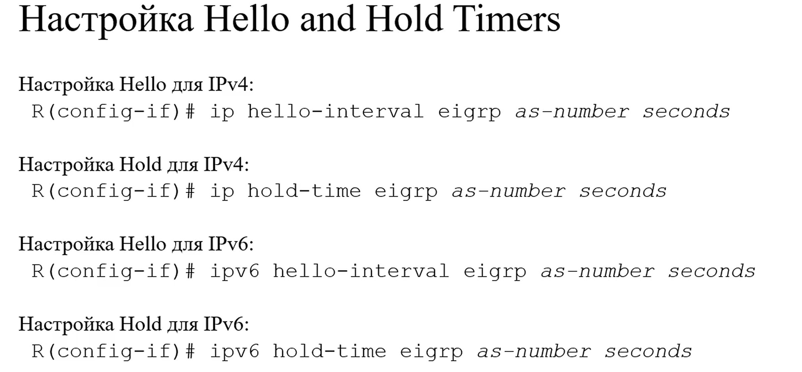

### Балансировка нагрузки

По умолчанию протокол EIGRP может балансировать нагрузку между разными каналами связи если они имеют одинаковую метрику
до одной сети. 

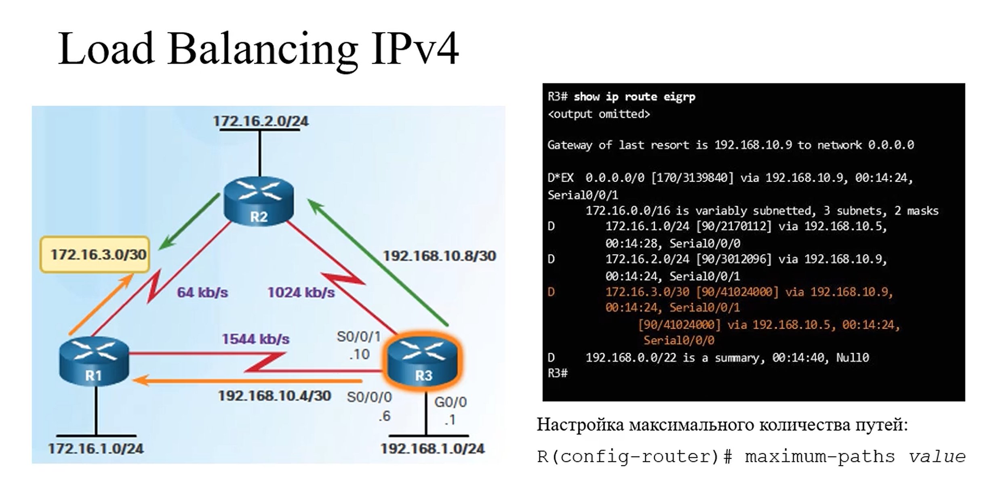

### Балансировка трафика для путей с не равной скоростью

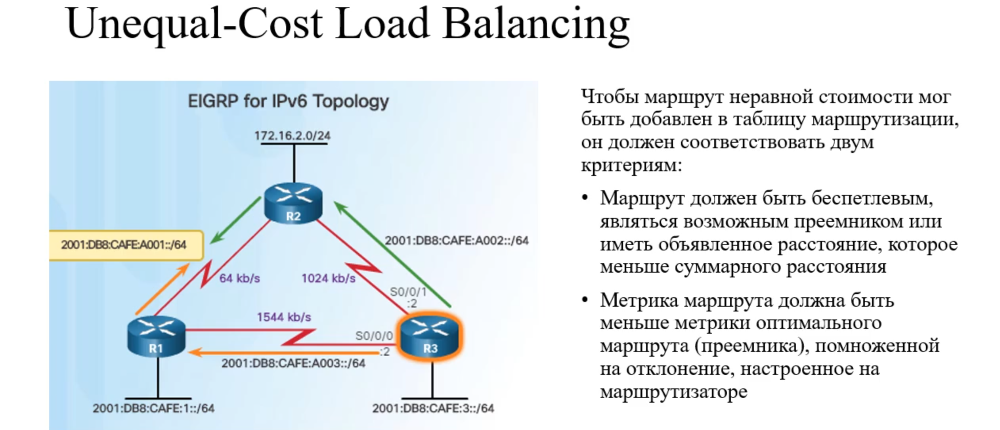

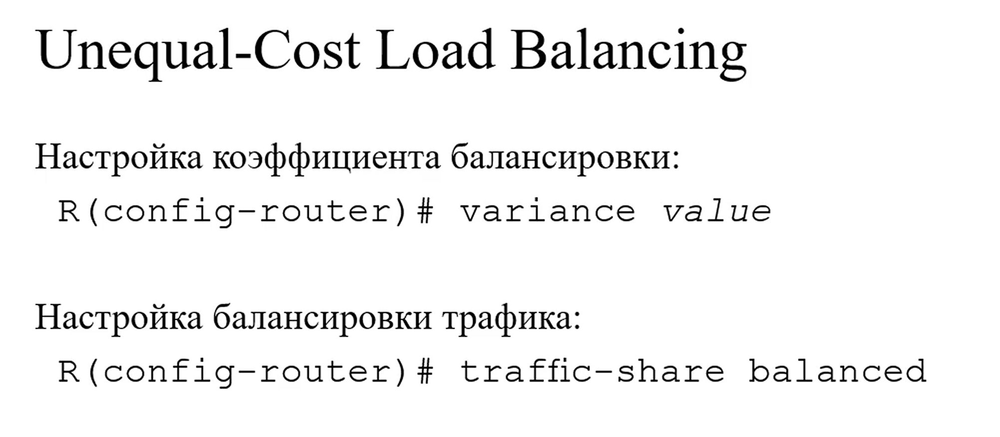

------------------------------

 