# Дополнительные настройки OSPF

## Multiarea OSPF

### Single Area OSPF

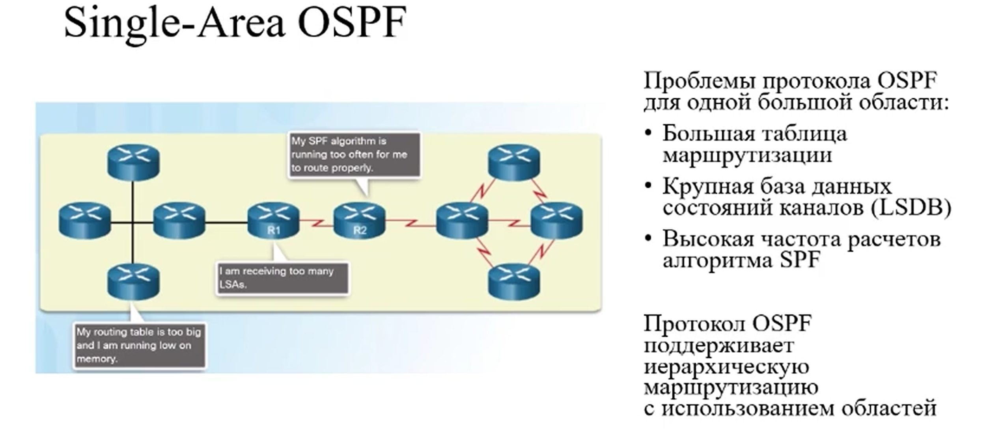

### Multiarea OSPF

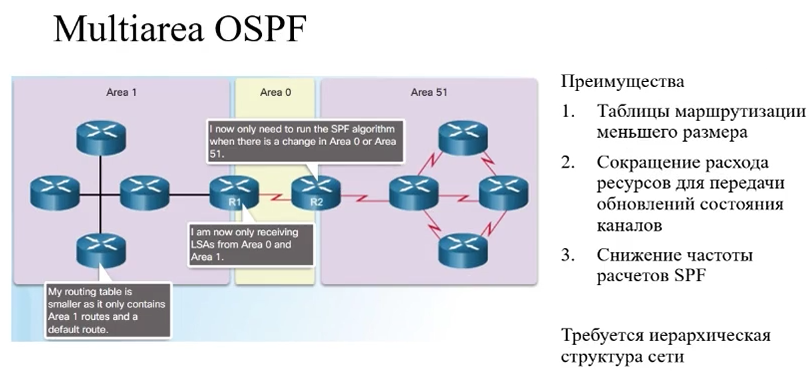

### Иерархия в OSPF

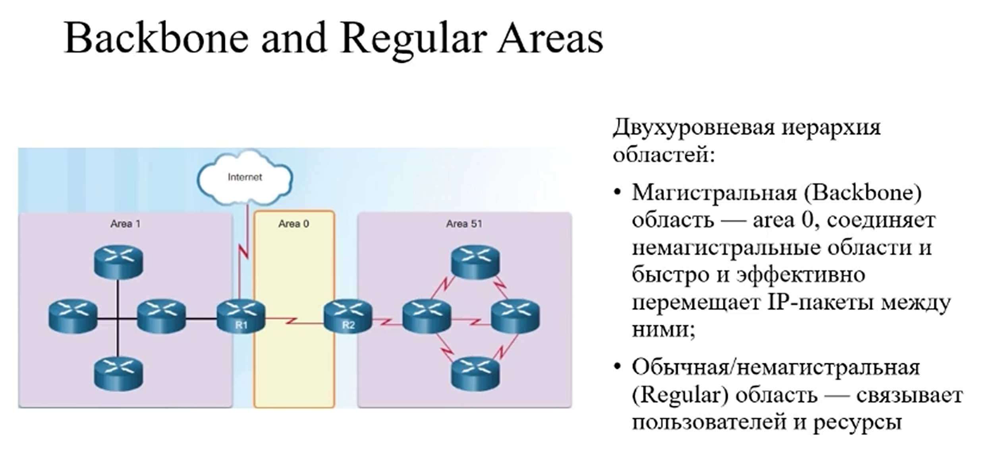

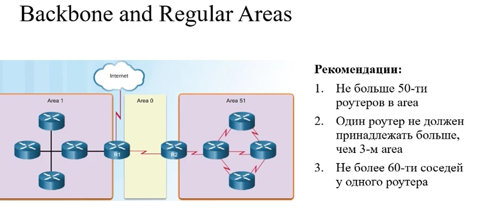

### Внутренний маршрутизатор

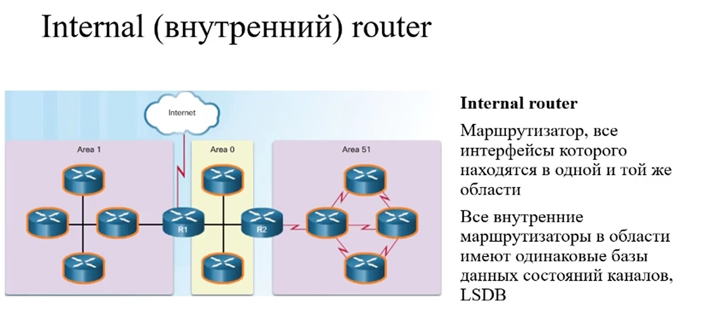

### Магистральные маршрутизаторы

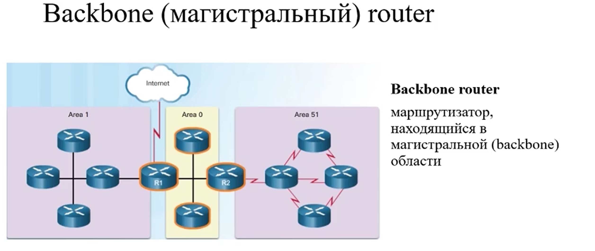

### Граничные маршрутизаторы (ABR)

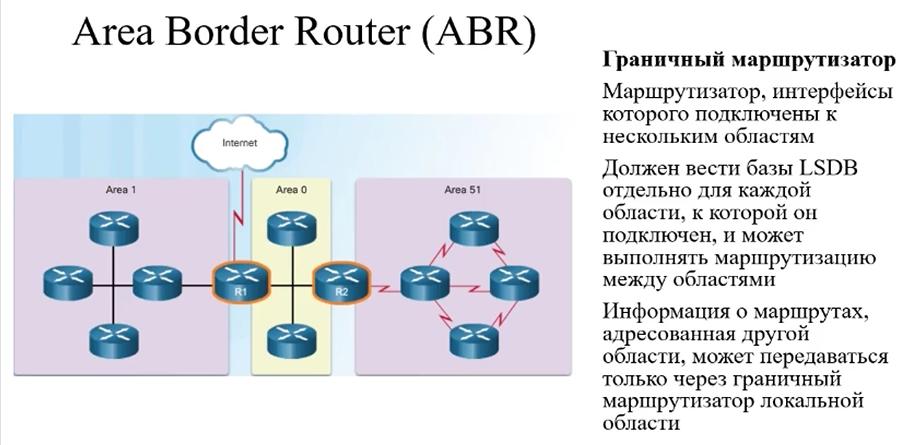

### Граничный маршрутизатор автономной системы (ASBR)

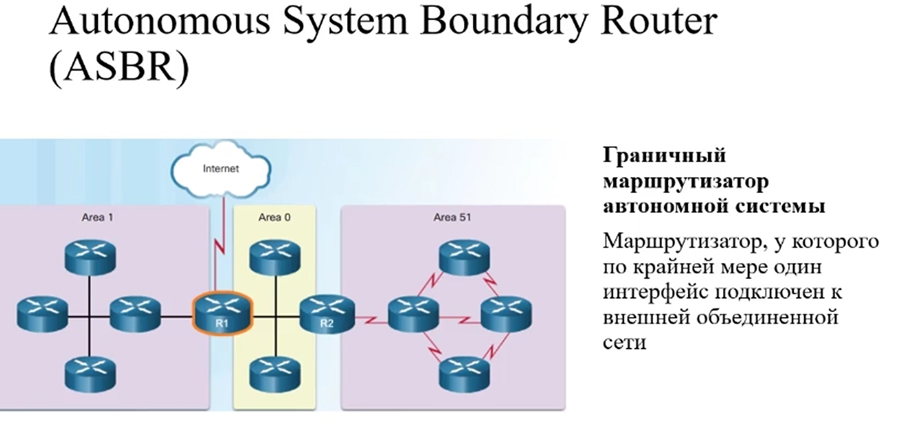

### Типы LSA

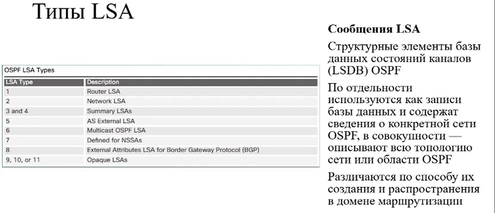

* LSA 1 каждый маршрутизатор сообщает информацию о сетях внутри одной области
* LSA 2 внутри области, генерируется только DR, нужно для сообщения топологии при соединении через Ethernet
* LSA 3 генерируется ABR для информирования других областей, а также получения от них DBD
* LSA 4 генерируется ABR, служат маршрутом для ASBR, говорим как добраться до него (через какие граничные идти) для
  всего домена маршрутизации
* LSA 5 генерируется ASBR для всего домена маршрутизации, сообщает о внешней сети, если настроена redistribute ...

### Type 1 LSA

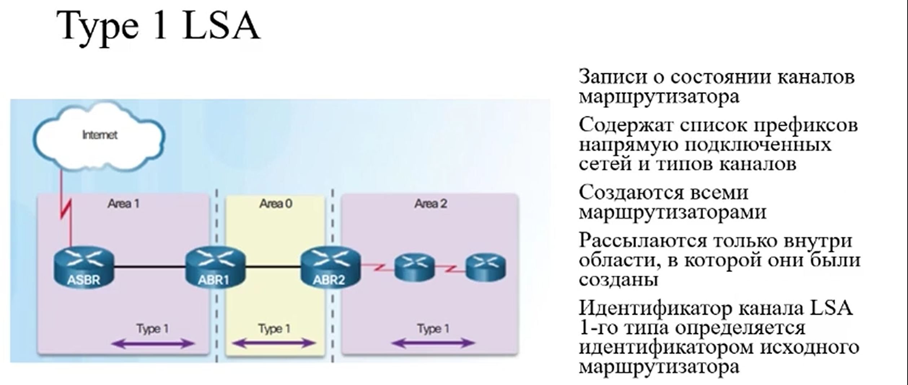

### Type 2 LSA

Записи о состоянии каналов сети. Создаются только роутером DR
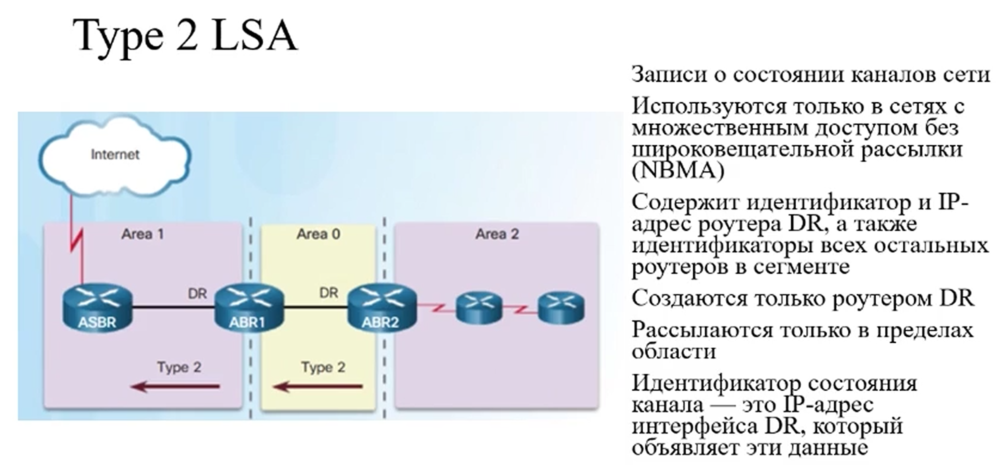

### Type 3 LSA

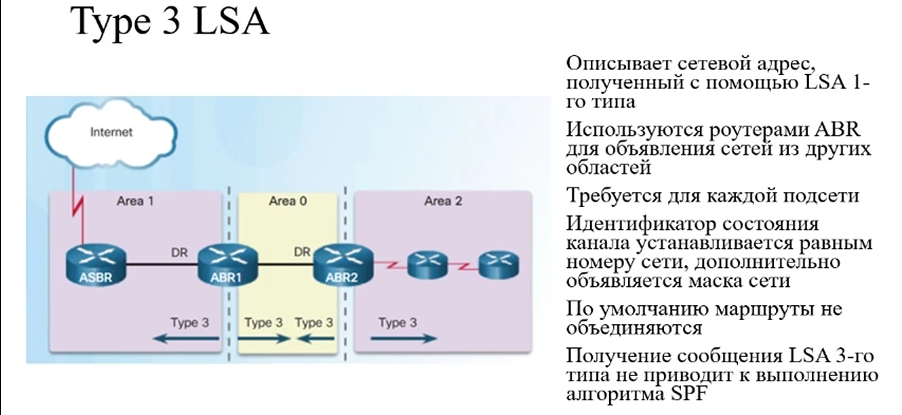

### Type 4 LSA

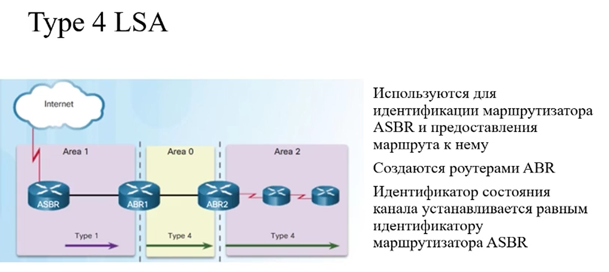

### Type 5 LSA

### Таблица маршрутизации

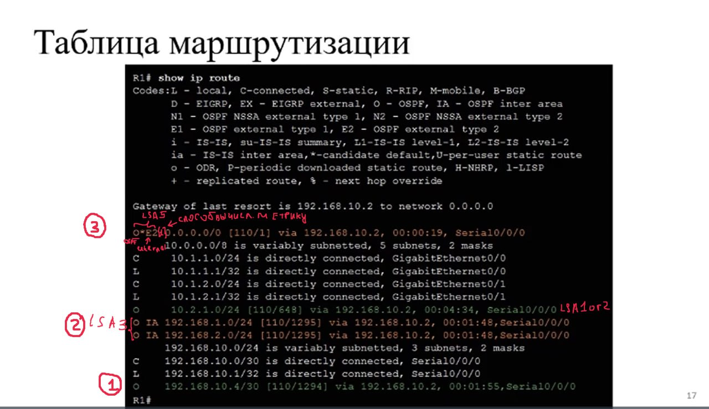
-------------------------------------------------------

## Настройка Multiarea OSPF

-------------------------------------------------------------------------------------

## Сети с множественным доступом в OSPF

### Типы ОСПФ сетей

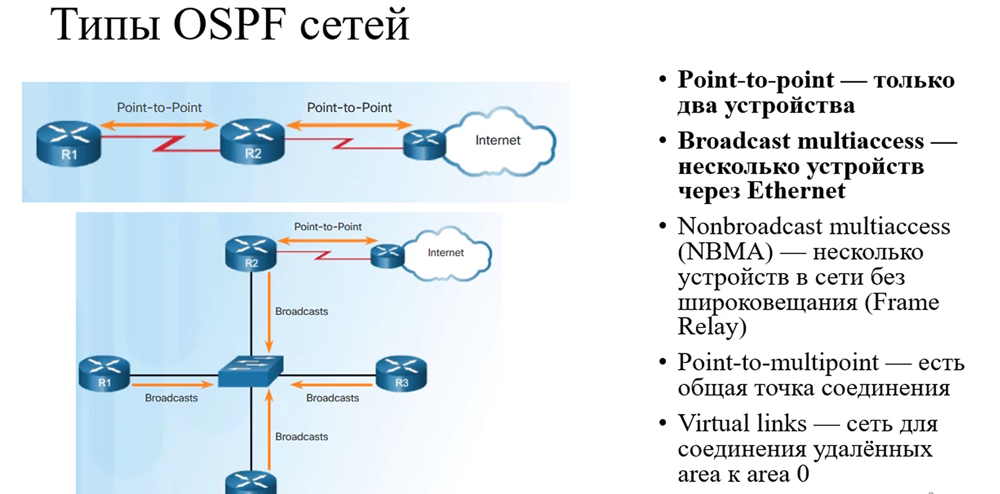

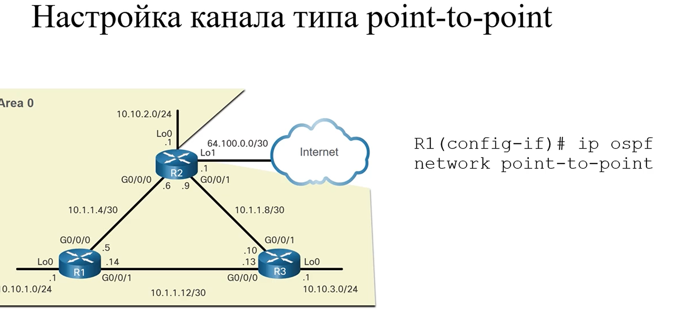

### Выделенный маршрутизатор

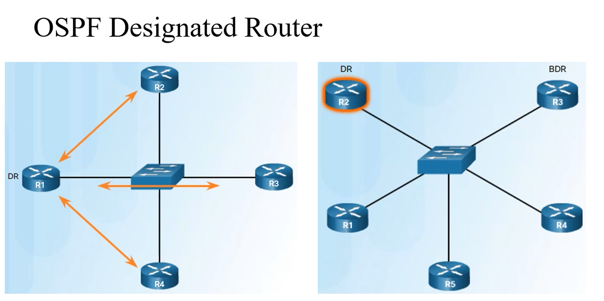

В сетях с множественным доступом OSPF все маршрутизаторы устанавливаются отношения смежности только с выделенным
маршрутизатором (Ну и с BDR т.к он запасной и нужен для подмены DR)

### Роли DR BDR

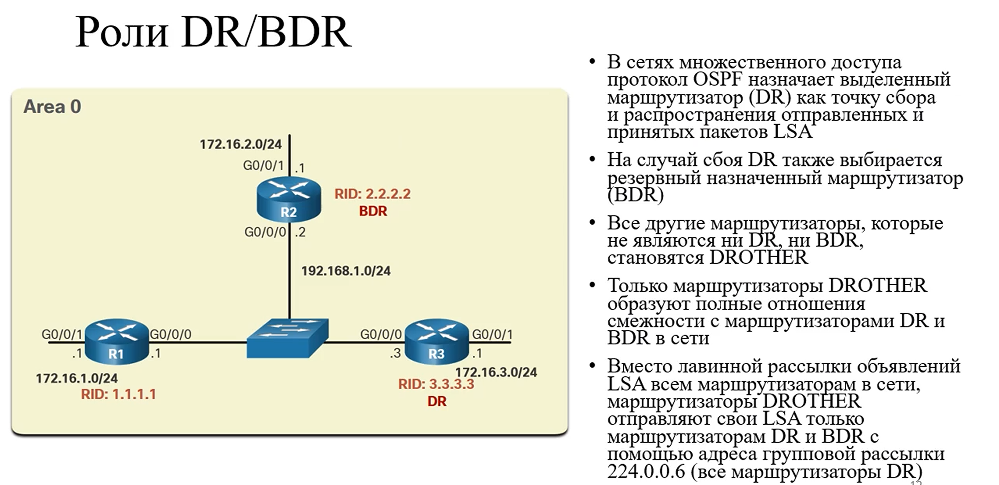

LSA сообщения отправляются только DR маршрутизатором

DROTHER отправляют свои LSA пакеты только DR и BDR маршрутизаторам

Для GigabitEthernet подключения состояние обязательно должно быть FULL - искл TO WAIT

### Выбор DR/BDR

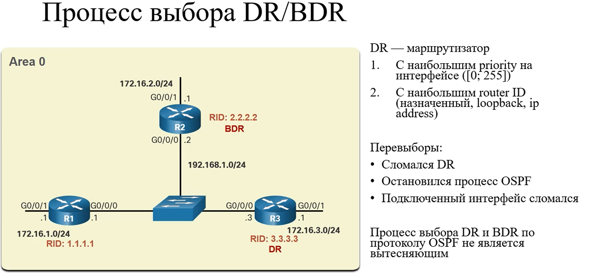

### Изменение приоритета

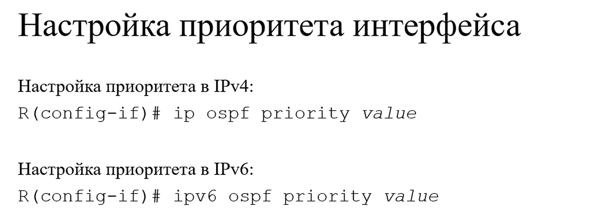

255 - гарантирует что маршрутизатор станет DR

--------------------------------------------------------------------------------------

## Дополнительные настройки OSPF

### Распространение маршрута по умолчанию

Распространение маршрута по умолчанию: пусть в нашей сети пограничный маршрутизатор - R1 имеет выход в интернет и путь
до интернета задается статическим маршрутом. Чтобы этот маршрутизатор R1 распространял статику через OSPF необходимо
воспользоваться простой командой default-information originate.

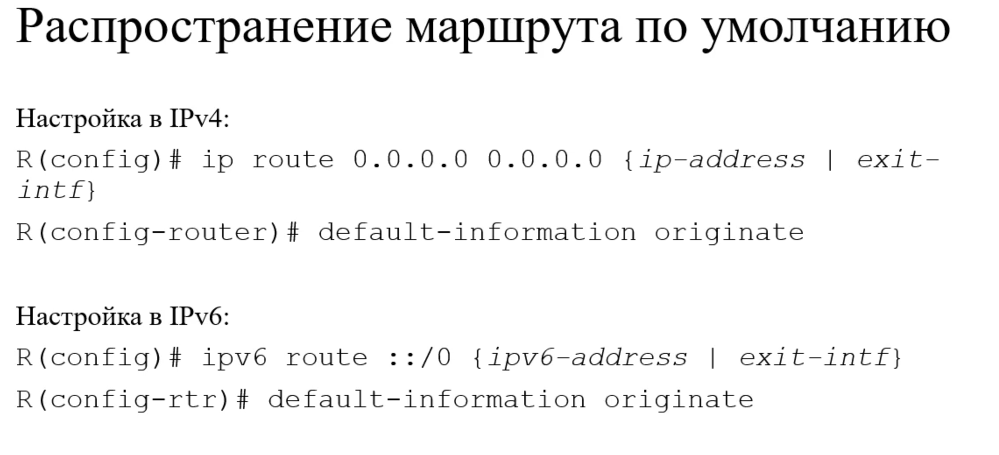

### Изменение Таймеров

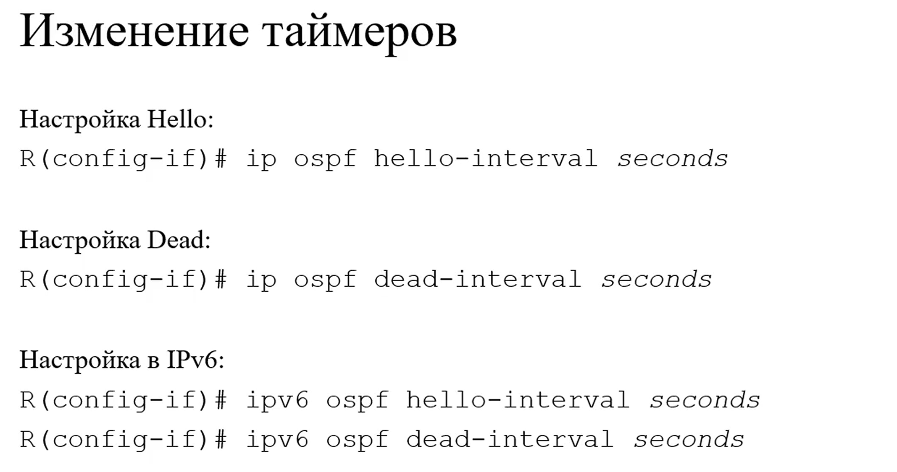