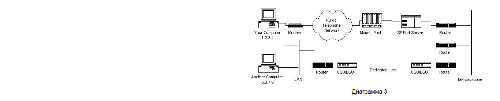
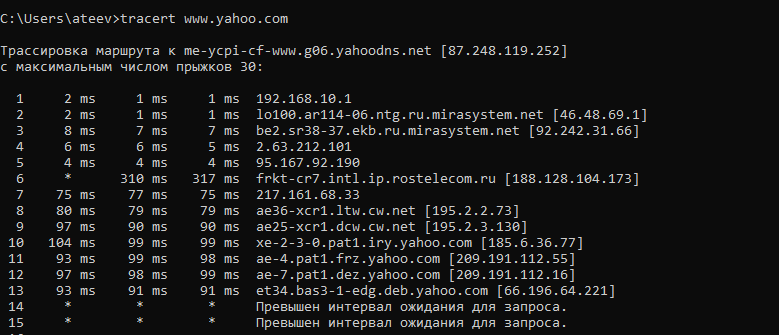
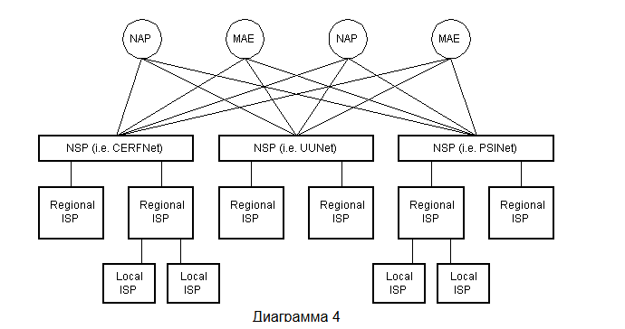
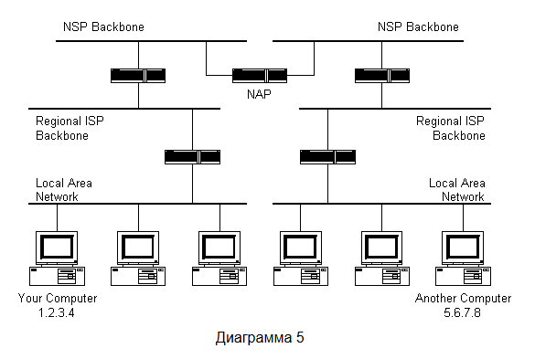
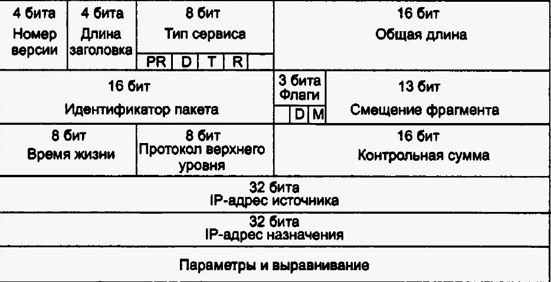

## 2 лекция

**Стек протоколов и пакеты**
*16.08.2025 Время занятия: `3`(с 13:00 до16:00)*

### Содержание:

- Стек протоколов и пакеты
- Сетевая инфраструктура
- Инфраструктура Интернет
- Иерархия Интернет-маршрутизации
- Разрешение доменных имён и адресов
- HTTP протокол
- SMTP протокол
- TCP протокол
- IP протокол

---

Наш компьютер имеет уникальный адрес, например `1.2.3.4`. Теперь мы хотим передать сообщение *"Привет ПК2"* второму
компьютеру с IP `5.6.7.8`.

Сообщение должно быть передано по каналу, связывающему компьютер и интернет. Допустим, мы позвонили нашему
интернет-провайдеру из дома, и сообщение должно быть передано по телефонной линии. Следовательно, сообщение
преобразуется из буквенного текста в электронные сигналы, передано через интернет и преобразовано обратно. Это
происходит благодаря **стеку протоколов**.

Каждому ПК для связи с интернетом нужен стек протоколов, который встроен, зачастую, в операционную систему. Стек
протоколов, используемый в интернете, называется **TCP/IP**.

### Уровни протоколов:

| Уровень протокола      | Комментарий                                                                                                                                                               |
|------------------------|---------------------------------------------------------------------------------------------------------------------------------------------------------------------------|
| **Прикладной**         | Отвечает за взаимодействие с конечными пользователями и приложениями.                                                                                                     |
| **Транспортный (TCP)** | Обеспечивает надежную передачу данных между источником и получателем.                                                                                                     |
| **Сетевой (IP)**       | Занимается маршрутизацией пакетов в сети.                                                                                                                                 |
| **Канальный**          | Отвечает за передачу данных на физическом уровне, обеспечивает прямую передачу между узлами, подключенными к одному и тому же медиа-носителю (например, Wi-Fi, Ethernet). |


1. Сообщение будет начинаться с верхнего уровня стека протоколов на вашем ПК и продвигаться вниз.
2. Если сообщение длинное, то каждый уровень стека протоколов будет его разбивать на **пакеты**.
3. Пакеты проходят через прикладной уровень и далее через транспортный (TCP). Каждому пакету присваивается номер порта.
   *(Многие программы могут использовать стек TCP/IP и отправлять сообщения. Нам нужно знать, какая программа на ПК
   получателя должна получить сообщение, потому что она будет прослушивать определённый порт.)*
4. Через прохождение уровня TCP пакеты переходят в сетевой уровень (IP). Здесь каждый пакет получает адрес назначения:
   `5.6.7.8`.
5. Когда у наших пакетов есть IP и номер порта, они готовы к отправке через интернет. Канальный уровень отвечает за
   преобразование пакетов, содержащих текст нашего сообщения, в электронные сигналы и их передачу по телефонной линии.
6. На другом конце телефонной линии — наш интернет-провайдер. **Интернет-провайдер — маршрутизатор** проверяет адрес
   назначения в каждом пакете данных и определяет, куда его отправить. *Чаще следующей остановкой пакетов становится
   другой маршрутизатор.*
7. В конце пакеты достигают ПК `5.6.7.8`. Здесь пакеты начинают свой путь в нижней части стека протоколов на ПК
   получателя.
8. По мере продвижения пакетов вверх по стеку все данные о маршрутизации, добавленные стеком протоколов отправителя (IP,
   порты), удаляются из пакетов.
9. Когда данные достигают вершины стека, пакеты собираются в исходную форму.

---

## Сетевая инфраструктура

Итак, теперь мы знаем, как пакеты данных передаются между ПК в интернете. Но что происходит между ними?



Физическое подключение к интернет-провайдеру было очевидным.

Интернет-провайдер предоставляет своим клиентам с коммутируемым доступом пул модемов. Управление осуществляется с
помощью выделенного ПК, который контролирует передачу данных из пула модемов в магистральную сеть или на выделенный
маршрутизатор. Такая система называется **портовым сервером**, так как она "обслуживает" доступ к сети.

После того как пакеты проходят через телефонную сеть и локальное оборудование провайдеров, они попадают в магистральную
сеть. Там они проходят ещё множество других локальных сетей и маршрутизаторов, пока не достигнут пункта назначения —
ПК2. Но было бы лучше, если бы мы заранее знали точный путь, через который будут проходить наши пакеты.

С помощью `traceroute` можно посмотреть полный список маршрутизаторов, компьютеров и других объектов, через которые
должны пройти наши пакеты.

**На Windows:**

```cmd
tracert IP
```



lo100.ar114-06.ntg.ru.mirasystem.net и т.д - интернет маршутизаторы, которые решают куда отправить наши пакеты.

## Инфраструктура Интернета

Магистральная сеть Интернета состоит из множества крупных сетей, которые соединены друг с другом. Эти крупные сети
называются интернет-провайдерами или **NSP (Network Service Providers)**. Эти сети взаимодействуют друг с другом для
обмена пакетным трафиком. Каждый NSP должен быть подключен к **точке доступа сети** **NAP (Network Access Point)**. В точках
NAP пакетный трафик может пересылаться с одной NSP на другую магистраль NSP.

В свою очередь магистрали NSP соединяются в крупных городских узлах или **MAE (Metropolitan Area Exchanges)**. MAE
выполняет ту же функцию, что и NAP, но находится в частной собственности. NAP и MAE называются точками обмена в
интернете или **IX (Internet Exchange Points)**. NSP также продают пропускную способность более мелким сетям, которые
также проводят трафик, но с меньшей пропускной способностью.



*Диаграмма не несёт верного представления о реальном фрагменте Интернета, только показывает как интернет-провайдеры
взаимодействуют друг с другом.*

---

## Иерархия Интернет-маршрутизации

Так как же находят свой путь пакеты в Интернете?  
Знает ли ПК, подключённый к интернету, где находятся другие ПК? Получают ли пакеты просто "широковещательную рассылку"
на все ПК? Ответ — **нет**.

Ни один ПК не знает, где находятся другие ПК, и пакеты не отправляются на все ПК. Информация, необходимая для доставки
пакетов до места назначения, находится в таблице маршрутизации, которая есть у каждого маршрутизатора, подключённого к
интернету.

**Маршрутизаторы** — это коммутаторы пакетов. Маршрутизатор обычно подключается между сетями для маршрутизации пакетов
между ними. Каждый маршрутизатор знает о своих подсетях и какие IP-адреса они используют. Маршрутизатор не знает, какие
IP-адреса находятся выше него.

Когда пакет данных поступает на маршрутизатор, тот проверяет IP-адрес, присвоенный ему уровнем IP-протокола на исходном
ПК. Далее маршрутизатор сверяется со своей таблицей маршрутизации. Если сеть, содержащая IP-адрес, найдена, то пакет
отправляется в ту сеть. Если сеть не найдена, то маршрутизатор отправляет пакеты по маршруту по умолчанию, вверх по
иерархии магистрали к следующему маршрутизатору. Если следующий маршрутизатор не знает, куда отправлять пакет, то он
снова идёт вверх по иерархии, пока не достигнет магистральной сети NSP. Маршрутизаторы, подключённые к NSP, имеют самые
большие таблицы маршрутизации, и здесь пакет направляется в нужную магистральную сеть и далее начинает свой путь вниз по
иерархии, пока не дойдёт до получателя.



*Чёрные прямоугольники — маршрутизаторы. Более крупные магистрали NSP в верхней части соединены на уровне NAP. Под ними
находятся несколько подсетей, а под ними — ещё несколько. Внизу расположены локальные сети, подключённые к ПК.*

---

## Разрешение доменных имён и адресов

Что делать, если мы не знаем IP-адрес ПК, но хотим отправить пакеты по адресу `www.secondPC.ru`? Как браузер узнает, где
в интернете находится этот ПК?

Тут нам поможет **DNS (Domain Name System)** — служба доменных имён. DNS — это распределённая база данных, в которой
хранятся имена ПК и соответствующие им IP-адреса в интернете.

**DNS-серверы** — компьютеры, подключённые к интернету, которые содержат часть базы данных DNS и ПО, позволяющее другим
пользователям получать доступ к ней. Ни один DNS-сервер не содержит всю базу данных, только её часть. Если DNS-сервер не
содержит у себя доменного имени, запрашиваемого компьютером, то он перенаправляет запрос на другой DNS-сервер.


Служба доменных имён структурирована в виде иерархии, как IP-маршрутизация. Компьютер, запрашивающий разрешение имени,
будет направлен вверх по иерархии до тех пор, пока не будет найден DNS-сервер, способный разрешить доменное имя в
запросе.

При настройке подключения к интернету указывается один основной или несколько дополнительных DNS-серверов. Таким
образом, любые интернет-приложения, которым требуется разрешение доменных имён, будут работать корректно.

**Например:**  
Когда мы вводим веб-адрес в браузер, мы сначала подключаемся к нашему основному DNS-серверу. После получения IP-адреса
для доменного имени браузер подключается к ПК и запрашивает нужную веб-страницу.

---

## HTTP протокол

**HyperText Transfer Protocol** — протокол прикладного уровня, который веб-браузеры и веб-серверы используют для
взаимодействия друг с другом.

HTTP — это текстовый протокол без установления соединения. Клиенты отправляют на веб-серверы запрос на получение
веб-элементов, таких как веб-страницы и изображения. После того как запрос обработан сервером, подключение между
клиентом и сервером разрывается. Для каждого запроса нужно устанавливать новое соединение.

**Что происходит, когда мы вводим URL в браузер:**

1. Если URL содержит доменное имя, браузер сначала подключается к DNS-серверу и получает соответствующий IP для
   веб-сервера.
2. Браузер подключается к серверу и отправляет HTTP-запрос для получения нужной веб-страницы.
3. Сервер проверяет запрос и наличие нужной страницы. Если страница существует — отправляет её. Если нет — отправляет
   ошибку HTTP 404.
4. Браузер получает страницу, и соединение разрывается.
5. Далее браузер анализирует страницу и ищет другие элементы для её заполнения (изображения и т. д.).
6. Для каждого дополнительного элемента браузер устанавливает дополнительное соединение и отправляет HTTP-запросы на
   сервер.
7. После загрузки всех доп. элементов страница будет полностью прогружена в окне браузера.

---

## SMTP протокол

**Simple Mail Transfer Protocol** — текстовый протокол прикладного уровня, но в отличие от HTTP, он устанавливает
соединение.

**Когда мы открываем почтовый клиент, происходит следующее:**

1. Почтовый клиент (Microsoft Outlook, Mail.ru и т. д.) устанавливает соединение с почтовым сервером по умолчанию.
   IP-адрес или доменное имя почтового сервера обычно настраиваются при установке почтового клиента.
2. Сервер всегда отправляет первое сообщение для идентификации.
3. Клиент отправляет команду SMTP `HELO`, на которую сервер ответит `250 OK`.
4. В зависимости от того, проверяет ли клиент почту или отправляет письма на сервер, будут отправляться соответствующие
   команды SMTP, на которые сервер будет отвечать соответствующим образом.
5. Эта транзакция "запрос/ответ" будет продолжаться до тех пор, пока клиент не отправит команду SMTP `QUIT`. После этого
   сервер закроет соединение с клиентом.

---

## TCP протокол

Когда приложения открывают соединение с другими ПК через интернет, сообщения, которые они отправляют, передаются по
стеку на уровень TCP.

TCP отвечает за маршрутизацию прикладных протоколов к нужному приложению на конечном компьютере. Для этого используются
номера портов.

**Порты** — как отдельные каналы на каждом ПК. Например, можно просматривать веб-страницы во время чтения почты, потому
что эти два приложения используют разные порты. Когда пакет данных поступает на компьютер и поднимается по стеку
протоколов, уровень TCP определяет, какое приложение получит пакет, на основе номера порта.

**Как работает TCP:**

1. Когда уровень TCP получает данные протокола прикладного уровня, он разбивает их на управляемые фрагменты (пакеты), а
   затем добавляет к каждому фрагменту заголовок TCP с определённой информацией. Информация, содержащаяся в заголовке
   TCP, включает номер порта приложения, которому нужно передать данные.
2. Когда уровень TCP получает пакет от нижних уровней, он извлекает данные о заголовке TCP, при необходимости выполняет
   реконструкцию данных, а затем отправляет данные нужному приложению, используя номер порта из заголовка.

TCP — это протокол, ориентированный на установление соединения, надежный протокол передачи данных в виде потока байт.
Ориентированность означает, что два приложения сначала должны установить соединение между собой, прежде чем обмениваться
данными. Надёжность обеспечивается тем, что для каждого полученного пакета отправителю отправляется подтверждение
доставки.

TCP также включает в заголовок контрольную сумму для проверки полученных данных на ошибки.


*В заголовке TCP нет места для IP-адреса, так как TCP ничего не знает об IP-адресах.*

---

## IP протокол

**Internet Protocol** — ненадёжный протокол без установления соединения.  
IP не важно, дойдёт ли пакет до получателя — он ничего не знает о соединениях и номерах портов.  
Задача IP — отправлять пакеты на другие ПК и маршрутизировать их. IP-пакеты — независимые объекты и могут приходить в
любом порядке либо вообще не приходить.

