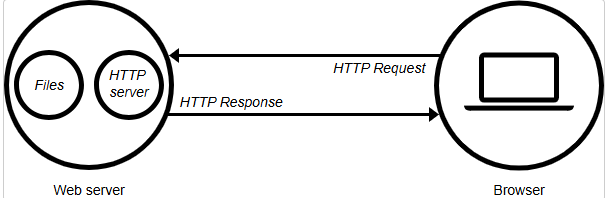
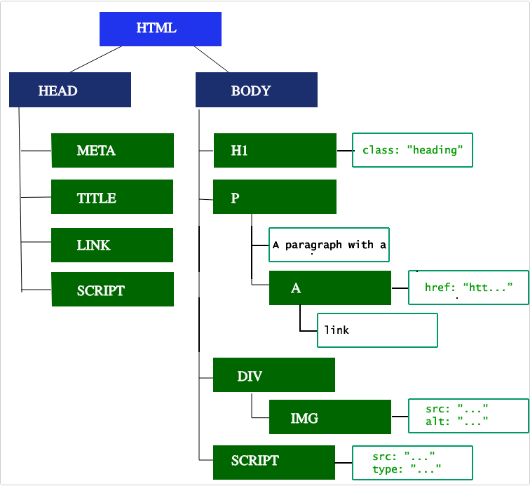

## Лекция 3

**Хостинг, Браузер и как они работают**
*18.08.2025 Время занятия:`3.5`(с11:45до12:45 + с16:00до18:30 msk)*

### Содержание:

- Основные понятия
- Хостинг и как он работает
- Веб-сервер
- Браузер и как он работает
    1. Навигация
    2. Поиск по DNS
    3. TCP-рукопожатие
    4. Согласование TLS
    5. Ответ
    6. Синтаксический анализ
    7. DOM и CSSOM-дерево
    8. Другие процессы
    9. Визуализация
    10. Интерактивность

---

## Основные понятия:

- **Веб-страница** - документ, который можно отобразить на веб-браузере или по другому "страница".
- **Веб-сайт** - набор веб-страниц, объединённых в единый ресурс с помощью ссылок.
- **Веб-сервер** - Компьютер на котором расположен веб-сайт в Интернете.
- **Веб-сервис** - Программное обеспечение, которое отвечает на запросы в Интернете и выполняет определенные функции или
  предоставляет данные.
  Работает на веб сервере и предоставляет доступ пользователям к веб-страницам в Интернете для взаимодействия.(*Примеры:
  сервисы, которые меняют
  размер изображения, предоставляют прогноз погоды, обрабатывают вход пользователя в систему*)
- **Поисковая система** - Веб-сервис, который помогает находить другие веб-страницы в Интернете. Доступ к поисковым
  системам осуществляется через
  веб-браузер или через веб-страницу.
- **Браузер** - это программа, которая загружает и отображает веб-страницы.
- **Пропускная способность** - показатель того, какой объем информации может пройти через канал передачи данных за
  определённое время.
- **Критические этапы рендеринга** - последовательность шагов, которые выполняет браузер, когда преобразует HTML, CSS,
  JS в пиксели, которые видно на экране. Оптимизация этих шагов улучшает производительность рендеринга.
- **DOM** - внутренне представление разметки для браузера.
- **Дерево доступности** - упрощенное представление веб-страницы, которое может "читаться" вспомогательными
  технологиями, такими как скринридеры. Его цель - сделать веб страницы доступными для всех пользователей.
- **Первая значимая отрисовка** - это отрисовка, после которой происходит самое масштабное изменение макета и
  загружаются веб-шрифты.
- **Компоновка** - это процесс определения размеров и расположения всех узлов в дереве рендеринга, а также определяет
  размер и положение каждого элемента на странице.
- **Перекомпоновка** - любое последующее определение размера и положения любой части страницы или всего документа.
- **Время до интерактивности(TTI)** - показатель того, сколько времени прошло с момента первого запроса, который привел
  к
  поиску DNS и установлению TCP-соединения, до момента, когда страница становится интерактивной.
- **Интерактивность** - момент времени после *первой отрисовки контента*, когда страница реагирует на действия
  пользователя в течении 50 мс.

---

# Хостинг и как он работает

**Хостинг** - услуга по предоставлению серверного пространства и ресурсов для хранения и доставки файлов веб-сайтов и
приложений пользователям
через Интернет.

**Хостинг-Провайдеры** предлагают инфраструктуру, такую как веб-серверы, хранилища и сетевые подключения, необходимые
для обеспечения
доступности веб-сайтов и приложений в Интернете.

*Виды хостинга:*

- Виртуальный хостинг(Когда несколько веб-сайтов используют один сервер)
- Виртуальные частные серверы(VPS)
- Выделенный хостинг(один сервер выделен для 1 пользователя)
- Облачный хостинг(Использует сеть серверов для предоставления масштабируемых ресурсов)

Услуги хостинга включат в себя регистрацию домена, функции безопасности и техническую поддержку.

*Хостинг-провайдеры* взимают плату в зависимости от того, сколько *пропускной способности* потребляет ваш веб-сайт.
Зависит от того, сколько людей, поисковых роботов получают доступ к вашему контенту за определённое кол-во времени, а
также сколько места занимает контент на сервере.

-----------------------

## Веб-сервер

**Веб-сервер:**

1. С точки зрения аппаратного обеспечения - это компьютер, на котором хранится программное обеспечение **веб-сервере** и
   файлы компонентов веб-сайта(*HTMl-страницы, CSS, изображения, и т.д*)
2. Что касается программного обеспечения, **веб-сервер** состоит из нескольких частей, которые управляют доступом
   пользователей
   к размещенной веб-странице. Как минимум это *HTTP-серверы* - программное обеспечение которое принимает url-address и
   HTTP.

Чтобы опубликовать веб-сайт, нужен статический или динамический веб-сервер

**Статический веб-сервер**, или стек, состоит из ПК с HTTP-сервером. Называется *статическим*, потому что сервер
отправляет размещенные на нем файлы в браузер без изменений

**Динамический веб сервер** состоит из веб-сервера и дополнительного программного обеспечения, чаще всего *сервера
приложений* и *базы данных*.
*Динамический*, потому что сервер приложений обновляет размещенные файлы перед отправкой контента в наш браузер через
HTTP-сервер.

---

# Браузер и как он работает.

## Навигация

**Навигация** - это первый этап загрузки страницы. Происходит каждый раз, когда пользователь запрашивает страницу, вводя
url в строку, переходя по ссылке и т.д.

Одно из целей повышения производительности веб-сайтов - уменьшить время, необходимое для навигации.

### Поиск по DNS

Первым шагом при переходе на веб-страницу является поиск ресурсов, необходимых для этой страницы.

Браузер запрашивает поиск DNS, который выполняется на сервере имён, а он, в свою очередь, отвечает IP-адресом.
После этого первоначального запроса IP-адрес, будет кэширован на некоторое время, что ускорит последующие запросы за
счёт извлечения IP-адреса из кэша вместо обращения к нему каждый раз.

Обычно DNS-запрос выполняется 1 раз для каждого имени хоста при загрузке страницы. Но DNS-запрос должен выполняться для
каждого уникального имени хоста, на который ссылается запрашиваемая страница. То есть, если у шрифтов, изображений,
медиа-файлов, метрик разные имена хостов, то для каждого будет выполнен DNS-запрос, что очень плохо для
производительности.

### TCP-рукопожатие

Как только IP-адрес становится известен, браузер устанавливает соединение с сервером с помощью трёхэтапного
*TCP-рукопожатия*. Механизм работает, так, чтобы 2 объекта, пытающиеся установить связь (*браузер и веб-сервер*) могли
согласовать параметры сетевого соединения TCP-сокета, перед передачей данных, чаще по *HTTPS*.

Метод трёх стороннего подтверждения TCP называют *SYN-SYN-ACK* или точнее SYN- SYN-ACK - ACK, потому что TCP передаёт 3
сообщения для согласования и запуска TCP-сеанса между двумя ПК. (*Это означает, что между каждым сервером будет передано
3 сообщения, а запрос еще не будет отправлен*)

### Согласование TLS

Для безопасных соединений, устанавливаемых через HTTPS, используют сертификат TLS. Согласование TLS определяет, какой
шифр будет использоваться для шифрования данных, проверяет сервер и устанавливает безопасное соединение перед началом
фактической передачи данных. Для этого требуется еще 5 обращений к серверу прежде чем будет отправлен запрос на
получение контента.

Только после 8 обращений браузер может отправить запрос.

### Ответ

После того как устанавливается соединение с веб-сервером, браузер отправляет от имени пользователя первоначальный HTTP
GET запрос, который для веб-сайтов чаше всего представляет собой HTML-файл. Получив запрос, сервер отвечает
соответствующими заголовками и содержимым HTML-файла.

## Синтаксический анализ

Как только бразуер получает первый фрагмент данных, он может приступить к обработке.
**Обработка** - это этап, на котором браузер преобразует данные, в DOM и CSSOM, которые нужны для отображения страницы
на экран.

**DOM** - внутренне представление разметки для браузера.

## DOM-дерево и CSSOM-дерево

### Построение DOM-дерева

5 Этапов **критически важного процесса рендеринга**.
*Первым этапом* является обработка HTML-разметки и построения DOM дерева. Разбор HTML включает в себя *токенизацию* и
построение дерева. HTML-токены включают в себя начальные и конечные теги, а также имена и значения атрибутов. Если
документ правильно сформирован, то разбор проходит быстрее. Парсер преобразует токенизированные исходные данные в
документ, выстраивая дерево.

Дерево DOM описывает содержимое документа. Элемент < html> является первым корневым узлом в дереве. Дерево отображает
связи и иерархиею между различными элементами. Чем больше узлов тем больше времени понадобиться для построения дерева
DOM.

Когда парсер находит неблокирующие ресурсы(*Например, изображения*) браузер запрашивает эти ресурсы и продолжает
парсинг. Парсинг может продолжиться после нахождения файла CSS, но < script > элементы, особенно те, у которых нет
атрибутов *async* или *defer*, блокируют рендеринг и приостанавливают парсинг HTML.

Хоть **сканер предварительной загрузки браузера** ускоряет процесс, большое количество скриптов замедляет загрузку
страницы.

### Сканер предварительной загрузки

Пока браузер строит дерево DOM это занимает основной поток. В это время *сканер предварительной загрузки* анализирует
доступный контент и запрашивает высокоприоритетные ресурсы, такие как CSS, JS и веб-шрифты. Благодаря этому нам не нужно
ждать, пока парсер найдет ссылку на внешний ресурс, т.к ресурсы будут загружаться в фоновом режиме.

### Построение дерева CSSOM

Вторым этапом рендеринга является обработка CSS и построение дерева CSSOM. Браузер преобразует правила CSS в карту
стилей, которую он может понимать и сможет работать. Браузер проходится по каждому набору правил, создавая дерево.

Как и в случае с HTML, браузеру нужно преобразовать полученные правила CSS в формат, с которым сможет работать. Таким
образом, он делает тот процесс для преобразования CSS в объект.

*Дерево CSSOM* включает в себя стили из таблицы стилей пользовательского агента. Браузер начинает с самого общего
правила, применимого к узлу, и рекурсивно уточняет вычисляемые стили, применяя более конкретные правила.

Создание CSSOM дерева, происходит очень быстро.

## Другие процессы

### Компиляция JS

Пока CSS анализируется и создается CSSOM, загружаются другие ресурсы, в том числе и файлы JS. JS анализируется,
компилируется и интерпретируется. Скрипты преобразуются в абстрактные синтаксические деревья.

### Построение дерева Доступности

Браузер создает *дерево доступности*, которое вспомогательные устройства используют для анализа и интерпретации
контента. Браузер обновляет дерево доступности при обновлении DOM.

Пока не будет настроено дерево доступности, контент будет недоступен для программ чтения с экранов.

## Визуализация

Этапы рендеринга включают в себя стилизацию, компоновку, отрисовку и, в некоторых случаях, композитинг. Деревья CSSOM и
DOM объединяются в дерево рендеринга, которое после используется для вычисления компоновки каждого видимого элемента,
после чего он отрисовывается на экране. Иногда содержимое может быть перенесено на еще один слой где оно будет
подвергнуть композитингу для повышения производительности за счет отрисовки частей экрана на графическом процессоре, а
не на центральном, что освобождает основной поток.

### Стиль

Третий этап критического пути рендеринга - объединение CSSOM и DOM в дерево рендеринга. Построение дерева рендеринга
начинается с корня дерева DOM и проходится по каждому узлу.

Элементы которые не будут отображаться на веб-странице(*Например, элементы < head >, display: None в CSS*) не включаются
в дерево рендеринга. JS а также узел < script > не будет включаться в дерево рендеринга

К каждому видимому узлу применяются свои правила CSSOM. Дерево рендеринга содержит все видимые узлы с содержимым и
вычисляемыми стилями. Оно сопоставит все соответствующие стили с элементами дерева DOM и на основе каскада CSS
определяет вычисляемые стили для каждого узла.

### Компоновка

Четвертый этап критического пути рендеринга - выполнение компоновки в дереве рендеринга для вычисления геометрии каждого
узла.

**Компоновка** - это процесс определения размеров и расположения всех узлов в дереве рендеринга, а также определяет
размер и положение каждого элемента на странице.

**Перекомпоновка** - любое последующее определение размера и положения любой части страницы или всего документа.

После создания дерева рендеринга начинается компоновка. Дерево рендеринга определяет какие элементы должны быть
отображены, но не знает размеры и расположение каждого узла. Чтобы определить точный размер и положение объекта, браузер
начинает с корня дерева рендеринга и проходится по нему.

Первый раз, когда определяются размер и положения узла, называется **разметкой**. Последующие *перерисовкой*.

### Отрисовка

Последний этап критического рендеринга является отображение отдельных узлов на экране, первое из которых называется
**Первой значимой отрисовкой**. На этапе отрисовки браузер преобразует каждый блок, рассчитанный на этап компоновки, в
реальные пиксели на экране. Отрисовка включает в себя отображение на экране всех визуальных элементов.

### Композитинг

Когда фрагменты документа отображаются на разных слоях, накладываясь друг на друга, требуется композитинг, чтобы
обеспечить их отображение на экране в правильном порядке и корректную визуализацию содержимого.

По мере загрузки ресурсов на странице могут происходить перекомпоновки. (*Например, если не указать размер изображения,
то когда изображение загружается с сервера, процесс рендеринга возвращается к этапам компоновки и начинается заново*)

## Интерактивность

После того как основной поток завершит работу по отрисовки содержимого на странице, то это не всегда говорит о том,
что "всё готово". Если загрузка включает в себя JS, который был правильно отложен и выполнен только после `onload`
события, основной поток может быть занят и недоступен для прокрутки, касания и других взаимодействий.

**Время до интерактивности(TTI)** - показатель того, сколько времени прошло с момента первого запроса, который привел к
поиску DNS и установлению TCP-соединения, до момента, когда страница становится интерактивной.

**Интерактивность** - момент времени после *первой отрисовки контента*, когда страница реагирует на действия
пользователя в течении 50 мс.

Если основной поток занят анализом, компиляцией и выполнением JavaScript, он недоступен, следовательно, не может
своевременно реагировать на действия пользователя.

*Если JS скрипт большой и у пользователя плохое сетевое подключение, то он быстро увидит страницу, но не сможет её
прокручивать без задержек, пока скрипт не будет проанализирован и выполнен.*