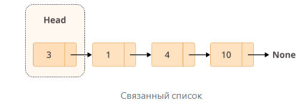
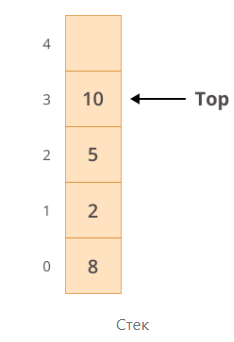
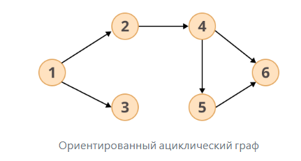
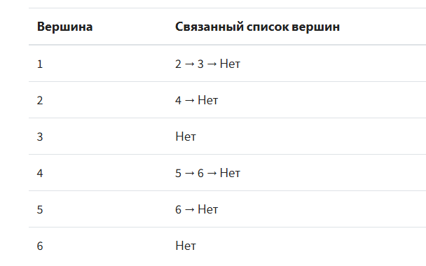

# Лекция 2

**Структуры данных и алгоритмы**

*24.08.2025 кол-во часов занятия:`2`(с12:20до14:20)*

## Основные понятия

- **Связанный список** - упорядоченный набор объектов, который хранит элементы в памяти. В связанных списках ссылки
  хранятся как часть самих элементов.
- **Узел** - Каждый элемент связанного списка
- **Очередь** - использует принцип FIFO(*Первым зашел - первым вышел*). Это значит, что первый добавленный элемент в
  список, будет извлечён первым.
- **Стек** - использует принцип LIFO(*Последний зашел - первый вышел*). Последний добавленный элемент списка, будет
  извлечён первым.
- **Список смежности** - список связанных списков, в котором каждая вершина графа хранится вместе с набором смежных
  вершин
-

## Массивы и связанные списки

**Связанный список** - упорядоченный набор объектов, который хранит элементы в памяти. В связанных списках ссылки
хранятся как часть самих элементов, в отличие от обычных списков, которые используют непрерывный блок памяти для
хранения ссылок на свои данные.

**Узел** - Каждый элемент связанного списка, у каждого узла есть 2 разных поля:

1. **Данные** - содержат значение, которое необходимо сохранить в узле.
2. **Next** - содержит ссылку на следующий узел в списке.

Связанный список *это набор узлов*. Первый узел - `head` и он используется в качестве отправной точки для любой итерации
по списку. Последний узел должен содержать ссылку `Next`, указывающую на `None`,чтобы определить конец списка.



### Практическое применение

В реальном мире связанные списки используют для различных целей. Их можно применять для реализации стека и очереди, а
также графов. Они полезны для решения более сложных задач, таких как, управление жизненным циклом приложения для
операционных систем.

### Очереди и стеки

**Очередь** - использует принцип FIFO(*Первым зашел - первым вышел*). Это значит, что первый добавленный элемент в
список, будет извлечён первым.


**Стек** - использует принцип LIFO(*Последний зашел - первый вышел*). Последний добавленный элемент списка, будет
извлечён первым.



### Графы

Графы можно использовать для отображения взаимосвязи между объектами или для представления *различных типов сетей.*
Например, ориентированный ациклический граф(ОАГ) может выглядеть так:


Существуют разные способы реализации подобных графов - но распространенный **список смежности**. Это список связанных
списков, в котором каждая вершина графа хранится вместе с набором смежных вершин.



Список смежности можно представить в коде в виде словаря:

```python
dictionary = {
    1: [2, 3, None],
    2: [4, None],
    3: [None],
    4: [5, 6, None],
    5: [6, None],
    6: [None]
}
```

Ключи - исходные вершины, значение - список смежных вершин.

### Сравнение производительности списков и связанных списков.

В Python списки являются *динамическими массивами*, что означает, что использование памяти как для списков так и для
связанных списков будет одинаковым.

Рассмотрим различия в их производительности, когда речь идет о **временной сложности**.

#### Вставка и удаление.

Для добавления элемента в список можно использовать `insert()` или `append()`, для удаления - `pop()` или `remove()`.

Основное различие заключается в том, что `insert(), remove()` - используются для вставки или удаления элемента в
определённой позиции списка, а `append(), pop()` - добавляет и удаляет элемент в конце списка. **Важно** понимать, что
удаление/вставка элемента на определённую позицию, требует сдвига всех других элементов, что усложняет операцию с точки
зрения затраченного времени.

Таким образом, хоть `append() или insert()` работают за константное время `O(1)`, при попытке вставить элемент ближе к
началу списка потребуется уже линейное время `O(n)`.

C другой стороны, связанные списки гораздо проще в использовании, когда нужно вставить/удалить элемент в начале/конце
списка, поскольку временная сложность будет `O(1)`.

#### Извлечение элементов.

Когда дело доходит до поиска элемента, списки справляются лучше. Если мы знаем к какому элементу хотим получить доступ,
то потратим `O(1)`. Попытка сделать то же самое в *связанном списке* потребует `O(n)` времени, поскольку для поиска
элемента, нужно пройтись по всему списку.

### collections.deque.

`deque` - двусторонняя очередь. Она использует реализацию связанного списка, в котором можно получать доступ к
элементам, вставлять/удалять их из начала/конца списка с постоянным временем `O(n)`.

[Работа с deque + создание своего связанного списка](lesson2.py)

### Массивы

**Массив** - структура данных, которая хранит несколько значений одновременно. Это упорядоченный набор элементов одного
типа.
```python
import array as arr

a = arr.array('i', [1, 2, 3, 4, 5, 6])

from  array import * 

b = array('f', [1.1, 2.2, 3.3, 4.4])

'''
2 способ работает только если импортировать все функции из модуля array
'''
```
Функция array(тип данных, список значений) принимает 2 параметра:
1. Тип данных сохраняемого значения(может быть любым int,float,double)
2. Список значений

arr - псевдоним используемый для удобства
## Хэш-таблицы

## Кучи, стеки и очереди.

## Бинарные деревья поиска

## Рекурсия

## Алгоритмы сортировки